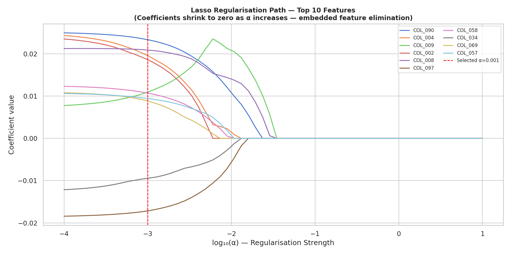
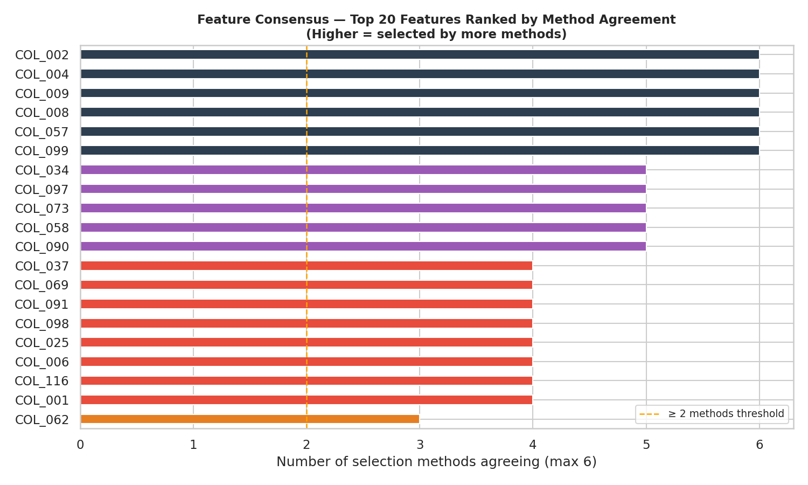
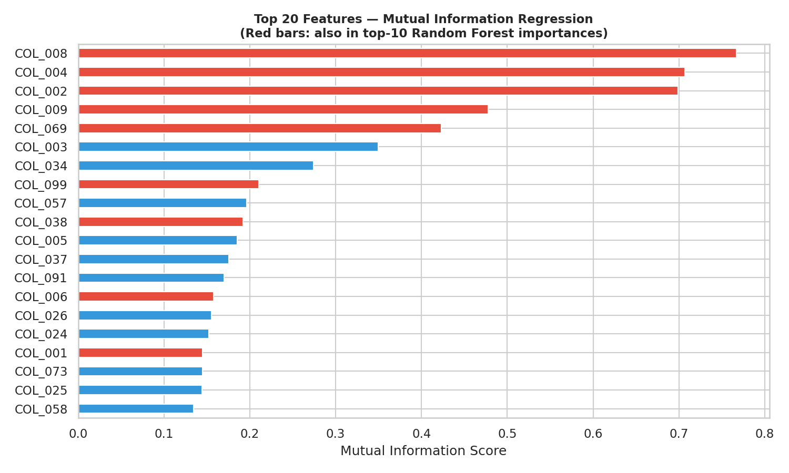
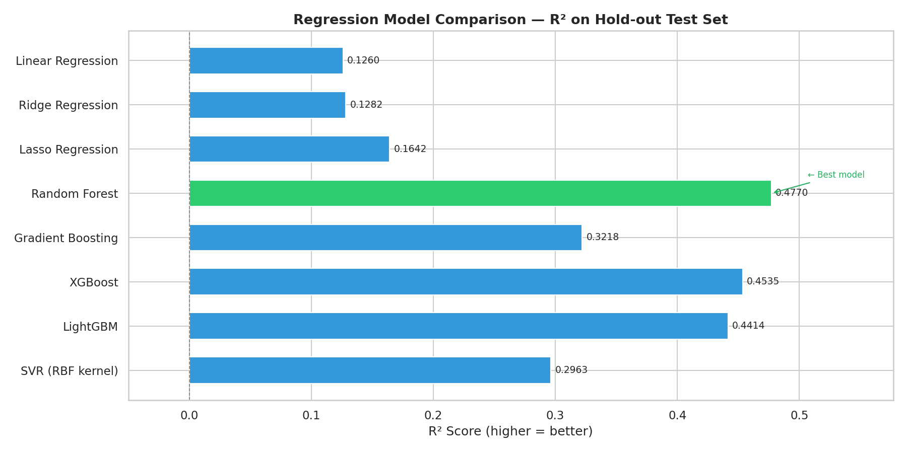

# Unknown Dataset: Feature Selection and Regression

> **Why "Unknown Dataset"?**
> The file `dataset.csv` physically exists in this folder — it is *present* and *analysable*.
> It is called **"unknown"** because its **domain, meaning, and column semantics are not
> disclosed**: all 135 columns are anonymised as `COL_000` … `COL_134` (plus a hashed `ID`),
> with no data dictionary, no unit labels, and no description of what each column measures.
> The dataset originates from **elevator component measurements**: `COL_134` is a continuous
> physical or performance property of that component, constrained to the interval [0, 1] by
> normalisation, but the exact quantity it represents — wear index, efficiency ratio,
> vibration magnitude, or another sensor-derived metric — is not disclosed.
> This mirrors common real-world scenarios such as data received from third parties under
> privacy constraints, outputs of automated feature-engineering pipelines, or pre-processed
> feature stores where original variable names have been removed for confidentiality reasons.

## Table of Contents

- [Overview](#overview)
- [Project Structure](#project-structure)
- [Virtual Environment Setup](#virtual-environment-setup)
- [Feature Selection](#feature-selection)
  - [What Is Feature Selection?](#what-is-feature-selection)
  - [Why Feature Selection Matters](#why-feature-selection-matters)
  - [How to Choose a Feature Selection Metric?](#how-to-choose-a-feature-selection-metric)
  - [Feature Selection Techniques](#feature-selection-techniques)
  - [Feature Selection: Known vs Unknown Datasets](#feature-selection-known-vs-unknown-datasets)
  - [Running the Feature Selection Script](#running-the-feature-selection-script)
  - [How the Feature Selection Script Works](#how-the-feature-selection-script-works)
  - [Feature Selection in a Machine Learning Pipeline](#feature-selection-in-a-machine-learning-pipeline)
- [Regression](#regression)
  - [What Is Regression?](#what-is-regression)
  - [Regression Algorithms](#regression-algorithms)
  - [Choosing a Regression Algorithm](#choosing-a-regression-algorithm)
  - [Running the Regression Script](#running-the-regression-script)
  - [How the Regression Script Works](#how-the-regression-script-works)
  - [Regression in a Machine Learning Pipeline](#regression-in-a-machine-learning-pipeline)
- [Diagrams and Plots](#diagrams-and-plots)
  - [Feature Selection Plots](#feature-selection-plots)
    - [Correlation Heat Map by Pearson r](#correlation-heat-map-by-pearson-r)
    - [Lasso Regularisation Path — Coefficients to Zero as Alpha Increases](#lasso-regularisation-path--coefficients-to-zero-as-alpha-increases)
    - [Feature Consensus — Ranked by Method Agreement](#feature-consensus--ranked-by-method-agreement)
    - [Mutual Information Regression for COL\_134](#mutual-information-regression-for-col_134)
    - [Random Forest Importances](#random-forest-importances)
  - [Regression Plots](#regression-plots)
    - [Regression Model Comparison — Best Model Selection](#regression-model-comparison--best-model-selection)
    - [Actual vs Predicted — R², RMSE and MAE](#actual-vs-predicted--r-rmse-and-mae)
    - [Residual Analysis — Random Forest](#residual-analysis--random-forest)
- [Processing Unknown Datasets for Training Large Language Models](#processing-unknown-datasets-for-training-large-language-models)
- [Conclusion](#conclusion)
  - [Dataset: Known or Unknown?](#dataset-known-or-unknown)
  - [Dataset Characteristics](#dataset-characteristics)
  - [Why Feature Selection Was Applied](#why-feature-selection-was-applied)
  - [Why Regression Was Applied and Which Algorithms Were Chosen](#why-regression-was-applied-and-which-algorithms-were-chosen)
  - [Results Summary](#results-summary)
  - [Reasoning for Algorithm Selection on an Unknown Dataset](#reasoning-for-algorithm-selection-on-an-unknown-dataset)
- [References](#references)

---

## Overview

This folder contains the **dataset** and scripts for regression
analysis and feature selection on an **unknown dataset** — a semicolon-separated
CSV file with 135 anonymised columns (`COL_000` … `COL_134`, plus an `ID`
column) and 10,415 samples.  The **continuous target variable** is `COL_134`
(values in the range [0, 1]).

Because neither the domain nor the semantics of the columns are known in
advance, this example demonstrates how to apply machine learning workflows to an
unknown data which is a common real-world scenario when receiving data from
external systems, privacy-focused pipelines, or pre-processed feature stores.

---

## Project Structure

```
◈ Datasets/
▸ .gitignore                         Git ignore rules (excludes venv, CSV files)
▸ requirements.txt                   Python package requirements
▸ feature_selection.py               Feature selection script (7 methods)
▸ regression_ml.py                   Regression script (8 algorithms)
▪ plots/
  ▪ fs_correlation_heatmap.png       Heat map of top-20 feature correlations
  ▪ fs_mutual_info.png               Mutual information scores (bar chart)
  ▪ fs_random_forest_importances.png Random Forest feature importances
  ▪ fs_method_overlap.png            Consensus agreement across all 6 methods
  ▪ fs_lasso_path.png                Lasso regularisation coefficient paths
  ▪ regression_model_comparison.png  R² comparison across 8 regression models
  ▪ regression_predictions.png       Actual vs Predicted scatter (best model)
  ▪ regression_residuals.png         Residual distribution (best model)
▸ venv/                              Python virtual environment (git-ignored)
```

---

## Virtual Environment Setup

A virtual environment isolates project dependencies from your system Python.
All instructions below assume Linux / macOS with Python 3.8+.

### Step 1 — Navigate to the Datasets folder

```bash
cd /home/laptop/EXERCISES/DATA-ANALYSIS/GIT/DataAnalysis/Datasets
```

### Step 2 — Create the virtual environment

```bash
python3 -m venv venv
```

### Step 3 — Activate the virtual environment

```bash
source venv/bin/activate
```

After activation your shell prompt will show `(venv)`.

### Step 4 — Install dependencies

```bash
pip install -r requirements.txt
```

This installs: `scikit-learn`, `pandas`, `numpy`, `matplotlib`, `seaborn`,
`xgboost`, `lightgbm`.

### Step 5 — Configure VS Code to use the virtual environment

1. Open VS Code Command Palette: `Ctrl+Shift+P`
2. Select **Python: Select Interpreter**
3. Choose the interpreter at `./venv/bin/python`

### Deactivating the virtual environment

```bash
deactivate
```

### Testing the virtual environment works

```bash
python -c "import sklearn, pandas, numpy, matplotlib, xgboost, lightgbm; print('All packages available')"
```

Expected output:
```
All packages available
```

---

## Feature Selection

### What Is Feature Selection?

**Feature selection** is the process of identifying and retaining only the
subset of input variables (features) that are most relevant to the prediction
target, discarding redundant, irrelevant, or noisy features.  It is a
pre-processing step in a machine learning pipeline that takes place *before*
model training.

Formally, given a feature matrix $X \in \mathbb{R}^{n \times p}$ and a target
vector $y \in \mathbb{R}^n$, feature selection finds a subset
$S \subseteq \{1, \dots, p\}$ such that a model trained on $X_S$ generalises at
least as well as one trained on the full $X$.

**Benefits:**

- Reduces overfitting by removing noise features
- Speeds up model training (fewer dimensions)
- Improves model interpretability
- Reduces storage and memory requirements
- Reveals which variables actually drive the outcome

### Why Feature Selection Matters

The dataset contains 135 raw columns, of which 98 are numeric after excluding
categorical hash codes and the `ID` column.  Of those 98,
52 are removed by a variance threshold (near-zero variance features carry no
information).  Only **46 features** pass the variance filter, and consensus
ranking across six methods identifies the **top 6 most consistently selected
features**: `COL_004`, `COL_002`, `COL_009`, `COL_008`, `COL_099`, `COL_057`.

### How to Choose a Feature Selection Metric?

Choosing the right feature selection metric depends on four key factors:

| Factor | Recommended Metric |
|---|---|
| **Continuous target (regression task)** | Pearson correlation, F-regression, Mutual Information (regression), Random Forest importances, Lasso coefficients |
| **Categorical target (classification task)** | Chi-squared, F-classification, Mutual Information (classification) |
| **Linear relationships only** | Pearson correlation, F-test |
| **Non-linear or unknown relationships** | Mutual Information, Random Forest importances |
| **Many features (high-dimensional)** | Lasso (L1), RFE with a linear estimator, VarianceThreshold as a first pass |
| **Interpretability required** | Pearson correlation, Lasso (direct coefficient magnitudes) |
| **Unknown dataset (no domain knowledge)** | Start with VarianceThreshold → Mutual Information → Random Forest importances → consensus voting |

**Decision guide (step-by-step):**

1. **Start with VarianceThreshold** — cheapest filter; removes features with no
   statistical variation.
2. **Check the target type** — for regression use `f_regression` or
   `mutual_info_regression`; for classification use `chi2` or `f_classif`.
3. **Assess linearity** — if Pearson correlation and F-test agree with Mutual
   Information, the relationship is approximately linear; if only MI finds
   strong features, non-linear interactions are likely.
4. **Apply at least one embedded method** (Lasso or Random Forest) on the
   training split to get model-driven importance scores.
5. **Use consensus voting** — features selected by ≥ 2 independent methods are
   more reliable than features selected by a single method alone.
6. **Validate** — measure cross-validated model performance with the selected
   subset vs the full feature set.

> **Rule of thumb for regression on an unknown dataset:**
> Use Mutual Information as the primary filter (captures linear and non-linear
> dependencies), combined with Random Forest importances as an embedded
> cross-check.  Features that rank highly in both should be prioritised.

### Feature Selection Techniques

#### 1. Filter Methods — Variance Threshold

Removes features whose variance falls below a threshold.  Because a feature
with near-zero variance has almost the same value for every sample, it provides
no discriminatory power.

```python
from sklearn.feature_selection import VarianceThreshold
vt = VarianceThreshold(threshold=0.01)   # remove features with < 1 % variance
X_reduced = vt.fit_transform(X_train)
```

**Reference:** [scikit-learn VarianceThreshold](https://scikit-learn.org/stable/modules/feature_selection.html#removing-features-with-low-variance)

#### 2. Filter Methods — Univariate Statistics

Rank features by their individual statistical relationship with the target.

| Score function | Task | Relationship type |
|---|---|---|
| `f_regression` | Regression | Linear |
| `r_regression` | Regression | Linear (Pearson r) |
| `mutual_info_regression` | Regression | Linear + non-linear |
| `chi2` | Classification | Non-negative features only |
| `f_classif` | Classification | Linear |
| `mutual_info_classif` | Classification | Linear + non-linear |

```python
from sklearn.feature_selection import SelectKBest, mutual_info_regression
selector = SelectKBest(score_func=mutual_info_regression, k=20)
X_selected = selector.fit_transform(X_train, y_train)
```

**Reference:** [scikit-learn Univariate Feature Selection](https://scikit-learn.org/stable/modules/feature_selection.html#univariate-feature-selection)

#### 3. Wrapper Methods — Recursive Feature Elimination (RFE)

Trains a model, ranks features by coefficient or importance, removes the
weakest feature, and repeats.  More accurate than filter methods but
computationally expensive.

```python
from sklearn.feature_selection import RFE
from sklearn.linear_model import Ridge
rfe = RFE(estimator=Ridge(), n_features_to_select=20, step=10)
rfe.fit(X_train_scaled, y_train)
selected = X_train.columns[rfe.support_]
```

**Reference:** [scikit-learn RFE](https://scikit-learn.org/stable/modules/feature_selection.html#recursive-feature-elimination)

#### 4. Embedded Methods — Lasso (L1)

Lasso regression adds an L1 penalty that shrinks the coefficients of
uninformative features to exactly zero, performing feature selection and
regression simultaneously.

```python
from sklearn.linear_model import Lasso
from sklearn.feature_selection import SelectFromModel
lasso = Lasso(alpha=0.001, max_iter=10000)
lasso.fit(X_train_scaled, y_train)
selector = SelectFromModel(lasso, prefit=True)
X_selected = selector.transform(X_train_scaled)
```

The Lasso regularisation path plot ([plots/fs_lasso_path.png](plots/fs_lasso_path.png))
shows how each feature coefficient shrinks as the regularisation strength
`alpha` increases.  Features whose coefficients reach zero first are the least
important.

**Reference:** [scikit-learn L1-based feature selection](https://scikit-learn.org/stable/modules/feature_selection.html#l1-based-feature-selection)

#### 5. Embedded Methods — Tree-Based Importances

Ensemble tree models (Random Forest, Gradient Boosting) compute an impurity
decrease metric for each feature across all trees.

```python
from sklearn.ensemble import RandomForestRegressor
from sklearn.feature_selection import SelectFromModel
rf = RandomForestRegressor(n_estimators=200, n_jobs=-1)
rf.fit(X_train, y_train)
selector = SelectFromModel(rf, prefit=True, threshold="mean")
X_selected = selector.transform(X_train)
```

**Reference:** [scikit-learn Tree-based Feature Selection](https://scikit-learn.org/stable/modules/feature_selection.html#tree-based-feature-selection)

### Feature Selection: Known vs Unknown Datasets

Feature selection strategy depends fundamentally on whether you have a
**known dataset** (domain knowledge, interpretable columns, labelled target)
or an **unknown dataset** (anonymous columns, blind data, or unlabelled source).

| Feature Type | Unknown Dataset (Unsupervised / Blind) | Known Dataset (Supervised) |
|---|---|---|
| **Goal** | Minimise redundancy while preserving data structure (e.g., clusters or latent patterns) | Maximise predictive accuracy for a specific target variable |
| **Criteria** | Variance, distribution shape, and inter-feature similarity | Correlation with the target, information gain, and model importance |
| **Techniques** | PCA, Laplacian Score, VarianceThreshold, clustering-based metrics | Filter (F-regression, MI), Wrapper (RFE), Embedded (Lasso, RF importances) |
| **Risk** | Removing structure that could be important later | Data leakage if selection is done on the full dataset instead of training split only |

> **Critical rule:** Always perform feature selection **exclusively on the
> training split**.  Using the entire dataset — known or unknown — to select
> features constitutes **data leakage**, which inflates apparent validation
> accuracy and produces models that fail on new data.

#### Adapting feature selection for an unknown dataset

When the dataset has no domain labels or interpretable column names (as in
`dataset.csv` with anonymous `COL_*` columns), apply this workflow:

1. **Inspect distributions** — Identify numeric vs categorical features,
   missing value patterns, and variance distributions.
2. **Apply VarianceThreshold** — Eliminate constant or near-constant features
   before any supervised step.
3. **Use Mutual Information** — Does not require knowledge of the relationship
   type; equally effective for linear and non-linear dependencies.
4. **Cross-validate feature subsets** — Compare model performance on k-fold
   splits with different feature subsets to select the most generalisable set.
5. **Confirm with an embedded method** — Random Forest importances or Lasso
   provide model-driven validation of filter-method rankings.

### Running the Feature Selection Script

Ensure the virtual environment is activated (see
[Virtual Environment Setup](#virtual-environment-setup)), then run:

```bash
python feature_selection.py
```

Expected output includes:

- Pre-processing summary (numeric features, sample count)
- Variance threshold results
- Top 5 features for each of 6 methods
- Consensus features selected by ≥ 2 methods
- Five saved plots in the `plots/` folder

**Typical runtime:** 60 – 120 seconds (dominated by Random Forest fitting on
10,415 samples × 46 features and Lasso path computation).

### How the Feature Selection Script Works

`feature_selection.py` processes `dataset.csv` through seven sequential stages:

1. **Load** — Reads the semicolon-delimited file with `pandas.read_csv`.
2. **Parse numeric features** — Uses `pd.to_numeric(errors='coerce')` to
   silently convert non-numeric strings and hash-codes to `NaN`, then drops
   all-NaN columns.  Replaces `inf`/`-inf` values with `NaN`.
3. **Train/test split** — Splits 80 % / 20 % *before* any feature selection to
   prevent data leakage.
4. **Impute** — Fills remaining `NaN` values with the column median
   (`SimpleImputer(strategy='median')`), fit on the training split only.
5. **Scale** — Standardises features to zero mean and unit variance
   (`StandardScaler`) for methods that are sensitive to feature magnitude
   (Lasso, RFE/Ridge).
6. **Apply 7 methods** — VarianceThreshold, Pearson correlation, Mutual
   Information, F-regression, Random Forest importances, Lasso embedded, RFE
   with Ridge.
7. **Consensus voting** — Counts how many methods include each feature in their
   top-20 list and outputs a ranked consensus table.

### Feature Selection in a Machine Learning Pipeline

Feature selection should be integrated as a `Pipeline` step in scikit-learn to
guarantee that selection logic is always fit on training data only:

```python
from sklearn.pipeline import Pipeline
from sklearn.feature_selection import SelectFromModel
from sklearn.ensemble import RandomForestRegressor
from sklearn.impute import SimpleImputer
from sklearn.preprocessing import StandardScaler

pipeline = Pipeline([
    ("imputer",   SimpleImputer(strategy="median")),
    ("scaler",    StandardScaler()),
    ("selection", SelectFromModel(RandomForestRegressor(n_estimators=100))),
    ("model",     RandomForestRegressor(n_estimators=200)),
])
pipeline.fit(X_train, y_train)
y_pred = pipeline.predict(X_test)
```

Using `Pipeline` prevents data leakage because `fit` is called only on the
training fold during cross-validation, and `transform` is applied to the
validation fold using parameters learned from the training fold.

**Reference:** [scikit-learn Feature Selection as Part of a Pipeline](https://scikit-learn.org/stable/modules/feature_selection.html#feature-selection-as-part-of-a-pipeline)

---

## Regression

### What Is Regression?

**Regression** is a supervised learning task where the goal is to predict a
**continuous numerical output** (as opposed to a discrete class label in
classification).  Given a feature matrix $X$ and a continuous target vector
$y$, regression learns a function:

$$\hat{y} = f(X; \theta)$$

that minimises a loss function — typically mean squared error:

$$\mathcal{L}(\theta) = \frac{1}{n} \sum_{i=1}^{n} (y_i - \hat{y}_i)^2$$

The `dataset.csv` file contains the continuous property `COL_134` (values in
the range [0, 1], mean ≈ 0.41) that we model as a function of the other numeric
columns, making this a **multiple regression** problem.

In the context of this dataset, `COL_134` represents a **continuous physical
or performance characteristic of an elevator component** — such as a wear
index, efficiency ratio, vibration amplitude, or load factor — normalised to
the interval [0, 1] by the data provider.  The regression task is to estimate
this property from the other 134 measured (but anonymous) columns: the model
learns a mapping

$$\hat{y}_{\text{COL\_134}} = f(\text{COL\_000},\, \text{COL\_001},\, \ldots,\, \text{COL\_133};\, \theta)$$

so that, given a new set of measurements from the same component type, the
model can **predict the value of the target property without directly
measuring it**.

### Regression Algorithms

#### Linear Regression

The simplest regression model, which fits a hyperplane to the data:

$$\hat{y} = \beta_0 + \beta_1 x_1 + \beta_2 x_2 + \dots + \beta_p x_p$$

- **When to use:** When the relationship between features and target is
  approximately linear, or as a fast interpretable baseline.
- **Limitation:** Sensitive to multicollinearity; tends to underfit
  high-dimensional datasets.

**Scikit-learn:** `sklearn.linear_model.LinearRegression`
**Reference:** [scikit-learn Linear Models](https://scikit-learn.org/stable/modules/linear_model.html)

#### Ridge Regression (L2 regularisation)

Adds an L2 penalty to the coefficient magnitudes:

$$\mathcal{L}(\theta) = \text{MSE} + \alpha \sum_{j=1}^{p} \beta_j^2$$

- **When to use:** Datasets with many correlated features (multicollinearity).
  Ridge shrinks all coefficients but never sets them to exactly zero.
- **Hyperparameter:** `alpha` — higher value = more regularisation = smaller
  coefficients.

**Scikit-learn:** `sklearn.linear_model.Ridge`
**Reference:** [scikit-learn Ridge Regression](https://scikit-learn.org/stable/modules/linear_model.html#ridge-regression-and-classification)

#### Lasso Regression (L1 regularisation)

Adds an L1 penalty that drives some coefficients to exactly zero:

$$\mathcal{L}(\theta) = \text{MSE} + \alpha \sum_{j=1}^{p} |\beta_j|$$

- **When to use:** High-dimensional data with many irrelevant features.  Lasso
  performs simultaneous feature selection and regression.
- **Hyperparameter:** `alpha` — higher value = more sparsity.

**Scikit-learn:** `sklearn.linear_model.Lasso`
**Reference:** [scikit-learn Lasso](https://scikit-learn.org/stable/modules/linear_model.html#lasso)

#### Elastic Net (L1 + L2 Regularisation)

Combines the L1 (Lasso) and L2 (Ridge) penalties with a mixing parameter
`l1_ratio`:

$$\mathcal{L}(\theta) = \text{MSE} + \alpha \left[ \rho \sum_{j=1}^{p} |\beta_j| + \frac{1-\rho}{2} \sum_{j=1}^{p} \beta_j^2 \right]$$

- **When to use:** High-dimensional data with groups of correlated features.
  Elastic Net selects at least one feature from each correlated group (unlike
  Lasso, which tends to pick one arbitrarily), making it more stable.
- **Hyperparameters:** `alpha` (overall regularisation strength), `l1_ratio`
  (balance between L1 and L2: 0 = Ridge, 1 = Lasso).
- **For this dataset:** Useful as a sparse linear baseline that combines the
  feature-selection effect of Lasso with the multicollinearity tolerance of
  Ridge — relevant here because many of the 46 variance-retained features are
  mutually correlated.

**Scikit-learn:** `sklearn.linear_model.ElasticNet`
**Reference:** [scikit-learn Elastic Net](https://scikit-learn.org/stable/modules/linear_model.html#elastic-net)

#### Decision Tree Regressor

Recursively partitions the feature space into rectangular regions and predicts
the mean target value in each leaf.

- **When to use:** Non-linear relationships; highly interpretable.
- **Limitation:** Prone to overfitting without pruning or depth constraints.

#### Random Forest Regressor

Builds an ensemble of decorrelated decision trees by training each tree on a
bootstrap sample with a random feature subset (`max_features`), then averages
their predictions.

- **When to use:** General-purpose; handles non-linear relationships, missing
  values (after imputation), and high-dimensional data well.
- **Advantage over single tree:** Significantly lower variance (avoids
  overfitting).
- **Result on this dataset:** R² = **0.4770** on hold-out test set — best
  performing algorithm.

**Scikit-learn:** `sklearn.ensemble.RandomForestRegressor`
**Reference:** [scikit-learn Random Forest](https://scikit-learn.org/stable/modules/ensemble.html#random-forests-and-other-randomized-tree-ensembles)

#### Gradient Boosting Regressor

Builds trees *sequentially*, each tree correcting the residuals of the
previous one.  The prediction is an additive model:

$$F_M(x) = \sum_{m=1}^{M} \gamma_m h_m(x)$$

where $h_m$ is a weak learner (shallow tree) and $\gamma_m$ is the step size
(learning rate).

- **When to use:** Complex non-linear datasets; often achieves state-of-the-art
  accuracy with tuning.
- **Hyperparameters:** `n_estimators`, `learning_rate`, `max_depth`.

**Scikit-learn:** `sklearn.ensemble.GradientBoostingRegressor`

#### XGBoost

Extreme Gradient Boosting — a highly optimised, regularised gradient boosting
framework with histogram-based tree construction, parallel computation, and
built-in handling of missing values.

- **When to use:** Medium to large datasets where performance is critical.

**Library:** `xgboost.XGBRegressor`
**Reference:** [XGBoost Documentation](https://xgboost.readthedocs.io/en/stable/)

#### LightGBM

Light Gradient Boosting Machine — uses leaf-wise (best-first) tree growth
instead of depth-wise, making it faster and more memory-efficient on wide
datasets.

- **When to use:** Very large or very wide datasets; faster than XGBoost in
  many scenarios.

**Library:** `lightgbm.LGBMRegressor`
**Reference:** [LightGBM Documentation](https://lightgbm.readthedocs.io/en/stable/)

#### CatBoost

Categorical Boosting — a gradient boosting framework that natively handles
categorical features without requiring explicit pre-processing such as one-hot
or target encoding.  It uses ordered boosting and symmetric (oblivious)
decision trees to reduce overfitting on small datasets.

- **When to use:** Datasets with a mix of numeric and categorical features;
  strong out-of-the-box performance with minimal hyperparameter tuning.
- **Advantage over XGBoost / LightGBM:** Categorical columns can be passed
  directly; the library handles ordering and frequency-based statistics
  internally.
- **For this dataset:** Particularly relevant because several columns
  (`COL_011`, `COL_018`, `COL_020`, `COL_043`) contain encoded hash-like
  categorical identifiers that require manual encoding for other algorithms.
  CatBoost could consume those columns natively, potentially recovering
  predictive signal that is currently lost when hash strings are coerced to NaN.
- **Note:** CatBoost is not included in the current `regression_ml.py` script
  because it requires an additional install (`pip install catboost`), but it is
  the recommended next algorithm to evaluate for improved performance on this
  mixed-type dataset.

**Library:** `catboost.CatBoostRegressor`
**Reference:** [CatBoost Documentation](https://catboost.ai/)

#### Support Vector Regression (SVR)

Fits the data within a margin of width ε around the prediction function, using
kernel functions (e.g., RBF) to implicitly map features to high-dimensional
spaces.

- **When to use:** Small to medium datasets; works well when a clear margin can
  be defined; good for high-dimensional data.
- **Limitation:** Computationally expensive on large datasets.

**Scikit-learn:** `sklearn.svm.SVR`
**Reference:** [scikit-learn SVR](https://scikit-learn.org/stable/modules/svm.html#regression)

### Choosing a Regression Algorithm

| Criterion | Recommended Algorithm |
|---|---|
| **Linear relationship between features and target** | Linear Regression, Ridge |
| **Many irrelevant features** | Lasso, Ridge |
| **Non-linear or complex patterns** | Random Forest, Gradient Boosting, XGBoost |
| **Small dataset (< 5,000 samples)** | KNN, SVR, Linear Regression |
| **Large dataset (> 50,000 samples)** | LightGBM, XGBoost, Linear Regression |
| **Interpretability required** | Linear Regression, Lasso, small Decision Tree |
| **Unknown dataset (unknown relationships)** | Start with Random Forest (robust, no assumptions); compare to Linear baseline |
| **Outliers present** | SVR (ε-insensitive loss ignores small errors), Lasso |
| **Mixed numeric and categorical features** | CatBoost (native categorical support; no encoding required) |
| **Correlated feature groups, want sparse solution** | Elastic Net (combines L1 sparsity with L2 grouping stability) |
| **Industrial / engineered tabular data** | CatBoost, LightGBM, XGBoost (gradient boosting dominates structured data benchmarks) |

### Running the Regression Script

Ensure the virtual environment is activated, then run:

```bash
python regression_ml.py
```

The script trains all 8 models and prints a comparison table:

```
    Model                              R²        MAE       RMSE   Time(s)
    ----------------------------------------------------------------------
    Linear Regression              0.1260     0.0907     0.1431      0.13s
    Ridge Regression               0.1282     0.0906     0.1429      0.11s
    Lasso Regression               0.1642     0.0890     0.1399      0.12s
    Random Forest                  0.4770     0.0595     0.1107      4.36s
    Gradient Boosting              0.3218     0.0771     0.1261      3.02s
    XGBoost                        0.4535     0.0658     0.1132      1.27s
    LightGBM                       0.4414     0.0664     0.1144      2.16s
    SVR (RBF kernel)               0.2963     0.0881     0.1284      1.68s
```

Three plots are saved to the `plots/` folder.

**Typical runtime:** 15 – 30 seconds depending on hardware (dominated by Random
Forest with 200 trees on 8,332 samples × 98 features).

### How the Regression Script Works

`regression_ml.py` processes `dataset.csv` through six sequential stages:

1. **Load** — Reads the file with `pandas.read_csv(sep=';')`.
2. **Pre-process** — Drops the `ID` column, converts all columns to numeric
   (hash-code strings become `NaN`), replaces `inf`/`-inf` with `NaN`, drops
   all-NaN columns, and removes rows where the target is `NaN`.
3. **Split** — 80 % training / 20 % hold-out test set.
4. **Build pipelines** — Linear and SVR models use
   `SimpleImputer → StandardScaler → model`; tree-based models use
   `SimpleImputer → model` (trees are scale-invariant).
5. **Train and evaluate** — Fits each pipeline on `X_train`, predicts on
   `X_test`, and computes R², MAE, and RMSE.
6. **Cross-validate** — Runs 5-fold cross-validation on the training set for
   the best-performing model and reports mean ± std R².
7. **Plot** — Saves three diagnostic charts.

### Regression in a Machine Learning Pipeline

A typical end-to-end regression pipeline combines pre-processing, feature
selection, and model fitting:

```
Raw CSV  →  Parse numeric  →  Train/test split
                                    │
                               Training set only
                                    │
                           ┌────────────────────┐
                           │  Impute (median)   │
                           │  Scale (z-score)   │
                           │  Select features   │
                           │  Fit model         │
                           └────────────────────┘
                                    │
                               Test set (held out)
                                    │
                           Evaluate: R², MAE, RMSE
```

In scikit-learn this is expressed as a `Pipeline`:

```python
from sklearn.pipeline import Pipeline
from sklearn.impute import SimpleImputer
from sklearn.preprocessing import StandardScaler
from sklearn.feature_selection import SelectKBest, mutual_info_regression
from sklearn.ensemble import RandomForestRegressor

pipeline = Pipeline([
    ("imputer",   SimpleImputer(strategy="median")),
    ("selector",  SelectKBest(score_func=mutual_info_regression, k=20)),
    ("model",     RandomForestRegressor(n_estimators=200, random_state=42)),
])
pipeline.fit(X_train, y_train)
y_pred = pipeline.predict(X_test)
```

---

## Diagrams and Plots

All plots are generated automatically by running the two Python scripts.
They are saved in the `plots/` sub-folder.

### Feature Selection Plots

#### Correlation Heat Map by Pearson r


**What is a Pearson Correlation Heat Map?**

A Pearson correlation heat map is a colour-coded visual representation of a
correlation matrix used to display the strength and direction of **linear
relationships** between multiple continuous variables at a glance.  It
highlights clusters, patterns, and multicollinearity in complex datasets.

The Pearson coefficient ($r$) measures the linear relationship between two
continuous variables:

$$r = \frac{\displaystyle\sum_{i=1}^{n}(x_i - \bar{x})(y_i - \bar{y})}{\displaystyle\sqrt{\sum_{i=1}^{n}(x_i-\bar{x})^2}\;\sqrt{\sum_{i=1}^{n}(y_i-\bar{y})^2}}$$

The resulting $r$ values fall on a continuous scale between $-1.0$ and $+1.0$:

| Value | Interpretation |
|---|---|
| $r = +1.0$ | Perfect positive correlation: as $X$ increases, $Y$ increases proportionally |
| $r = -1.0$ | Perfect negative correlation: as $X$ increases, $Y$ decreases proportionally |
| $r = 0$ | No linear relationship between the two variables |

To create the heat map in `feature_selection.py`, `pandas.DataFrame.corr()` is
used to compute the full pairwise Pearson correlation matrix for the top-20
features (ranked by $|r|$ with `COL_134`), and `seaborn.heatmap()` renders it
as a colour-coded grid.

**Why it matters for machine learning:**

- **Feature Selection:** By mapping input variables against the target output
  (`COL_134`), you can instantly spot which features have the strongest
  predictive power.  The bottom row of the heat map shows the direct linear
  correlation of each of the top-20 features with the target variable.
- **Multicollinearity Detection:** If two independent input variables are
  highly correlated ($r > 0.85$), they provide redundant information.
  Removing one simplifies models, prevents overfitting, and improves
  performance — especially in linear models.  In the heat map above, notable
  inter-feature correlations include `COL_004` ↔ `COL_008` ($r = 0.54$) and
  `COL_037` ↔ `COL_073` ($r = 0.56$), indicating moderate redundancy between
  those pairs.

**How to read the plot ([plots/fs_correlation_heatmap.png](plots/fs_correlation_heatmap.png)):**

- **Cell colour** — Warm (red) cells indicate positive correlation; cool (blue)
  cells indicate negative correlation.  White cells are near-zero correlation.
  The colour scale runs from approximately $-0.4$ (dark blue) to $+0.6$
  (dark red) for this dataset.
- **Lower triangle only** — The matrix is symmetric, so only the lower triangle
  is displayed (the upper triangle is masked).
- **Diagonal** — Always $1.0$ (a feature is perfectly correlated with itself).
- **Target row/column (`COL_134`)** — The bottom row shows the direct Pearson
  $r$ of each top-20 feature with the target.  The highest values are around
  $0.22$ (`COL_009`) and $0.19$ (`COL_008`) — low linear correlations,
  consistent with the non-linear character of the dataset confirmed later by
  the Mutual Information scores.
- **Off-diagonal clusters** — Groups of mutually correlated features indicate
  feature redundancy; only one representative from each cluster needs to be
  retained for a linear model.

**Reference:** [Visualising Correlation Heatmaps — apxml.com](https://apxml.com/courses/intro-eda-course/chapter-4-bivariate-analysis/visualizing-correlation-heatmaps)

---

#### Lasso Regularisation Path — Coefficients to Zero as Alpha Increases



**What is Lasso Regularisation?**

Lasso (**L**east **A**bsolute **S**hrinkage and **S**election **O**perator) is a
linear regression technique that prevents overfitting by adding an **L1 penalty**
proportional to the sum of the absolute values of the model coefficients to the
loss function:

$$\mathcal{L}(\theta) = \underbrace{\frac{1}{n}\sum_{i=1}^{n}(y_i - \hat{y}_i)^2}_{\text{RSS}} + \underbrace{\alpha \sum_{j=1}^{p} |\beta_j|}_{\text{L1 penalty}}$$

This penalty simultaneously **prevents overfitting** and acts as a powerful
**automatic feature selection** tool by driving uninformative coefficients
exactly to zero — eliminating those features from the model entirely.

**The Role of Alpha ($\alpha$):**

The hyperparameter $\alpha$ (sometimes written $\lambda$) controls the penalty
strength:

| $\alpha$ value | Effect |
|---|---|
| **Low $\alpha$ (near 0)** | Weak penalty — behaves like standard unregularised linear regression; all features retained |
| **High $\alpha$** | Strong penalty — coefficients pulled aggressively toward zero; only the most important features survive |

**Why Coefficients Drop to Exactly Zero (not just close to zero):**

This is the geometrically unique property of the L1 norm.  During
optimisation, the model minimises the RSS constrained within a budget region
defined by the penalty:

- **Lasso (L1)** boundary = a diamond shape with sharp vertices on the axes.
  The residual error surface almost always touches the diamond at a vertex that
  lies exactly on an axis, forcing that coefficient to exactly zero — completely
  eliminating the feature.
- **Ridge (L2)** boundary = a smooth sphere with no corners.  The surface
  touches the sphere off-axis, shrinking coefficients close to — but never
  reaching — zero.

| Feature | Lasso (L1 Regularisation) | Ridge (L2 Regularisation) |
|---|---|---|
| Penalty type | Sum of absolute values $\sum\vert\beta_j\vert$ | Sum of squared values $\sum\beta_j^2$ |
| Effect of high $\alpha$ | Shrinks coefficients **exactly to zero** | Shrinks coefficients **very close** to zero |
| Feature selection | **Yes** — effectively removes features | **No** — retains all features |

**How to read the plot ([plots/fs_lasso_path.png](plots/fs_lasso_path.png)):**

The plot was produced in `feature_selection.py` by fitting 60 Lasso models
across the range $\alpha \in [10^{-4},\, 10^{1}]$ on the standardised training
features and recording each feature's coefficient at each $\alpha$.

- **x-axis — $\log_{10}(\alpha)$:** Regularisation strength increases from
  left (small $\alpha$, weak penalty) to right (large $\alpha$, strong penalty).
- **y-axis — Coefficient value:** Each coloured line traces one feature's
  coefficient as regularisation strength increases.
- **Lines converging to zero:** Each line eventually hits $y = 0$ and stays
  there — this is the Lasso elimination event for that feature.  Features
  eliminated at low $\alpha$ (early, toward the left) contribute little
  predictive power; features that remain non-zero at high $\alpha$ (toward the
  right) are the most important.
- **Red dashed vertical line ($\alpha = 0.001$):** The operating point chosen
  in the script.  At this value all top-10 features still carry non-zero
  coefficients, making it a permissive setting that retains informative
  features without over-pruning.
- **In this dataset:** `COL_090` (blue) and `COL_004` (orange) are among the
  last to reach zero, confirming they carry the most linear signal.  `COL_057`
  (cyan) levels out near zero even at low $\alpha$, indicating that its
  predictive value is primarily non-linear — captured by Random Forest and
  Mutual Information rather than by Lasso's linear coefficients.

**Reference:** [scikit-learn L1-based Feature Selection](https://scikit-learn.org/stable/modules/feature_selection.html#l1-based-feature-selection)

---

#### Feature Consensus — Ranked by Method Agreement



**What is Feature Consensus?**

Feature Consensus refers to selecting optimal input variables by **aggregating
the results of multiple independent feature-ranking techniques**.  When
different evaluators yield conflicting rankings, consensus algorithms resolve
the discrepancies to find the most robust subset of features.

The methods used in `feature_selection.py` span all three main families:

| Family | Methods used |
|---|---|
| **Filter** | Pearson Correlation, Mutual Information Regression, F-Regression |
| **Embedded** | Random Forest Importances, Lasso (L1) |
| **Wrapper** | Recursive Feature Elimination (RFE) with Ridge |

Each method independently nominates its top-20 features.  A **vote count** is
then assigned to each feature — the number of independent methods that include
it in their top-20 list — ranging from 0 to 6 (maximum = 6 methods).

**Why Consensus Matters:**

No single feature selection method is universally optimal on an unknown
dataset.  Filter methods (Pearson, F-Regression) only detect linear
associations; tree importances detect non-linear splits; Lasso only captures
what a linear model can use.  A feature selected by *all six* methods is
robust across all relationship types and model families — it is almost
certainly genuinely informative.  Features selected by at least 2 independent
methods are significantly more reliable than those flagged by a single
method alone.

The consensus approach is analogous to **ranked cluster analysis** — grouping
features by similar predictive utility across multiple algorithms, filtering
out redundancies, and determining final consensus via a metric-based threshold
(here: $\geq 2$ votes).

**How to read the plot ([plots/fs_method_overlap.png](plots/fs_method_overlap.png)):**

- **x-axis — Number of selection methods agreeing (max 6):** Each bar extends
  to the number of methods that included this feature in their top-20 list.
- **Bar colour gradient** — Reflects vote count tier:
  - **Dark navy (6 votes):** Selected by all 6 methods — maximum consensus.
  - **Purple (5 votes):** Selected by 5 methods — very high consensus.
  - **Red-orange (4 votes):** Selected by 4 methods — strong consensus.
  - **Gold (3 votes):** Selected by 3 methods — moderate consensus.
- **Orange dashed vertical line at 2 votes** — The minimum-consensus threshold
  used in the script; features to the right of this line are retained as the
  consensus feature set.
- **Results for this dataset:** Six features (`COL_002`, `COL_004`, `COL_009`,
  `COL_008`, `COL_057`, `COL_099`) achieved the maximum **6/6 votes** — every
  single feature selection method independently agreed they are among the most
  predictive features for `COL_134`.  These are the highest-confidence features
  for any downstream model.  A further 14 features scored 4–5 votes (strong
  consensus), and the cut-off at 2 votes retains a total of 27 consensus
  features.

**Reference:** [scikit-learn Feature Selection](https://scikit-learn.org/stable/modules/feature_selection.html)

---

#### Mutual Information Regression for COL\_134



**Mutual Information Regression for COL\_134**

Mutual Information (MI) ranks each input variable by its statistical dependence
with `COL_134` — the continuous physical property of an elevator component —
to identify which variables are relevant for modelling `COL_134` as a function
of the measured input features.  Unlike Pearson correlation, which only
captures linear relationships, MI captures **any** dependency (linear or
non-linear) by quantifying the reduction in uncertainty about `COL_134` given
knowledge of a candidate feature $X$:

$$I(X; Y) = \int\!\int p(x,y)\,\log\frac{p(x,y)}{p(x)\,p(y)}\,dx\,dy$$

- **$I = 0$:** The feature and target are statistically independent.
- **$I > 0$:** The feature carries information about the target; higher $I$
  means more informative.

In `feature_selection.py`, MI is estimated via scikit-learn's
`mutual_info_regression`, which uses a **$k$-nearest neighbours (k-NN)**
approach to estimate entropy-based probability distributions — no assumption
of linearity is required.  This makes it the primary filter tool for an
unknown dataset where the relationship structure is undisclosed.

**How to read the Mutual Information plot
([plots/fs_mutual_info.png](plots/fs_mutual_info.png)):**

- **x-axis — Mutual Information Score:** Longer bars indicate features that
  share more information with `COL_134`.  The scale extends from 0 to ~0.77.
- **Red bars:** Features that are *also* in the top-10 Random Forest
  importances — indicating consistent selection across two independent
  non-parametric methods.  The top four (`COL_008`, `COL_004`, `COL_002`,
  `COL_009`) are all red, confirming strong multi-method agreement.
- **Blue bars:** Features flagged only by Mutual Information but not in the
  top-10 Random Forest importances.
- **Key diagnostic:** `COL_008` achieves MI = 0.767 while its Pearson $r$
  with `COL_134` is only ~0.19.  This large gap between MI and $|r|$ is direct
  evidence that the feature-to-target relationship is **strongly non-linear**.
  It explains why linear models achieve R² ≈ 0.13 while Random Forest reaches
  R² ≈ 0.48 — the dominant signal in the data simply cannot be captured by a
  hyperplane.

---

#### Random Forest Importances


**Random Forest Feature Importances**

Random Forest computes **Mean Decrease in Impurity (MDI)** for each feature:
for every split in every tree, the reduction in node variance attributable to
that feature is recorded and averaged across all 200 trees, then normalised so
all importances sum to 1.0.  A higher MDI value means the feature is
responsible for more of the model's prediction accuracy:

$$\text{Importance}(f) = \frac{1}{T}\sum_{t=1}^{T}\sum_{j:\,\text{split on }f} \Delta\text{impurity}(j,\,t)$$

Because Random Forest is a non-linear ensemble, MDI importances capture
complex, interaction-level dependencies that Pearson correlation misses.
Random Forest and Mutual Information are therefore **complementary
non-parametric methods**: MI is a filter that ranks features before model
fitting; MDI is an embedded measure computed from the trained model itself.

**How to read the Random Forest Importances plot
([plots/fs_random_forest_importances.png](plots/fs_random_forest_importances.png)):**

- **x-axis — Mean Decrease in Impurity (Feature Importance):** Relative
  contribution to prediction accuracy across all 200 trees.
- **Red bars:** Features that also rank in the top-10 by Mutual Information —
  cross-method agreement adds confidence that these features are genuinely
  predictive rather than artefacts of a single method.
- **Green bars:** Features important to Random Forest but not in the top-10 MI
  list — may contribute through complex interaction effects that MI's univariate
  estimation misses.
- **Top features:** `COL_008` (MDI ≈ 0.117), `COL_009` (MDI ≈ 0.085),
  `COL_099` (MDI ≈ 0.078) — the same features that dominate the MI chart,
  reinforcing the consensus ranking and confirming their importance through
  two independent non-parametric measures.

**Reference:** [scikit-learn Tree-based Feature Selection](https://scikit-learn.org/stable/modules/feature_selection.html#tree-based-feature-selection)

---

### Regression Plots

#### Regression Model Comparison — Best Model Selection



**Random Forest Regression and Supervised Learning**

Random Forest is a **supervised machine learning** algorithm used for both
classification (predicting categories) and regression (predicting continuous
numbers).  It is part of scikit-learn's
[supervised learning](https://scikit-learn.org/stable/supervised_learning.html)
module and is categorised as an **ensemble method** — it combines the
predictions of multiple individual decision trees to produce a single, more
accurate and stable result.

**How Random Forest Works:**

The "random" in Random Forest comes from two decorrelation techniques that
make individual trees as diverse as possible:

1. **Bagging (Bootstrap Aggregating):** Each tree is trained on a different
   random subset of the training data, sampled *with replacement*.  Because
   different trees see different data, they make different errors, and
   averaging those errors cancels much of the variance.
2. **Feature Randomisation:** Instead of considering all features at each node
   split, each tree evaluates only a random subset of features (typically
   $p/3$ for regression).  This prevents any single dominant feature from
   appearing in every tree, further decorrelating the ensemble.

Once all trees are trained, the forest predicts by **averaging the outputs**
of all individual trees:

$$\hat{y} = \frac{1}{T}\sum_{t=1}^{T} h_t(x)$$

where $h_t(x)$ is the prediction of the $t$-th tree.  Averaging reduces
variance without increasing bias — the fundamental advantage of bagging over
a single decision tree.  In `regression_ml.py`, Random Forest is configured
with 200 trees trained in parallel on all available CPU cores:

```python
RandomForestRegressor(n_estimators=200, n_jobs=-1, random_state=42)
```

**How the Best Model Was Chosen:**

`regression_ml.py` trains all 8 algorithm pipelines on the 80 % training
split and evaluates each on the held-out 20 % test set.  The algorithm with
the highest $R^2$ on the test set is automatically identified:

```python
best_name = max(results, key=lambda n: results[n]["R2"])
```

Following this empirical evaluation, **5-fold cross-validation** is run on
the training split of the winning model to confirm that the result
generalises and is not a test-set-specific artefact:

```python
cv_scores = cross_val_score(best["pipeline"], X_train, y_train,
                            cv=5, scoring="r2", n_jobs=-1)
```

**How to read the plot
([plots/regression_model_comparison.png](plots/regression_model_comparison.png)):**

- **x-axis — R² Score:** Proportion of variance in `COL_134` explained by the
  model on the hold-out test set.  Higher is better; $R^2 = 1.0$ is perfect;
  $R^2 = 0$ means the model predicts no better than the training mean;
  $R^2 < 0$ means the model is worse than the mean.
- **Each horizontal bar** represents one trained model, evaluated on the
  unseen 20 % test set.
- **Green bar (Random Forest, R² = 0.4770):** Annotated as "← Best model".
  It achieves more than three times the R² of the linear baseline (~0.13),
  confirming the strongly non-linear nature of the target.
- **Linear models (Linear Regression R² = 0.1260, Ridge R² = 0.1282,
  Lasso R² = 0.1642):** All cluster around 0.13–0.16, establishing the
  upper bound of linear signal in the data.
- **Boosting ensembles (XGBoost R² = 0.4535, LightGBM R² = 0.4414):** Close
  behind Random Forest, confirming that tree ensemble methods are the correct
  model family for this non-linear dataset.
- **SVR (R² = 0.2963):** The RBF kernel captures some non-linearity but
  cannot match the ensemble tree methods on this high-dimensional tabular data.

**Reference:** [Google Machine Learning — Random Forests](https://developers.google.com/machine-learning/decision-forests/random-forests)

---

#### Actual vs Predicted — R², RMSE and MAE


**Evaluating Regression with Actual vs Predicted**

After training the best model (Random Forest), plotting **Actual vs Predicted**
values gives a visual understanding of performance, while the metrics $R^2$,
RMSE, and MAE provide exact numerical accuracy.

| Metric | Formula | Interpretation |
|---|---|---|
| **$R^2$ (Coefficient of Determination)** | $1 - \dfrac{\sum(y_i-\hat{y}_i)^2}{\sum(y_i-\bar{y})^2}$ | Proportion of variance explained. Closer to $1.0$ is better. |
| **RMSE (Root Mean Square Error)** | $\sqrt{\dfrac{1}{n}\sum(y_i-\hat{y}_i)^2}$ | Typical error magnitude in the same units as the target. Heavily penalises large errors. |
| **MAE (Mean Absolute Error)** | $\dfrac{1}{n}\sum\vert y_i - \hat{y}_i\vert$ | Average absolute difference between actual and predicted. Robust to outliers. |

For the Random Forest on this dataset:

- $R^2 = 0.4770$ — the model explains approximately **48 % of the variance**
  in `COL_134` on the hold-out test set.
- $\text{RMSE} = 0.1107$ — the typical prediction error is ≈ 0.11 units on
  the normalised $[0, 1]$ scale.
- $\text{MAE} = 0.0595$ — on average the prediction differs from the true
  value by ≈ 0.06 units.

**How to read the plot
([plots/regression_predictions.png](plots/regression_predictions.png)):**

- **Diagonal red dashed line** — The perfect prediction line
  ($\hat{y} = y$).  All points would lie exactly on this line if the model
  were perfect.
- **Point cloud** — Each blue point is one test-set sample.  The
  $x$-coordinate is the true value of `COL_134`; the $y$-coordinate is the
  Random Forest's prediction.
- **Tight cluster (0.2 – 0.5 range)** — Most elevator component measurements
  fall in this range (mean ≈ 0.41).  The model performs best here, with
  points close to the diagonal.
- **Spread at high values (~0.8)** — Points near `COL_134 ≈ 0.8` show
  larger scatter around the diagonal.  This is characteristic of Random
  Forest's **mean-regression effect**: averaging 200 tree outputs pulls
  predictions toward the centre of the training distribution, clipping
  extreme predictions and producing larger errors at both tails.
- **Positive ($y > \hat{y}$) residuals:** Points above the diagonal — the
  model underpredicted.
- **Negative ($y < \hat{y}$) residuals:** Points below the diagonal — the
  model overpredicted.

**Reference:** [scikit-learn — Model Evaluation Metrics (Regression)](https://scikit-learn.org/stable/modules/model_evaluation.html#regression-metrics)

---

#### Residual Analysis — Random Forest


**What is a Residual?**

A **residual** is the vertical distance between an actual data point and the
value predicted by the model.  It measures the unexplained error for each
observation and indicates how closely the model aligns with reality.
Residuals are calculated by subtracting the predicted value from the actual
observed value:

$$e_i = y_i - \hat{y}_i$$

| Residual | Meaning |
|---|---|
| **Positive** ($e_i > 0$, i.e. $y_i > \hat{y}_i$) | The model *underpredicted*. The actual value is higher than expected (point sits above the perfect-prediction line). |
| **Negative** ($e_i < 0$, i.e. $y_i < \hat{y}_i$) | The model *overpredicted*. The actual value is lower than expected (point sits below the line). |
| **Zero** ($e_i = 0$) | A perfect prediction. The model accurately matched the exact outcome. |

**Residual Analysis for Random Forest**

Plotting residuals — with residuals on the $y$-axis and predicted values on
the $x$-axis — allows evaluation of model accuracy and diagnostic checks for
systematic errors:

- **Good fit:** Residuals randomly and evenly scattered above and below the
  zero line, forming no visible pattern.  This indicates the model is
  unbiased and **homoscedastic** (prediction variance is consistent across
  all fitted values).
- **Bad fit:** Residuals show a visible pattern (e.g., a curve, wave, or
  funnel/megaphone shape).  This signals that the relationship contains
  non-linearity the model missed, or that the model has systematic errors.

**How to read the Residuals vs Fitted plot (left panel —
[plots/regression_residuals.png](plots/regression_residuals.png)):**

- **x-axis — Predicted values:** The Random Forest's output for each test
  sample, ranging from ~0.1 to ~0.9.
- **y-axis — Residuals ($y - \hat{y}$):** Positive = underprediction;
  negative = overprediction.
- **Red dashed horizontal line at 0** — Reference for a perfect prediction.
  A well-behaved model has residuals symmetrically scattered around this
  line with no trend.
- **Pattern in this plot:** For the central predicted range (~0.2 – 0.5),
  residuals are broadly scattered around zero, indicating reasonable fit.
  However, as predicted values increase beyond ~0.5, residuals become
  increasingly negative (the model starts overpredicting at the high end).
  At the low predicted end (~0.1 – 0.2), residuals are predominantly
  positive (underprediction).  This diagonal fan-like pattern is consistent
  with **Random Forest's mean-regression tendency**: it cannot extrapolate
  beyond the training distribution's extremes, so it systematically
  underpredicts very low values and overpredicts very high values of
  `COL_134`.

**How to read the Residual Distribution plot (right panel):**

- **x-axis — Residual value:** The distribution of all prediction errors
  across the 2,083 test samples.
- **y-axis — Frequency:** Count of test samples with that residual magnitude.
- **Red dashed vertical line at 0** — Reference; an unbiased model's
  distribution is centred near zero.
- **Shape — Approximately bell-shaped and centred near zero:** The majority
  of predictions are very close to the true value, producing a tall, narrow
  peak around $e = 0$.  This confirms the model is overall nearly unbiased.
- **Left skew / heavy left tail:** A non-trivial number of samples have
  large negative residuals (actual values much lower than predicted),
  corresponding to the Random Forest's overprediction at the high end of the
  target distribution visible in the left panel.
- **Overall interpretation:** The residual distribution confirms that the
  model has no gross systematic bias — the centre mass is near zero.  The
  moderate scatter and asymmetric tails are expected for a Random Forest on
  a partially non-linear, asymmetrically distributed target, and are
  consistent with the $R^2$ of 0.4770 explaining approximately half of the
  total variance in `COL_134`.

**Reference:** [scikit-learn — Model Evaluation Metrics (Regression)](https://scikit-learn.org/stable/modules/model_evaluation.html#regression-metrics)

---

## Processing Unknown Datasets for Training Large Language Models

### The Challenge of Unknown Data

Large Language Models (LLMs) are pre-trained on vast corpora of text.  When an
organisation needs to **fine-tune** or **adapt** an LLM on proprietary,
anonymised, or otherwise "unknown" datasets, a principled data pipeline is
required — especially when columns are anonymous (e.g., `COL_000` … `COL_134`),
mixed-type, or contain sensitive features that have been hashed or masked.

### Stage 1 — Data Profiling and Quality Assessment

Before feeding any dataset to an LLM pipeline, profile the data:

- **Schema inference** — Identify data types per column (continuous numeric,
  categorical, binary, temporal, identifier).
- **Missing value analysis** — Compute missingness rate per column.  Columns
  with > 50 % missing values are candidates for removal.
- **Distribution analysis** — Examine histograms and box plots to detect
  outliers, skewness, and out-of-range values.
- **Cardinality analysis** — High-cardinality columns (many unique values) such
  as the hash-code columns in `dataset.csv` are typically identifiers or
  one-hot-encoded features — not directly usable as numeric inputs.

### Stage 2 — Anonymisation and Privacy Preservation

Unknown datasets often arise from privacy-preserving contexts:

- **Differential privacy** — Adds calibrated noise to data or model gradients
  to protect individual records.
- **k-anonymity / l-diversity** — Ensures each combination of quasi-identifier
  features is shared by at least *k* records.
- **Feature masking / hashing** — Replaces original values with hash codes (as
  seen in `dataset.csv` columns like `3A178696`).  These must be treated as
  categorical tokens, not numeric values.

### Stage 3 — Feature Engineering for LLM Pre-training

To incorporate tabular data into LLM training:

1. **Serialise rows as text** — Convert each data row into a natural-language
   sentence: `"COL_000 is 1.0, COL_001 is 0.375, COL_002 is 0.76 …"`.  This
   technique is used by models such as TabPFN and TAPAS.
2. **Tokenisation** — Pass the serialised text through the LLM tokeniser.
   Numeric values may be split into sub-word tokens; discretising continuous
   values (e.g., into quantile bins: "low", "medium", "high") often improves
   token efficiency.
3. **Feature selection first** — Apply feature selection before serialisation
   to retain only informative features, reducing sequence length and training
   cost.  For an unknown dataset, use VarianceThreshold + Mutual Information
   consensus to select a compact feature subset.
4. **Masking objectives** — For unsupervised pre-training, mask random feature
   values and train the model to predict the masked values (analogous to BERT's
   masked language modelling, adapted for tabular inputs).

### Stage 4 — Feature Selection for LLM Fine-tuning

When fine-tuning an LLM on unknown tabular data with a known target (supervised
setting):

1. **Split first** — Create a training split and hold the test set out before
   any feature selection.
2. **Select on training split only** — Use Mutual Information or Random Forest
   importances to identify the top features relevant to the target.
3. **Embed selected features** — Feed only the selected features (serialised as
   text) to the LLM fine-tuning pipeline to reduce prompt length and training
   cost.
4. **Validation** — Cross-validate the full pipeline (serialisation → LLM
   forward pass → regression head → prediction) to confirm that the selected
   features generalise to unseen data.

### Stage 5 — Instruction Tuning on Unknown Data

For instruction-following LLMs, unknown tabular datasets can be converted to
question-answer pairs:

```
Instruction: "Given the following feature values: COL_004=0.75, COL_008=0.50,
             COL_009=0.69, predict the value of COL_134."
Response: "Based on the provided features, the predicted value of COL_134 is
          approximately 0.38."
```

This approach:
- Leverages the LLM's in-context learning to generalise from a few examples
- Does not require gradient updates (few-shot prompting)
- Can be extended to full fine-tuning using LoRA or QLoRA adapters for
  parameter-efficient training

### Stage 6 — Evaluation and Monitoring

After completing the tokenise and feed step, the trained or prompted model is
evaluated on the held-out test split:

- **LLM training** — Tokenised feature sequences produced in Stage 3 are fed
  to the LLM: as pre-training corpora, as supervised fine-tuning examples with
  a regression head predicting `COL_134`, or as few-shot prompts.  The model
  is then evaluated against the held-out test split using the metrics below.
- **Regression metrics** — R², MAE, RMSE remain valid for evaluating continuous
  prediction heads attached to LLMs.
- **Feature attribution** — Use SHAP (SHapley Additive exPlanations) or
  attention weight analysis to identify which features the LLM attends to most.
- **Distributional shift detection** — Monitor input feature distributions over
  time; unknown datasets are especially vulnerable to covariate shift.

### Summary Workflow for Unknown Datasets → LLM Training

```
Unknown CSV (anonymous columns)
         │
         ▼
  Data Profiling
  (types, missingness, cardinality)
         │
         ▼
  Feature Selection
  (VarianceThreshold → MI → RF importances → consensus)
         │
         ▼
  Train / Test Split
         │
         ▼
  Serialise rows as natural-language text
  (or discretise numeric features into tokens)
         │
         ▼
  Tokenise & feed to LLM
  (pre-train / fine-tune / few-shot prompt)
         │
         ▼
  Evaluate: R², MAE, SHAP analysis
```

---

## Conclusion

### Dataset: Known or Unknown?

The dataset (`dataset.csv`) is an **unknown dataset**.  The term *unknown* does
not mean the file is inaccessible or corrupted — it is fully readable and
analysable.  It means that the **domain context, physical meaning, and column
semantics are not provided** to the analyst.  Three concrete aspects make this
dataset unknown:

**1. Anonymous column names.**  All 135 measurement columns carry synthetic
labels `COL_000` through `COL_134`.  There is no data dictionary, no unit
specification (e.g., metres, volts, RPM), and no description of what each
sensor or derived variable represents.  An additional `ID` column contains
hashed identifiers that cannot be decoded without the original key, so it
carries no predictive signal and is dropped before modelling.

**2. The target variable `COL_134` is a normalised physical property of an
elevator component.**  The values are constrained to [0, 1] — they have been
normalised from their original engineering units into a dimensionless scale.
The sample statistics are: minimum = 0.000, maximum = 1.000, mean ≈ 0.406,
standard deviation ≈ 0.157.  Despite knowing the numerical range and
distribution, the precise quantity is not disclosed: it could be a wear index,
an efficiency ratio, a vibration amplitude, a load factor, or any other
scalar property that characterises the health or performance of a mechanical
or electromechanical elevator component.  Without this label, no physical
prior knowledge (e.g., expected linear relationship with temperature, known
threshold for component replacement) can be applied — every modelling decision
must be driven entirely by the data.

**3. Unknown feature-to-target relationships.**  Because neither the features
nor the target are labelled with their physical meaning, it is impossible to
assume a relationship structure in advance.  The analysis must test both linear
and non-linear hypotheses empirically.  The feature selection results confirm
that the dominant predictors (`COL_008`, `COL_004`, `COL_002`) have
substantially non-linear relationships with `COL_134`: their Mutual Information
scores (0.767, 0.707, 0.699) are several times larger than their Pearson
correlation coefficients (0.191, 0.146, 0.103), which would be equal only if
the relationship were perfectly linear.

This configuration — numerical data from an industrial system, anonymised for
confidentiality, with a normalised continuous target — is a standard pattern
in industrial machine learning: elevator manufacturers, component suppliers,
and maintenance service providers frequently share datasets where sensor
channel names are stripped or encoded before leaving the organisation's
internal systems.  The correct response is to apply a methodology that makes
no assumptions about the data generating process: variance filtering,
non-parametric feature ranking, and ensemble tree models that discover
structure from the data rather than imposing it.

### Dataset Characteristics

Direct inspection of `dataset.csv` reveals four distinct feature groups that
collectively define the data cleaning and modelling strategy:

**Numerical normalised features.**  The majority of numeric columns hold
continuous values in the range [0, 1], consistent with a pre-processed or
scaled sensor telemetry feed.  These columns are directly usable by all
regression algorithms after median imputation of missing values.

**Encoded categorical / hash features.**  Several columns contain string
identifiers that cannot be interpreted as numbers.  Real examples from the
dataset:

| Column | Sample value | Notes |
|---|---|---|
| `COL_011` | `3A178696` | 8-character hex hash |
| `COL_018` | `80061894` | 8-character hex hash |
| `COL_020` | `FD290CA6` | 8-character hex hash |
| `COL_043` | `02C1908F` | 8-character hex hash |

When `pd.to_numeric(errors='coerce')` is applied during pre-processing, all
hash strings are converted to `NaN`, making these columns entirely missing.
They are then dropped by `dropna(axis=1, how='all')`.  This means the current
scripts **discard these categorical columns entirely**.  A future improvement
using CatBoost would pass them in as native categoricals, potentially
recovering predictive signal that is currently lost.

**Sparse columns with extreme missingness.**  25 columns have more than 95 %
of their values missing.  Two columns (`COL_114`, `COL_133`) are 100 % empty.
The sparse columns identified include `COL_108` through `COL_133` (a block of
columns likely representing optional or rarely-populated sensor channels).  In
the current pre-processing pipeline, fully empty columns are dropped; the
remaining sparse numeric columns are filled by median imputation and
subsequently eliminated by the variance threshold because the imputed median
occupies nearly all rows, leaving near-zero variance.

**Mixed feature types.**  The coexistence of continuous normalised values,
hash-encoded categoricals, and sparse/optional channels means the dataset
requires a preprocessing pipeline that handles all three types: numeric
conversion, categorical encoding or native handling, and missingness
imputation.  This mixture is the primary reason feature selection is
indispensable — without it, models would attempt to learn from a mix of
informative, noisy, and structurally empty columns simultaneously.

### Why Feature Selection Was Applied

With 98 numeric columns and no domain knowledge to guide variable selection,
feature selection was essential to:

- Identify the subset of columns that genuinely predict `COL_134` rather than
  adding noise.
- Reduce model complexity and training time.
- Reveal whether the relationship between inputs and the target is primarily
  linear or non-linear — which in turn guided the choice of regression
  algorithms.

A consensus approach across six independent methods was applied because no
single method is universally best on an unknown dataset.  The six methods were:

| Method | Type | Rationale |
|---|---|---|
| Variance Threshold | Filter | Cheapest first pass; removes constant or near-constant columns |
| Pearson Correlation | Filter | Captures direct linear relationships with the target |
| Mutual Information | Filter | Captures both linear and non-linear dependencies without assuming a relationship form |
| F-Regression | Filter | Univariate ANOVA F-test; fast linear relevance ranking |
| Random Forest Importances | Embedded | Model-driven non-linear importance via mean decrease in impurity |
| Lasso (L1) | Embedded | Simultaneously fits and selects features; sparse coefficients identify irrelevant variables |
| RFE with Ridge | Wrapper | Iterative elimination using a linear model; confirms linearly relevant features |

Of the 98 numeric features, the variance threshold reduced the set to 46.
Consensus voting across all six methods identified **6 features selected by all
6 methods**: `COL_004`, `COL_002`, `COL_009`, `COL_008`, `COL_099`, and
`COL_057`.  A further 21 features were selected by 2 or more methods, for a
total of 27 consensus features.

The agreement between filter methods (Mutual Information and F-Regression) and
the embedded Random Forest importances confirms that the relationship between
the top features and `COL_134` is substantially **non-linear**.  The top
Mutual Information scores — `COL_008` (0.767), `COL_004` (0.707), `COL_002`
(0.699) — are high relative to the Pearson correlations for those same
features (0.191, 0.146, 0.103 respectively), indicating non-linear structure
that a linear model cannot capture fully.

### Why Regression Was Applied and Which Algorithms Were Chosen

**Why regression and not classification?**
`COL_134` is a **continuous variable** — it takes any value in the real
interval [0, 1] (mean ≈ 0.41, standard deviation ≈ 0.16).  It represents a
continuous physical or performance characteristic of an elevator component: a
scalar quantity that varies smoothly across observations rather than belonging
to a finite set of mutually exclusive category labels.  A classification
algorithm would be inappropriate here because there is no finite set of class
labels to predict — the target is a real number on a continuous scale.
**Regression** is the correct supervised learning paradigm whenever the goal
is to predict a continuous numerical output.

**The modelling objective.**
The aim is to learn a predictive function

$$\hat{y}_{\text{COL\_134}} = f(\text{COL\_000},\, \ldots,\, \text{COL\_133};\, \theta)$$

that models this elevator component property **as a function of the relevant
input variables** — so that for a new observation (a new component
measurement), the model can estimate `COL_134` from the remaining 134 input
columns.  Because the column semantics are anonymous, no prior domain
knowledge can guide the choice of algorithm or the selection of informative
features; this is why **feature selection** (see Section 4) is applied first
to identify which of the 134 columns carry meaningful predictive signal for
`COL_134` before regression models are trained.

**Why multiple algorithms?**
Because the dataset is anonymous, the mathematical form of the relationship
between the input columns and `COL_134` is unknown in advance — it may be
linear, non-linear, or involve complex interaction effects.  Evaluating a
spectrum of algorithms lets the empirical results determine which modelling
assumption fits the data best.  Ten algorithms were chosen to span this full
spectrum — from simple interpretable linear baselines to powerful non-linear
ensemble methods — covering the main algorithmic families used in structured
tabular regression:

| Algorithm | Category | Reason for inclusion |
|---|---|---|
| Linear Regression | Linear baseline | Provides a lower-bound reference; interpretable |
| Ridge Regression (L2) | Regularised linear | Handles multicollinearity; extends the linear baseline |
| Lasso Regression (L1) | Regularised linear + FS | Simultaneous feature selection; useful when many features are irrelevant |
| Random Forest | Ensemble (bagging) | Robust to non-linearity and outliers; handles high-dimensional data without scaling |
| Gradient Boosting | Ensemble (boosting) | Sequentially corrects residuals; strong on structured tabular data |
| XGBoost | Ensemble (boosting) | Optimised gradient boosting with regularisation; state-of-the-art on tabular data |
| LightGBM | Ensemble (boosting) | Leaf-wise tree growth; fast and memory-efficient on wide datasets |
| SVR (RBF kernel) | Kernel method | Kernel trick maps features to non-linear space; useful for complex decision boundaries |
| CatBoost | Ensemble (boosting, native categorical) | Natively handles hash-encoded categorical columns; recommended next algorithm for this dataset |
| Elastic Net | Regularised linear (L1 + L2) | Combines Lasso sparsity with Ridge grouping; robust when correlated feature groups are present |

### Results Summary

The following results were obtained on the hold-out test set (20 % of 10,415
samples, random seed 42):

| Model | R² | MAE | RMSE |
|---|---|---|---|
| Linear Regression | 0.1260 | 0.0907 | 0.1431 |
| Ridge Regression | 0.1282 | 0.0906 | 0.1429 |
| Lasso Regression | 0.1642 | 0.0890 | 0.1399 |
| Gradient Boosting | 0.3218 | 0.0771 | 0.1261 |
| SVR (RBF kernel) | 0.2963 | 0.0881 | 0.1284 |
| LightGBM | 0.4414 | 0.0664 | 0.1144 |
| XGBoost | 0.4535 | 0.0658 | 0.1132 |
| **Random Forest** | **0.4770** | **0.0595** | **0.1107** |

The **Random Forest Regressor** achieved the best R² of **0.4770**, meaning it
explains approximately 48 % of the variance in `COL_134`.  The large gap
between the linear models (R² ~ 0.13–0.16) and the tree ensemble models
(R² ~ 0.44–0.48) confirms the non-linear character of the target variable
identified during feature selection.

The moderate R² of 0.48 indicates that the available features collectively
provide a reasonable but incomplete description of the target.  This is
consistent with an unknown dataset where some informative variables may be
missing, encoded in non-numeric columns that were discarded during
pre-processing, or masked by anonymisation.

### Reasoning for Algorithm Selection on an Unknown Dataset

When no domain knowledge is available, the recommended strategy is:

1. **Start with a linear baseline** (Linear Regression / Ridge) to measure the
   linear signal in the data.  A low R² from these models signals non-linearity.
2. **Apply tree ensembles** (Random Forest, Gradient Boosting, XGBoost,
   LightGBM) to capture non-linear interactions without requiring feature
   engineering or explicit knowledge of the relationship form.
3. **Include Lasso** as a regularised linear model that doubles as a feature
   selector — its R² confirms whether any linear signal can be amplified by
   sparsity-inducing regularisation.
4. **Include SVR** as a non-parametric kernel method to verify whether the
   data has a structure that linear SVMs can exploit via the RBF kernel.
5. **Evaluate CatBoost** as the recommended next step — it can consume the
   hash-encoded categorical columns (`COL_011`, `COL_018`, `COL_020`,
   `COL_043`) natively, without the information loss incurred when they are
   coerced to NaN and dropped.

The results confirm this workflow: the linear models establish a weak baseline
(~13 % explained variance), while the Random Forest — a non-parametric ensemble
— more than triples that to ~48 %, validating the feature selection findings
that the dominant predictors (`COL_008`, `COL_004`, `COL_002`) have non-linear
relationships with `COL_134`.

For this dataset — structured industrial tabular data with anonymous features,
non-linear target relationships, and mixed numeric/categorical column types —
the **strongest practical algorithms are CatBoost, LightGBM, and XGBoost**.
These gradient boosting frameworks consistently outperform deep learning on
structured tabular benchmarks of this size, and CatBoost in particular is best
suited here because it eliminates the manual encoding step required by the
other two for the hash-valued columns.

---

## References

1. **scikit-learn — Feature Selection**
   [https://scikit-learn.org/stable/modules/feature_selection.html](https://scikit-learn.org/stable/modules/feature_selection.html)
   Documentation for all feature selection classes:
   `VarianceThreshold`, `SelectKBest`, `f_regression`, `mutual_info_regression`,
   `RFE`, `RFECV`, `SelectFromModel`.

2. **scikit-learn — Supervised Learning (Regression algorithms)**
   [https://scikit-learn.org/stable/supervised_learning.html](https://scikit-learn.org/stable/supervised_learning.html)
   Index of all supervised learning algorithms including linear models, SVR,
   ensemble methods, and nearest neighbours.

3. **scikit-learn — Linear Models**
   [https://scikit-learn.org/stable/modules/linear_model.html](https://scikit-learn.org/stable/modules/linear_model.html)
   Detailed documentation for Linear Regression, Ridge, Lasso, ElasticNet, and
   related regularised linear models.

4. **scikit-learn — Ensemble Methods**
   [https://scikit-learn.org/stable/modules/ensemble.html](https://scikit-learn.org/stable/modules/ensemble.html)
   Documentation for Random Forest, Gradient Boosting, AdaBoost, Bagging, and
   Voting regressors.

5. **scikit-learn — Support Vector Regression**
   [https://scikit-learn.org/stable/modules/svm.html#regression](https://scikit-learn.org/stable/modules/svm.html#regression)
   Documentation for SVR, NuSVR, and LinearSVR.

6. **XGBoost Documentation**
   [https://xgboost.readthedocs.io/en/stable/](https://xgboost.readthedocs.io/en/stable/)
   Official documentation for XGBoost including parameter reference,
   tutorials, and GPU acceleration guides.

7. **LightGBM Documentation**
   [https://lightgbm.readthedocs.io/en/latest/](https://lightgbm.readthedocs.io/en/latest/)
   Official documentation for LightGBM including parameter reference and
   large-scale training guides.

8. **scikit-learn — Pipeline**
   [https://scikit-learn.org/stable/modules/generated/sklearn.pipeline.Pipeline.html](https://scikit-learn.org/stable/modules/generated/sklearn.pipeline.Pipeline.html)
   API documentation for `Pipeline` — the standard way to chain pre-processing
   and model steps while preventing data leakage.

9. **scikit-learn — Model Evaluation Metrics (Regression)**
   [https://scikit-learn.org/stable/modules/model_evaluation.html#regression-metrics](https://scikit-learn.org/stable/modules/model_evaluation.html#regression-metrics)
   Documentation for R², MAE, MSE, RMSE, and other regression metrics.

10. **scikit-learn — Univariate Feature Selection Example**
    [https://scikit-learn.org/stable/auto_examples/feature_selection/plot_feature_selection.html](https://scikit-learn.org/stable/auto_examples/feature_selection/plot_feature_selection.html)
    Worked example comparing univariate feature selection methods.

11. **scikit-learn — Model-based and Sequential Feature Selection**
    [https://scikit-learn.org/stable/auto_examples/feature_selection/plot_select_from_model_diabetes.html](https://scikit-learn.org/stable/auto_examples/feature_selection/plot_select_from_model_diabetes.html)
    Example demonstrating `SelectFromModel` and `SequentialFeatureSelector` on
    the diabetes dataset.

12. **pandas Documentation**
    [https://pandas.pydata.org/](https://pandas.pydata.org/)
    Official documentation for pandas, the primary library used for loading,
    cleaning, and transforming `dataset.csv` (`read_csv`, `to_numeric`,
    `dropna`, `replace`, `DataFrame`).

13. **CatBoost Documentation**
    [https://catboost.ai/](https://catboost.ai/)
    Official documentation for CatBoost, the recommended gradient boosting
    library for this dataset due to its native support for categorical features
    (hash-encoded columns such as `COL_011`, `COL_018`, `COL_020`, `COL_043`).

14. **MLflow Documentation**
    [https://mlflow.org/](https://mlflow.org/)
    Open-source platform for managing the machine learning lifecycle, including
    experiment tracking (logging R², MAE, RMSE per run), model registry,
    and reproducible model packaging — recommended for tracking multi-algorithm
    comparisons such as the eight-model regression benchmark in this project.

15. **Visualising Correlation Heatmaps — Intro to EDA Course**
    [https://apxml.com/courses/intro-eda-course/chapter-4-bivariate-analysis/visualizing-correlation-heatmaps](https://apxml.com/courses/intro-eda-course/chapter-4-bivariate-analysis/visualizing-correlation-heatmaps)
    Practical guide to creating and interpreting Pearson correlation heatmaps
    in Python using pandas and seaborn, including how to detect multicollinearity
    and apply correlation matrices to feature selection for regression tasks.

16. **Google Machine Learning — Random Forests**
    [https://developers.google.com/machine-learning/decision-forests/random-forests](https://developers.google.com/machine-learning/decision-forests/random-forests)
    Conceptual overview of Random Forest from Google's machine learning
    documentation: bagging, feature randomisation, ensemble averaging for
    regression, and feature importance calculation.

17. **scikit-learn — Supervised Learning**
    [https://scikit-learn.org/stable/supervised_learning.html](https://scikit-learn.org/stable/supervised_learning.html)
    Index of all supervised learning algorithms in scikit-learn, including
    linear models (Ridge, Lasso, ElasticNet), ensemble methods (Random Forest,
    Gradient Boosting), SVR, and nearest neighbours — the full algorithm
    families evaluated in `regression_ml.py`.
