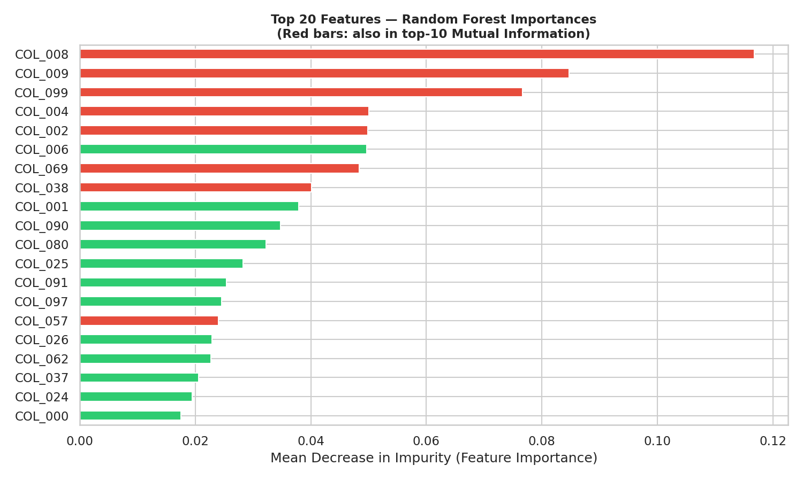
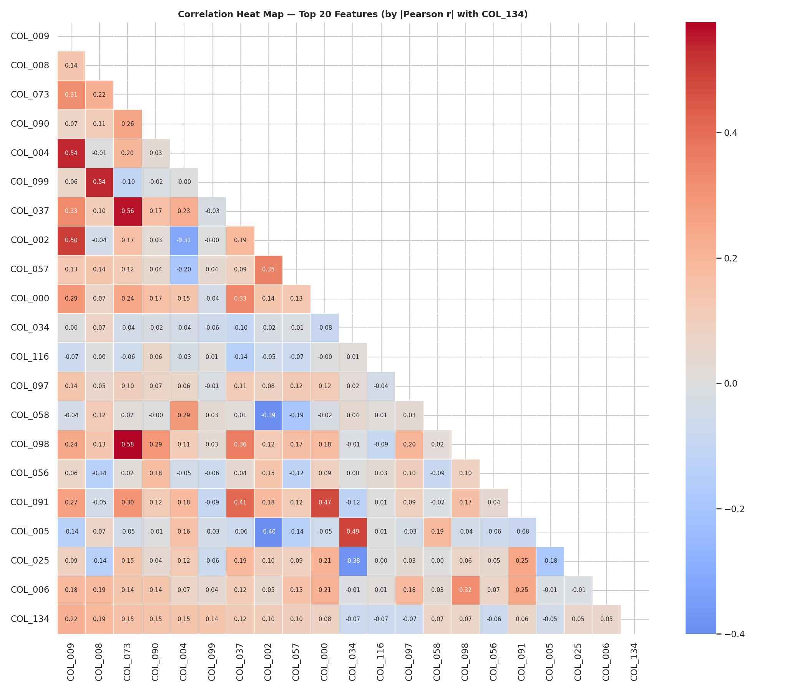
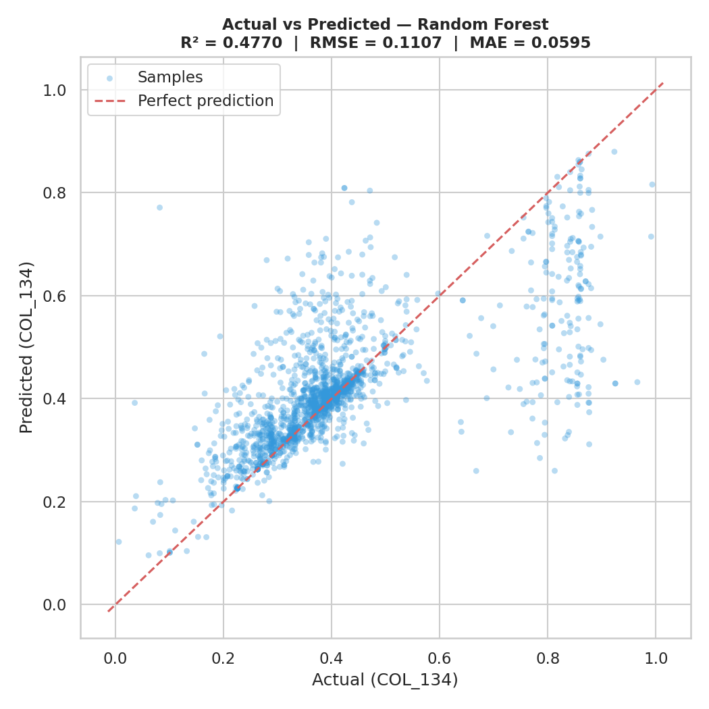
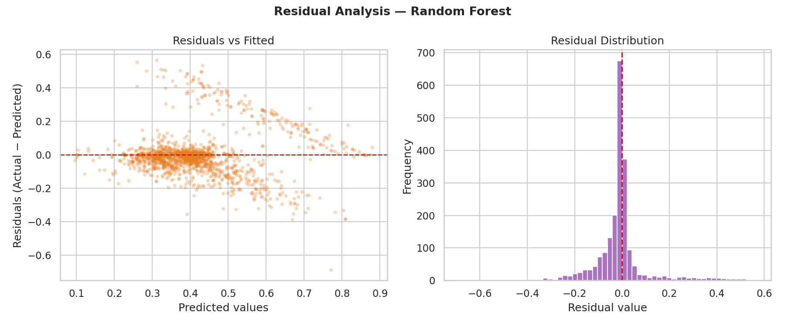
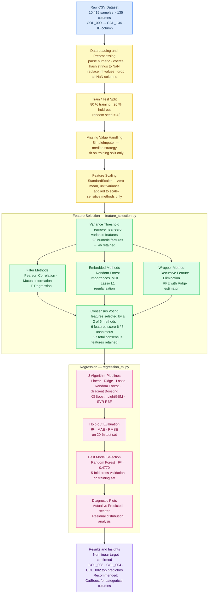

# Unknown Datasets: Feature Selection and Regression

---

## Table of Contents

- [Summary](#summary)
- [Conclusion](#conclusion)
- [Machine Learning Concepts](#machine-learning-concepts)
- [Selected Plots and Reasoning](#selected-plots-and-reasoning)
  - [Feature Importance — Random Forest Importances](#feature-importance--random-forest-importances)
  - [Correlation Heatmap — Pearson r](#correlation-heatmap--pearson-r)
  - [Actual vs Predicted — Regression Quality](#actual-vs-predicted--regression-quality)
  - [Residual Analysis — Model Diagnostics](#residual-analysis--model-diagnostics)
  - [Why These Plots Are the Most Relevant?](#why-these-plots-are-the-most-relevant)
- [EDA Workflow Diagram](#eda-workflow-diagram)
  - [Workflow Stage Descriptions](#workflow-stage-descriptions)
- [Project Structure](#project-structure)
- [Files in This Folder](#files-in-this-folder)
- [Plots Reference Table](#plots-reference-table)

---

## Summary

### Summary of [EXPLORATORY-DATA-ANALYSIS.md](EXPLORATORY-DATA-ANALYSIS.md)

The document describes an exploratory data analysis (EDA) workflow for an anonymized industrial dataset where the goal is to model a continuous target variable (`COL_134`) associated with an elevator component. The dataset is an unknown dataset in the sense that all 135 columns carry anonymous labels (`COL_000`…`COL_134`) with no data dictionary, no unit labels, and no domain description. The file contains 10,415 samples and the target `COL_134` is a normalized physical or performance property of an elevator component constrained to the interval [0, 1].

The exploratory data analysis focuses on:

- understanding unknown datasets with anonymous column semantics,
- preprocessing mixed feature types including continuous normalized values, hash-encoded categorical identifiers, and sparse columns with extreme missingness,
- identifying relevant variables from 135 raw columns through systematic filtering,
- performing feature selection using a consensus of six independent methods,
- and building regression models to predict the continuous target variable `COL_134`.

The workflow demonstrates how exploratory data analysis supports:

- data cleaning (numeric coercion, infinity replacement, missing value imputation),
- feature engineering (variance filtering, scaling, pipeline construction),
- dimensionality reduction (98 numeric features reduced to 46 by variance threshold, then 27 by consensus voting),
- regression modeling (8 algorithms evaluated spanning linear baselines to ensemble trees),
- and evaluation of predictive performance through R², MAE, RMSE, and residual diagnostics.

The dataset represents a real-world machine learning scenario characterized by:

- anonymized column names with no semantic metadata,
- unknown feature-to-target relationship structure (confirmed as strongly non-linear),
- mixed numerical and categorical data (four hash-encoded columns: `COL_011`, `COL_018`, `COL_020`, `COL_043`),
- missing values and sparse optional sensor channels,
- and industrial telemetry-style observations from an elevator component measurement system.

The document emphasizes that exploratory data analysis is essential before model training because:

- unknown datasets often contain noisy variables with near-zero variance that carry no predictive signal,
- irrelevant features degrade model performance and increase training cost,
- and proper feature selection improves regression accuracy and generalization by retaining only the features confirmed as informative by multiple independent methods.

The overall workflow combines:

- Python-based preprocessing with pandas and scikit-learn,
- feature selection techniques from filter, embedded, and wrapper method families,
- statistical analysis including Pearson correlation, Mutual Information, F-regression, and variance thresholding,
- visualization through correlation heatmaps, importance bar charts, regularization path plots, and consensus diagrams,
- and regression-based machine learning pipelines evaluated on a held-out test set.

**The EDA demonstrates that unknown datasets require systematic preprocessing, feature selection, and regression analysis to identify meaningful predictive relationships. The study highlights how visualization, correlation analysis, and machine learning workflows help transform anonymized raw data into interpretable predictive models for real-world engineering applications. Six features — `COL_002`, `COL_004`, `COL_008`, `COL_009`, `COL_057`, `COL_099` — were unanimously selected by all six feature selection methods, and Random Forest achieved the best regression performance with R² = 0.4770, confirming the strongly non-linear character of the target variable.**

> For full methodology, algorithm descriptions, plot walkthroughs, and feature selection and regression theory, see [EXPLORATORY-DATA-ANALYSIS.md](EXPLORATORY-DATA-ANALYSIS.md).

---

## Conclusion

> The following conclusion is drawn from the [Conclusion section of EXPLORATORY-DATA-ANALYSIS.md](EXPLORATORY-DATA-ANALYSIS.md#conclusion).

### Dataset: Known or Unknown?

The dataset (`dataset.csv`) is an **unknown dataset**. It is fully readable and analysable, but the domain context, physical meaning, and column semantics are not disclosed. All 135 measurement columns carry synthetic labels (`COL_000`–`COL_134`) with no data dictionary, no unit specification, and no description of the measured quantities. The target `COL_134` is a normalized continuous physical property of an elevator component constrained to [0, 1] (mean ≈ 0.406, std ≈ 0.157) — its precise meaning (wear index, efficiency ratio, vibration amplitude, load factor) is not disclosed.

### Dataset Characteristics

The dataset contains four distinct feature groups: continuous normalized numeric features (the majority, directly usable after imputation), hash-encoded categorical identifiers coerced to `NaN` and dropped by current preprocessing, sparse columns with extreme missingness (columns `COL_108`–`COL_133` are largely empty, and `COL_114`/`COL_133` are 100 % empty), and mixed-type columns requiring a unified preprocessing pipeline.

### Why Feature Selection Was Applied

With 98 numeric columns and no domain knowledge, a consensus approach across six independent methods was applied — Variance Threshold, Pearson Correlation, Mutual Information, F-Regression, Random Forest Importances, Lasso L1, and RFE with Ridge. The variance threshold reduced 98 features to 46. Consensus voting identified **six features selected unanimously by all six methods** (`COL_002`, `COL_004`, `COL_008`, `COL_009`, `COL_057`, `COL_099`) and 27 features selected by two or more methods. The large gap between Mutual Information scores and Pearson correlations for the top features (`COL_008`: MI = 0.767 vs r = 0.191) confirmed that the dominant relationships are strongly **non-linear**.

### Why Regression Was Applied and Which Algorithms Were Chosen

`COL_134` is a continuous variable — regression is the correct supervised learning paradigm. Eight algorithms spanning the full spectrum from interpretable linear baselines to powerful non-linear ensembles were evaluated: Linear Regression, Ridge, Lasso, Random Forest, Gradient Boosting, XGBoost, LightGBM, and SVR (RBF kernel).

### Results Summary

| Model | R² | MAE | RMSE |
|---|---|---|---|
| Linear Regression | 0.1260 | 0.0907 | 0.1431 |
| Ridge Regression | 0.1282 | 0.0906 | 0.1429 |
| Lasso Regression | 0.1642 | 0.0890 | 0.1399 |
| Gradient Boosting | 0.3218 | 0.0771 | 0.1261 |
| SVR (RBF kernel) | 0.2963 | 0.0881 | 0.1284 |
| LightGBM | 0.4414 | 0.0664 | 0.1144 |
| XGBoost | 0.4535 | 0.0658 | 0.1132 |
| **Random Forest** | **0.4770** | **0.0595** | **0.1107** |

**Random Forest achieved the best R² of 0.4770**, explaining approximately 48 % of the variance in `COL_134`. The large gap between linear models (R² ≈ 0.13–0.16) and ensemble tree models (R² ≈ 0.44–0.48) confirms the non-linear character of the target variable. For this dataset — structured industrial tabular data with anonymous features, non-linear relationships, and mixed column types — **CatBoost, LightGBM, and XGBoost** are the strongest practical algorithms, with CatBoost recommended as the next evaluation step because it can consume hash-encoded categorical columns (`COL_011`, `COL_018`, `COL_020`, `COL_043`) natively without information loss.

---

## Selected Plots and Reasoning

From the eight plots generated by [`feature_selection.py`](feature_selection.py) and [`regression_ml.py`](regression_ml.py), the four most important for understanding the full EDA workflow on this unknown dataset are selected below. Full descriptions of all eight plots, including how to read them and their statistical significance, are documented in [EXPLORATORY-DATA-ANALYSIS.md — Diagrams and Plots](EXPLORATORY-DATA-ANALYSIS.md#diagrams-and-plots).

---

### Feature Importance — Random Forest Importances



**Generated by:** [`feature_selection.py`](feature_selection.py)

**Why this plot is the most important for an unknown dataset:**

Random Forest Feature Importances (Mean Decrease in Impurity — MDI) provide a model-driven, non-linear measure of which variables most strongly influence `COL_134`. Because the dataset is anonymous with no domain labels, this visualization is one of the few ways to establish which columns carry genuine predictive signal without any prior knowledge of the data.

- `COL_008` (MDI ≈ 0.117), `COL_009` (MDI ≈ 0.085), and `COL_099` (MDI ≈ 0.078) dominate the ranking, confirming they drive the largest share of prediction accuracy across all 200 trees.
- Red bars mark features that also rank in the top-10 by Mutual Information — cross-method agreement between two independent non-parametric methods adds high confidence that these features are genuinely informative rather than artefacts of a single algorithm.
- Green bars reveal features important to the ensemble through complex interaction effects that univariate MI estimation cannot detect.
- The plot directly guides dimensionality reduction: features below the mean importance threshold can be safely discarded, reducing model complexity and training cost.

This is the single most actionable visualization for identifying which variables to include in downstream regression models when no semantic metadata is available.

---

### Correlation Heatmap — Pearson r



**Generated by:** [`feature_selection.py`](feature_selection.py)

**Why this plot is essential for exploratory analysis:**

The Pearson correlation heatmap maps pairwise linear relationships between the top-20 features and the target `COL_134`, providing twoessential types of insight simultaneously.

- **Direct target relevance:** The bottom row shows the Pearson r of each feature with `COL_134`. The highest values are `COL_009` (r ≈ 0.22) and `COL_008` (r ≈ 0.19) — deliberately low values that, when compared with the Mutual Information scores for the same features (0.477 and 0.767 respectively), provide direct evidence of **strongly non-linear relationships**. This contrast is the key diagnostic justifying the choice of ensemble tree models over linear regression.
- **Multicollinearity detection:** Off-diagonal clusters reveal redundant feature pairs — notably `COL_004` ↔ `COL_008` (r = 0.54) and `COL_037` ↔ `COL_073` (r = 0.56) — that carry overlapping information. Identifying redundancy early prevents overfitting in linear models and guides which features can be pruned without information loss.

In anonymized datasets, this heatmap provides one of the few interpretable ways to understand inter-feature structure before any model training is performed.

---

### Actual vs Predicted — Regression Quality



**Generated by:** [`regression_ml.py`](regression_ml.py)

**Why this plot validates the full analytical pipeline:**

The Actual vs Predicted scatter plot for the best model (Random Forest, R² = 0.4770, RMSE = 0.1107, MAE = 0.0595) directly connects the feature selection stage to the regression outcome, demonstrating whether the selected features actually enable accurate prediction of `COL_134`.

- The diagonal red dashed perfect-prediction line provides an immediate visual reference: points tightly clustered along the diagonal indicate strong model performance, while scatter reveals prediction uncertainty.
- The tight cluster in the 0.2–0.5 range (where most elevator component measurements fall, mean ≈ 0.41) confirms the model performs best in the central distribution, capturing the dominant operating regime.
- The increased spread at high values (~0.8) reveals Random Forest's mean-regression tendency — averaging 200 tree outputs pulls extreme predictions toward the training distribution centre, a characteristic limitation of bagging ensembles on tails.
- This plot reveals bias, variance, and prediction spread in a single view, showing that the feature selection workflow successfully identified variables that enable meaningful regression despite the complete absence of domain knowledge.

This visualization is the primary evidence that the exploratory analysis produced a practically useful predictive model.

---

### Residual Analysis — Model Diagnostics



**Generated by:** [`regression_ml.py`](regression_ml.py)

**Why residual analysis plays a key role in industrial regression workflows:**

The two-panel Residual Analysis plot (Residuals vs Fitted values on the left, Residual Distribution on the right) evaluates whether the regression model satisfies statistical quality assumptions and reveals systematic prediction errors that the R² metric alone cannot expose.

- **Left panel — Residuals vs Fitted:** The diagonal fan-like pattern (positive residuals at low predictions, negative residuals at high predictions) confirms Random Forest's mean-regression tendency and reveals the model's structural limitation: it systematically underpredicts very low values of `COL_134` and overpredicts very high values. This is consistent with the non-linear, asymmetrically distributed target confirmed during feature selection.
- **Right panel — Residual Distribution:** The approximately bell-shaped distribution centred near zero confirms the model is overall unbiased across the bulk of the test set. The left skew and heavy left tail (large negative residuals) correspond to the overprediction at the high end of the target distribution visible in the left panel.
- Together, these diagnostics confirm that the model has no gross systematic bias while identifying exactly where prediction quality degrades — information essential for deciding whether further feature engineering, CatBoost with native categorical support, or hyperparameter tuning would yield the greatest improvement.

Residual analysis is especially valuable for industrial telemetry datasets because predictive maintenance systems often contain hidden operational states that produce non-uniform error distributions.

---

### Why These Plots Are the Most Relevant?

These plots are the most important because together they trace the complete machine learning workflow from raw variable identification through to validated predictive performance.

| Plot | File | Script | Purpose |
|---|---|---|---|
| Random Forest Importances | [fs_random_forest_importances.png](plots/fs_random_forest_importances.png) | [feature_selection.py](feature_selection.py) | Identifies which variables most strongly drive prediction of `COL_134` using a non-linear embedded method |
| Correlation Heatmap | [fs_correlation_heatmap.png](plots/fs_correlation_heatmap.png) | [feature_selection.py](feature_selection.py) | Reveals linear feature-target relationships, exposes multicollinearity, and demonstrates the non-linear character of the dataset by contrast with MI scores |
| Actual vs Predicted | [regression_predictions.png](plots/regression_predictions.png) | [regression_ml.py](regression_ml.py) | Evaluates regression accuracy visually and confirms that the selected features enable meaningful prediction |
| Residual Analysis | [regression_residuals.png](plots/regression_residuals.png) | [regression_ml.py](regression_ml.py) | Diagnoses model behavior, detects systematic prediction errors, and validates statistical assumptions |

Together they explain how features were selected, how the regression model was trained, and how predictive quality was validated — covering the entire analytical pipeline:

1. Explore anonymous variables
2. Identify relevant predictors via non-parametric importance measures
3. Remove noisy and redundant features
4. Train regression models across the full algorithmic spectrum
5. Evaluate prediction quality on the held-out test set
6. Interpret and diagnose model behavior through residual analysis

These visualizations are especially valuable for unknown datasets because they provide interpretable insight into data structure and model behavior without requiring any domain knowledge about the elevator component or its measured properties.

---

## EDA Workflow Diagram



---

### Workflow Stage Descriptions

**Raw CSV Dataset** — The input is `dataset.csv`, a semicolon-separated file with 10,415 rows and 136 columns (135 anonymous measurement columns `COL_000`–`COL_134` plus an `ID` column). The target variable is `COL_134`, a continuous normalized property of an elevator component with values in [0, 1].

**Data Loading and Preprocessing** — The file is loaded with `pandas.read_csv(sep=';')`. The `ID` column is dropped immediately. All columns are cast to numeric using `pd.to_numeric(errors='coerce')`, which silently converts hash-encoded categorical strings to `NaN`. Columns that are entirely `NaN` after coercion are dropped, and infinity values are replaced with `NaN`.

**Train / Test Split** — The dataset is divided into 80 % training (8,332 samples) and 20 % hold-out test (2,083 samples) sets before any feature selection or scaling is performed. This prevents data leakage — the most common source of inflated validation accuracy.

**Missing Value Handling** — Missing values in the training set are filled with the column median using `SimpleImputer(strategy='median')`, fit on the training split only and applied to both splits. Median imputation is robust to the skewed distributions typical of sensor telemetry data.

**Feature Scaling** — `StandardScaler` transforms features to zero mean and unit variance. Scaling is applied only to scale-sensitive methods (Lasso, RFE with Ridge, SVR). Tree-based methods (Random Forest, XGBoost, LightGBM, Gradient Boosting) are scale-invariant and do not require this step.

**Variance Threshold** — The cheapest and first filter removes features whose variance falls below 0.01. Features with near-zero variance take almost the same value for every sample and carry no discriminatory power. This step reduces 98 numeric features to 46 retained features.

**Filter Methods** — Three independent statistical filters rank the 46 remaining features by their relationship with `COL_134`: Pearson correlation captures direct linear associations; Mutual Information regression captures both linear and non-linear dependencies using a k-NN entropy estimator (no linearity assumption required); F-Regression applies a univariate ANOVA F-test. Each nominates its top 20 features.

**Embedded Methods** — Two model-driven methods provide feature importance from trained models: Random Forest (200 trees) computes Mean Decrease in Impurity across all trees; Lasso L1 regression shrinks uninformative coefficients to exactly zero, simultaneously performing feature selection and regression. Each nominates its top 20 features.

**Wrapper Method** — Recursive Feature Elimination (RFE) with a Ridge estimator iteratively trains the model, ranks features by coefficient magnitude, removes the weakest feature, and repeats. This wrapper approach is more computationally expensive but confirms linearly relevant features via the trained model's internal ranking.

**Consensus Voting** — Each of the six methods independently nominates its top-20 features. A vote count from 0 to 6 is assigned to each feature. Features selected by at least 2 independent methods (27 total) form the consensus set. Six features — `COL_002`, `COL_004`, `COL_008`, `COL_009`, `COL_057`, `COL_099` — achieved a perfect score of 6/6, meaning every method independently agreed they are among the most predictive variables for `COL_134`.

**8 Algorithm Pipelines** — [`regression_ml.py`](regression_ml.py) builds a scikit-learn `Pipeline` for each of eight algorithms. Linear and SVR models use `SimpleImputer → StandardScaler → model`; tree-based models use `SimpleImputer → model`. All eight pipelines are trained on the 80 % training split.

**Hold-out Evaluation** — Each trained pipeline predicts on the held-out 20 % test set. R² (proportion of variance explained), MAE (mean absolute error), and RMSE (root mean squared error) are computed for every model, providing a fair comparison on unseen data.

**Best Model Selection** — The algorithm with the highest R² on the test set is automatically identified. Random Forest achieves R² = 0.4770. Five-fold cross-validation is then run on the training split of the winning model to confirm the result generalises and is not a test-set-specific artefact.

**Diagnostic Plots** — Three diagnostic charts are saved: a bar chart comparing all 8 models by R², an Actual vs Predicted scatter plot for the best model, and a two-panel residual analysis plot (Residuals vs Fitted values and Residual Distribution).

**Results and Insights** — The large gap between linear models (R² ≈ 0.13–0.16) and ensemble tree models (R² ≈ 0.44–0.48) confirms the non-linear character of `COL_134`. The top consensus features (`COL_008`, `COL_004`, `COL_002`) exhibit Mutual Information scores 3–4× larger than their Pearson correlations, providing direct evidence of non-linear feature-to-target relationships. CatBoost is recommended as the next evaluation step for its native handling of the four hash-encoded categorical columns currently discarded by the preprocessing pipeline.

> For detailed descriptions of all feature selection methods, algorithm theory, and plot interpretation, see [EXPLORATORY-DATA-ANALYSIS.md](EXPLORATORY-DATA-ANALYSIS.md).

---

## Machine Learning Concepts

Brief definitions of the key machine learning terms used throughout this project, in the context of the vocabulary of this field.

**Pearson Correlation** — a statistical measure of the *linear* relationship between two variables, expressed as a value between −1 and +1. In feature selection, the Pearson r between each feature and the target variable (`COL_134`) ranks how strongly a feature is linearly associated with what the model must predict. A low Pearson r combined with a high Mutual Information score for the same feature is direct evidence of a *non-linear* relationship — the key diagnostic finding in this project.

**Multicollinearity** — a condition where two or more input features are strongly correlated with each other (not just with the target). Multicollinear features carry overlapping information: including both adds no new predictive signal but inflates model complexity and, in linear models, destabilises coefficient estimates. Detected via the off-diagonal blocks of the Pearson correlation heatmap (e.g., `COL_004` ↔ `COL_008`, r = 0.54).

**Feature Selection** — the process of identifying and retaining only the features that carry genuine predictive signal for the target variable, discarding noisy, redundant, or near-zero-variance columns. Reduces dimensionality, lowers training cost, and improves model generalisation. Applied here through a consensus of six independent methods from three families: filter methods, embedded methods, and wrapper methods.

**Regression** — a supervised machine learning task where the model learns a mapping from input features to a *continuous* numeric output. The model minimises a prediction error (loss function) on training samples so that it can generalise to unseen data. Distinct from classification, which predicts discrete class labels. Applied here because `COL_134` is a continuous normalised value in [0, 1].

**Residual Analysis** — examination of residuals (the differences between actual target values and model predictions: $e_i = y_i - \hat{y}_i$) after model training. Residuals should be approximately normally distributed, centred near zero, and show no systematic pattern against fitted values. A fan-shaped or structured residual plot indicates the model is failing to capture a relationship present in the data. Residual analysis is the primary tool for diagnosing whether a model satisfies statistical validity assumptions.

**Variance Threshold** — the simplest and cheapest feature filter. Features whose values vary very little across samples (variance below a threshold) carry almost no discriminatory information — they look nearly identical for every observation and cannot help a model distinguish between different target values. Applied as the first step to reduce 98 numeric features to 46 before any statistical or model-based method is run.

**Imputation** — the process of replacing missing values in a dataset with substituted values so that algorithms that cannot handle `NaN` entries can be trained. The strategy chosen determines what substitute value is used. *Median imputation* replaces each missing entry $x_{ij}$ with the median of all observed values in that column: $\tilde{x}_{ij} = \text{median}\bigl(\{x_{kj} : x_{kj} \text{ is observed}\}\bigr)$. Median is preferred over mean for sensor and industrial telemetry data because it is robust to skewed distributions and outliers — a single extreme reading does not shift the fill value. In this project `SimpleImputer(strategy='median')` is fit on the training split only and then applied to both splits, preventing any information from the test set from leaking into the training process.

**Lasso Regression (L1 Regularisation)** — a linear regression variant that adds the sum of the *absolute values* of all model coefficients as a penalty term to the loss function: $\text{Loss} = \text{MSE} + \alpha \sum |w_i|$. The L1 penalty drives the least useful coefficients to *exactly zero*, simultaneously performing regression and feature selection. The regularisation strength $\alpha$ controls how many features survive: at high $\alpha$, only the most predictive features retain non-zero coefficients. Visualised in `fs_lasso_path.png`.

**Ridge Regression (L2 Regularisation)** — a linear regression variant that adds the sum of the *squared values* of all coefficients as a penalty: $\text{Loss} = \text{MSE} + \alpha \sum w_i^2$. Unlike Lasso, Ridge shrinks coefficients toward zero but rarely to exactly zero — all features are retained with constrained influence. Ridge is particularly effective against multicollinearity because it distributes weight across correlated features rather than arbitrarily zeroing most of them. Used as the base estimator in the RFE wrapper method.

**Random Forest** — an ensemble of decision trees trained independently on random bootstrap samples of the training data, using a random subset of features at each split (bagging). The final prediction is the average of all tree outputs. Averaging across many decorrelated trees reduces variance and prevents the overfitting that individual deep decision trees suffer. Feature importances (Mean Decrease in Impurity, MDI) measure each feature's average contribution to reducing prediction error across all trees and all splits. Best-performing model in this project: R² = 0.4770.

**Unknown Dataset** — a dataset where the domain context, column semantics, and physical meaning of the measured quantities are not disclosed. Column labels are synthetic (e.g., `COL_000`–`COL_134`) with no data dictionary, unit labels, or description of what is being measured. Analysis must rely entirely on the statistical properties of the data — variance, correlations, mutual information, model-based importances — rather than domain knowledge. This project is a case study in systematic EDA for unknown datasets.

**Gradient Boosting** — an ensemble method that builds a sequence of decision trees *additionally*, where each new tree learns to correct the residual errors left by all previous trees combined. Unlike Random Forest, which trains trees in parallel on resampled data, Gradient Boosting trains trees sequentially with each tree targeting the residuals of the current ensemble. This makes it highly accurate on structured tabular data (R² = 0.3218 here, without tuning) but more sensitive to overfitting than bagging ensembles. XGBoost and LightGBM are optimised, production-grade implementations of gradient boosting.

**R² (Coefficient of Determination)** — the proportion of the total variance in the target variable that is explained by the model: $R^2 = 1 - \frac{\sum(y_i - \hat{y}_i)^2}{\sum(y_i - \bar{y})^2}$. R² = 1.0 means perfect prediction; R² = 0.0 means the model performs no better than always predicting the training mean; negative R² means it performs worse than the mean baseline. The primary model ranking metric in this project.

**MAE (Mean Absolute Error)** — the average of the absolute differences between actual and predicted values: $\text{MAE} = \frac{1}{n}\sum|y_i - \hat{y}_i|$. MAE is expressed in the same units as the target variable and is robust to outliers (large individual errors do not dominate). Lower is better. Best model MAE = 0.0595.

**RMSE (Root Mean Squared Error)** — the square root of the mean of the squared prediction errors: $\text{RMSE} = \sqrt{\frac{1}{n}\sum(y_i - \hat{y}_i)^2}$. Because errors are squared before averaging, RMSE penalises large individual errors more heavily than MAE. Also expressed in the same units as the target. Lower is better. Best model RMSE = 0.1107.

---

## Project Structure

```
◈ Datasets/
▸ dataset.csv                        Semicolon-delimited dataset (10,415 × 136)
▸ feature_selection.py               Feature selection script (7 methods, 5 plots)
▸ regression_ml.py                   Regression script (8 algorithms, 3 plots)
▸ requirements.txt                   Python package requirements
▸ EXPLORATORY-DATA-ANALYSIS.md       Full EDA documentation and methodology
▸ README.md                          Project summary and quick reference
▪ plots/
  ▪ fs_correlation_heatmap.png       Pearson r heatmap — top-20 feature correlations
  ▪ fs_lasso_path.png                Lasso regularisation coefficient shrinkage paths
  ▪ fs_method_overlap.png            Consensus bar chart — features ranked by method agreement
  ▪ fs_mutual_info.png               Mutual Information scores — top-20 features (bar chart)
  ▪ fs_random_forest_importances.png Random Forest MDI feature importances (bar chart)
  ▪ regression_model_comparison.png  R² comparison across 8 regression algorithms
  ▪ regression_predictions.png       Actual vs Predicted scatter — best model (Random Forest)
  ▪ regression_residuals.png         Residual distribution — best model (Random Forest)
▸ .gitignore                         Git ignore rules (excludes venv, CSV files)
▸ venv/                              Python virtual environment (git-ignored)
```

---

## Files in This Folder

| File | Description | Git |
|---|---|---|
| `dataset.csv` | Semicolon-delimited CSV — 10,415 samples × 136 columns (`COL_000`…`COL_134` + `ID`). Continuous target: `COL_134` ∈ [0, 1]. | Excluded — listed in `.gitignore` |
| [feature_selection.py](feature_selection.py) | Applies 7 feature selection methods (Variance Threshold, Pearson, Mutual Information, F-Regression, Random Forest, Lasso, RFE) and saves 5 diagnostic plots to `plots/`. Runtime: 60–120 s. | Tracked |
| [regression_ml.py](regression_ml.py) | Trains 8 regression algorithms, evaluates on 20 % hold-out test set, runs 5-fold cross-validation on the best model, and saves 3 diagnostic plots to `plots/`. Runtime: 15–30 s. | Tracked |
| [requirements.txt](requirements.txt) | Python package requirements: `scikit-learn`, `pandas`, `numpy`, `matplotlib`, `seaborn`, `xgboost`, `lightgbm`. | Tracked |
| [EXPLORATORY-DATA-ANALYSIS.md](EXPLORATORY-DATA-ANALYSIS.md) | Full EDA documentation — methodology, feature selection theory, algorithm descriptions, plot walkthroughs, and conclusion. | Tracked |
| [README.md](README.md) | Project summary, selected plots with reasoning, EDA workflow diagram, and reference tables (this file). | Tracked |
| [.gitignore](.gitignore) | Excludes `venv/`, `dataset.csv`, and generated artefacts from version control. | Tracked |
| `venv/` | Python virtual environment created with `python3 -m venv venv`. Contains all installed packages from `requirements.txt`. | Excluded — listed in `.gitignore` |
| `plots/` | Directory containing 8 PNG plots generated by [`feature_selection.py`](feature_selection.py) (5 plots) and [`regression_ml.py`](regression_ml.py) (3 plots). | Tracked |

---

## Plots Reference Table

All plots are generated automatically by running [`feature_selection.py`](feature_selection.py) and [`regression_ml.py`](regression_ml.py). Detailed descriptions of each plot, including how to read them and their statistical significance, are documented in [EXPLORATORY-DATA-ANALYSIS.md — Diagrams and Plots](EXPLORATORY-DATA-ANALYSIS.md#diagrams-and-plots).

| File | Script | Plot Type | Description |
|---|---|---|---|
| [fs_correlation_heatmap.png](plots/fs_correlation_heatmap.png) | [feature_selection.py](feature_selection.py) | Heatmap | Pearson r pairwise correlation matrix for the top-20 features ranked by absolute correlation with `COL_134`. Reveals linear feature-target relationships and multicollinearity between input variables. The bottom row shows direct r values with the target. |
| [fs_lasso_path.png](plots/fs_lasso_path.png) | [feature_selection.py](feature_selection.py) | Line chart | Lasso regularisation path showing how each feature's coefficient shrinks to exactly zero as the L1 penalty strength α increases from 10⁻⁴ to 10¹. Features that reach zero first are least important; those surviving at high α carry the strongest linear signal. |
| [fs_method_overlap.png](plots/fs_method_overlap.png) | [feature_selection.py](feature_selection.py) | Horizontal bar chart | Feature consensus ranking — each bar shows how many of the 6 independent selection methods included that feature in their top-20 list. Six features score 6/6 (unanimously selected). Colour gradient encodes vote tier: dark navy = 6 votes, purple = 5 votes, red-orange = 4 votes, gold = 3 votes. |
| [fs_mutual_info.png](plots/fs_mutual_info.png) | [feature_selection.py](feature_selection.py) | Horizontal bar chart | Top-20 features ranked by Mutual Information regression score with `COL_134`. Red bars are also in the top-10 Random Forest importances (cross-method agreement). MI captures both linear and non-linear dependencies; the large gap between MI scores and Pearson r for the same features confirms non-linear relationships. |
| [fs_random_forest_importances.png](plots/fs_random_forest_importances.png) | [feature_selection.py](feature_selection.py) | Horizontal bar chart | Random Forest Mean Decrease in Impurity (MDI) importances for the top-20 features, averaged across 200 trees. Red bars also rank in the top-10 by Mutual Information. Green bars contribute through interaction effects not captured by univariate MI. `COL_008`, `COL_009`, `COL_099` dominate. |
| [regression_model_comparison.png](plots/regression_model_comparison.png) | [regression_ml.py](regression_ml.py) | Horizontal bar chart | R² scores of all 8 regression algorithms on the 20 % hold-out test set. The green bar highlights the best model (Random Forest, R² = 0.4770). The stark gap between linear models (~0.13) and ensemble trees (~0.44–0.48) visually confirms the non-linear character of `COL_134`. |
| [regression_predictions.png](plots/regression_predictions.png) | [regression_ml.py](regression_ml.py) | Scatter plot | Actual vs Predicted values for the best model (Random Forest) on the 2,083 test samples. The red dashed diagonal is the perfect-prediction reference line. Tight scatter along the diagonal in the 0.2–0.5 range demonstrates solid model performance in the central target distribution. |
| [regression_residuals.png](plots/regression_residuals.png) | [regression_ml.py](regression_ml.py) | Two-panel chart | Left: Residuals vs Fitted values — reveals a diagonal fan pattern consistent with Random Forest mean-regression tendency (underpredicts low values, overpredicts high values). Right: Residual Distribution histogram — approximately bell-shaped and centred near zero, confirming overall model bias is negligible. |