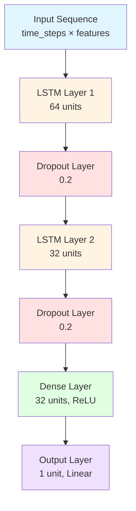
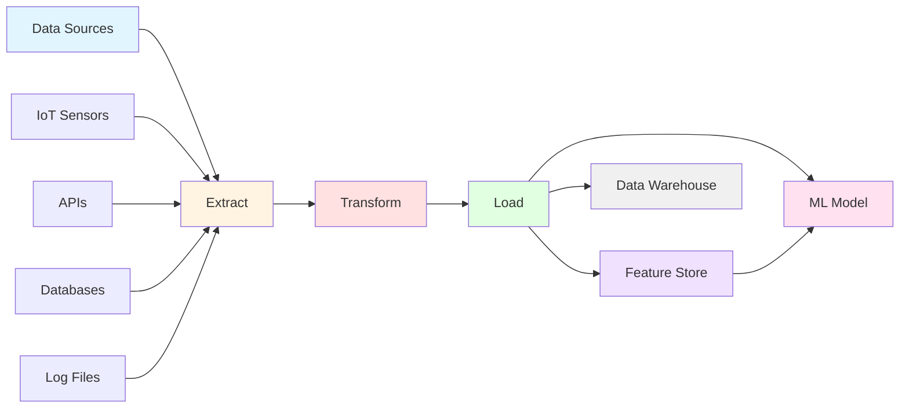
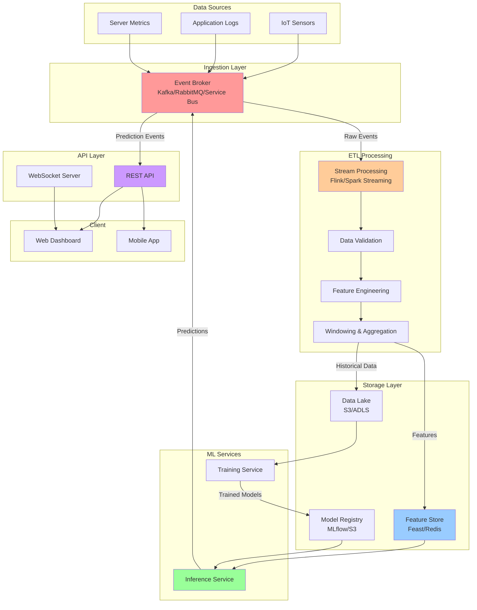
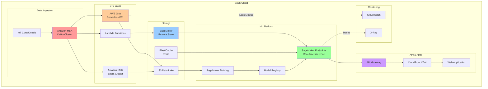
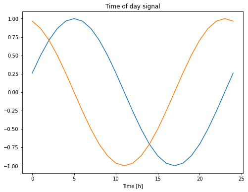

# Deep Learning in Microservices

This document presents an end-to-end workflow for building deep learning applications for time-series analysis. It explores event-driven ETL pipelines, recurrent neural networks (RNNs), and long short-term memory (LSTM) architectures, together with deployment strategies for on-premises environments and cloud platforms such as Amazon Web Services (AWS).

## Table of Contents

- [Deep Learning in Microservices](#deep-learning-in-microservices)
  - [Table of Contents](#table-of-contents)
  - [Project Structure](#project-structure)
  - [Prerequisites](#prerequisites)
    - [Virtual Environment Setup](#virtual-environment-setup)
    - [Install Required Dependencies](#install-required-dependencies)
  - [Time Series Forecasting](#time-series-forecasting)
  - [Recurrent Neural Networks (RNN)](#recurrent-neural-networks-rnn)
    - [Long Short Term Memory (LSTM)](#long-short-term-memory-lstm)
    - [LSTM Architecture](#lstm-architecture)
  - [Event-Driven Architecture and Deep Learning](#event-driven-architecture-and-deep-learning)
    - [Message Brokers Overview](#message-brokers-overview)
    - [Apache Kafka](#apache-kafka)
    - [RabbitMQ](#rabbitmq)
    - [Azure Service Bus](#azure-service-bus)
    - [Apache Kafka vs RabbitMQ](#apache-kafka-vs-rabbitmq)
  - [ETL Pipeline for Deep Learning](#etl-pipeline-for-deep-learning)
    - [Understanding ETL Basics](#understanding-etl-basics)
    - [ETL vs ELT Pipelines](#etl-vs-elt-pipelines)
    - [ETL Pipeline Architecture](#etl-pipeline-architecture)
    - [Extract Phase](#extract-phase)
    - [Transform Phase](#transform-phase)
    - [Load Phase](#load-phase)
  - [Event-Driven ETL Flow for Time-Series ML](#event-driven-etl-flow-for-time-series-ml)
    - [System Architecture](#system-architecture)
    - [Streaming Logic and Moving Averages](#streaming-logic-and-moving-averages)
  - [Deployment: On-Premises vs Amazon AWS](#deployment-on-premises-vs-amazon-aws)
    - [On-Premises Deployment](#on-premises-deployment)
    - [Amazon AWS Deployment](#amazon-aws-deployment)
    - [Comparison Table](#comparison-table)
  - [Backend Server and Infrastructure Requirements](#backend-server-and-infrastructure-requirements)
    - [Data Broker Layer (Kafka Cluster)](#data-broker-layer-kafka-cluster)
    - [Computing Layer (ETL and Inference Workers)](#computing-layer-etl-and-inference-workers)
    - [Storage and Feature Store Layer](#storage-and-feature-store-layer)
  - [Microservices Implementation](#microservices-implementation)
    - [Project Structure for Microservices](#project-structure-for-microservices)
    - [Docker Configuration](#docker-configuration)
    - [Running the Complete System](#running-the-complete-system)
  - [Sample Code Implementation](#sample-code-implementation)
    - [ETL Microservice](#etl-microservice)
    - [ML Inference Microservice](#ml-inference-microservice)
    - [LSTM Model Training](#lstm-model-training)
  - [Best Practices and Production Tips](#best-practices-and-production-tips)
  - [MQ Telemetry Transport (MQTT)](#mq-telemetry-transport-mqtt)
  - [References](#references)

## Project Structure

```
DeepLearning/
│
├── 📄 README.md                          # This documentation file
├── 📄 requirements.txt                   # Python dependencies
├── 📄 .env.example                       # Environment variables template
│
├── 📁 src/                               # Source code directory
│   ├── 📁 etl_service/                   # ETL microservice
│   │   ├── 📄 __init__.py
│   │   ├── 📄 kafka_etl_worker.py       # Kafka-based ETL worker
│   │   └── 📄 transform.py              # Data transformation logic
│   │
│   ├── 📁 inference_service/             # ML Inference microservice
│   │   ├── 📄 __init__.py
│   │   ├── 📄 kafka_ml_inference.py     # Real-time inference worker
│   │   └── 📄 model_loader.py           # Model loading utilities
│   │
│   ├── 📁 models/                        # Trained ML models
│   │   ├── 📄 lstm_model.py             # LSTM model definition
│   │   └── 📄 train_model.py            # Model training script
│   │
│   └── 📁 utils/                         # Utility functions
│       ├── 📄 __init__.py
│       ├── 📄 config.py                 # Configuration management
│       └── 📄 logger.py                 # Logging utilities
│
├── 📁 docker/                            # Docker configuration
│   ├── 📄 Dockerfile.etl                # ETL service Dockerfile
│   ├── 📄 Dockerfile.inference          # Inference service Dockerfile
│   ├── 📄 docker-compose.yml            # Multi-container orchestration
│   └── 📄 docker-compose.aws.yml        # AWS-specific configuration
│
├── 📁 kubernetes/                        # Kubernetes manifests (optional)
│   ├── 📄 etl-deployment.yaml
│   ├── 📄 inference-deployment.yaml
│   └── 📄 kafka-deployment.yaml
│
├── 📁 tests/                             # Unit and integration tests
│   ├── 📄 test_etl.py
│   ├── 📄 test_inference.py
│   └── 📄 test_model.py
│
├── 📁 data/                              # Sample data and datasets
│   ├── 📄 sample_timeseries.csv
│   └── 📄 test_data.json
│
├── 📁 notebooks/                         # Jupyter notebooks
│   └── 📄 exploratory_analysis.ipynb
│
└── 📁 scripts/                           # Utility scripts
    ├── 📄 setup_env.sh                  # Environment setup
    ├── 📄 start_kafka.sh                # Start Kafka locally
    └── 📄 train_model.sh                # Model training script
```

## Prerequisites

### Virtual Environment Setup

Before running any commands or scripts, create and activate a Python virtual environment to isolate dependencies.

**On Linux/macOS:**

```bash
# Navigate to project directory
cd /home/laptop/EXERCISES/MISCELLANEOUS/miscellaneous/DeepLearning

# Create virtual environment
python3 -m venv venv

# Activate virtual environment
source venv/bin/activate

# Verify activation (should show path to venv)
which python
```

**On Windows:**

```powershell
# Create virtual environment
python -m venv venv

# Activate virtual environment
.\venv\Scripts\activate

# Verify activation
where python
```

### Install Required Dependencies

After activating the virtual environment, install all required libraries:

```bash
# Upgrade pip
pip install --upgrade pip

# Install core dependencies
pip install tensorflow==2.15.0
pip install keras==2.15.0
pip install numpy==1.24.3
pip install pandas==2.0.3
pip install scikit-learn==1.3.0

# Install Kafka client
pip install confluent-kafka==2.3.0

# Install additional event-driven libraries
pip install pika==1.3.2              # RabbitMQ client
pip install azure-servicebus==7.11.4  # Azure Service Bus client

# Install utilities
pip install python-dotenv==1.0.0
pip install requests==2.31.0

# Save dependencies
pip freeze > requirements.txt
```

**For development and testing:**

```bash
pip install pytest==7.4.3
pip install jupyter==1.0.0
pip install matplotlib==3.7.2
pip install seaborn==0.12.2
```

## Time Series Forecasting

Time series forecasting is the process of predicting future values based on previously observed values over time intervals. The sequence of values is critically important with time-series data, as temporal dependencies carry predictive information.

**Key Concepts:**

- **Temporal Dependencies**: Learning to store information over extended time intervals via recurrent backpropagation requires significant computational resources and training time.
- **Forecasting Horizon**: The graph below visualizes using values from time steps $t-n$ to $t-1$ to predict the target value at time $t+1$.
- **Open Loop Forecasting**: Predicts the next time step in a sequence using only the input data, without feeding predictions back as inputs.
- **Closed Loop Forecasting**: Uses previous predictions as inputs for subsequent predictions, suitable for multi-step ahead forecasting.

You can use a Long Short Term Memory (LSTM) network to forecast subsequent values of a time series or sequence using previous time steps as input. LSTM networks excel at capturing long-term dependencies in sequential data.

## Recurrent Neural Networks (RNN)

Recurrent Neural Networks (RNNs) are a class of neural networks specifically designed for modeling sequence data such as time series, natural language, and audio signals.

**How RNNs Work:**

1. **Forward Pass**: The neural network performs a forward pass and computes prediction errors to obtain loss values on the training dataset and validation set.
2. **Gradient Descent**: Refers to the search for a global minimum by evaluating partial derivatives of the loss function with respect to model weights.
3. **Backpropagation**: The network calculates partial derivatives of the error with respect to the weights and adjusts them accordingly.
4. **Weight Updates**: The RNN updates weights (up or down) based on partial derivatives to minimize the loss function.
5. **Loss Function**: The loss or error measures the prediction error of the network as a numerical value.

**Data Preparation:**

- Split data into training, validation, and test sets (typically 70%/15%/15% or 80%/10%/10%).
- **Normalization**: Scale features before training to improve convergence (e.g., Min-Max scaling or Z-score normalization).
- **Windowing**: Convert consecutive inputs into windows of fixed size for input and label sequences.

**RNN Layer**: Uses a for loop to iterate over the timesteps of a sequence, maintaining hidden state across time steps.

### Long Short Term Memory (LSTM)

Long Short Term Memory (LSTM) is a specialized recurrent neural network architecture trained using Backpropagation Through Time (BPTT). LSTMs address the vanishing gradient problem that affects traditional RNNs by introducing memory cells and gating mechanisms.

**LSTM Capabilities:**

- Train deep neural networks to predict numeric values from time-series data.
- Learn long-term dependencies between time steps of sequence data.
- At each time step of the input sequence, the LSTM network learns to predict the value of the next time step.
- For multi-step predictions, use the previous prediction as input to forecast subsequent time steps iteratively.

**LSTM Components:**

- **Sequence Input Layer**: Inputs time-series data into the network with shape `(batch_size, time_steps, features)`.
- **LSTM Layer**: Contains memory cells with forget gate, input gate, and output gate to selectively retain or discard information.
- **Dense Layer**: Fully connected layer for final predictions.

### LSTM Architecture



LSTMs and RNNs are a subset of deep learning. The LSTM architecture shown has multiple layers:

- LSTM Layer 1 (64 units)
- Dropout Layer
- LSTM Layer 2 (32 units)
- Dropout Layer
- Dense Layer (32 units)
- Output Layer

## Event-Driven Architecture and Deep Learning

Event-driven architectures enable building scalable, resilient, and fault-tolerant systems by decoupling services through asynchronous message passing. Instead of relying on synchronous API calls (REST or gRPC) that tightly couple services, producers and consumers interact via message brokers.

**Core Concepts:**

- **Pub/Sub Model**: Publishers emit events without knowing who will consume them; subscribers receive events they are interested in.
- **Decoupling**: The order service simply publishes an "Order Placed" event to a central hub without waiting for downstream services.
- **Asynchronous Processing**: Producers don't wait for consumers, enabling independent scaling and fault isolation.
- **Backpressure Handling**: Message brokers buffer events when consumers are slower than producers.

**Message Broker Flow:**

1. **Producer**: Sends a message to the broker instead of calling the consumer directly.
2. **Broker**: Stores the message in a queue or topic until it is processed.
3. **Consumer**: Retrieves (pull-based) or is pushed the message from the broker and processes it.

Building an event-driven ETL pipeline for time-series deep learning involves ingesting streaming data, transforming it (resampling, imputing, feature engineering), and loading it for feature storage or real-time inference.

### Message Brokers Overview

Message brokers act as middleware between applications or services, receiving messages from producers, storing them temporarily, and delivering them to one or more consumers.

### Apache Kafka

**Best suited for**: High-throughput event streaming, real-time analytics, and distributed log aggregation.

**Key Features:**

- **Durable Commit Log**: Acts as a partitioned, immutable log allowing both real-time stream processing and historical event replay.
- **High Throughput**: Handles millions of events per second (ideal for IoT/sensor data ingestion).
- **Horizontal Scalability**: Data is partitioned across multiple brokers for parallel processing.
- **Pull-Based Consumption**: Consumers read at their own pace, enabling different consumer groups to process the same data independently.
- **Data Retention**: Retains data for configurable periods, enabling event replay and recovery.

**Topics**: Data streams are organized into topics (named feeds or categories like `orders`, `payments`, `sensor-data`).

**Use Apache Kafka when**: You need high throughput, real-time streams to multiple consumers, event replay capabilities, or building data pipelines.

### RabbitMQ

**Best suited for**: Lightweight, flexible messaging with low latency, complex routing, and task queue orchestration.

**Key Features:**

- **Push-Based Delivery**: Broker actively pushes messages to consumers.
- **Message Acknowledgment**: Guarantees reliable delivery with explicit consumer acknowledgments.
- **Routing Flexibility**: Supports direct, topic, fanout, and header-based routing patterns.
- **Priority Queues**: Enables urgent inference requests to be processed first.
- **Multiple Protocols**: AMQP, MQTT, STOMP support.

**Use RabbitMQ when**: You need complex message routing, offline task queues, ML workflow orchestration, or RPC-style communication in microservices.

### Azure Service Bus

**Best suited for**: Enterprise-grade messaging within Microsoft and Azure ecosystems.

**Key Features:**

- **Managed Service**: Fully managed queues and topics with built-in high availability.
- **Sessions**: FIFO (First-In-First-Out) ordering guarantees for handling sequential time-series data.
- **Dead-Letter Queues**: Automatically routes unprocessable messages for later analysis.
- **Enterprise Integration**: Native integration with Azure services and Active Directory.

**Use Azure Service Bus when**: You operate in Azure environments and require managed queues with enterprise features.

### Apache Kafka vs RabbitMQ

| Feature | Apache Kafka | RabbitMQ |
|---------|--------------|----------|
| **Architecture** | Distributed streaming platform | Traditional message broker |
| **Message Model** | Pull-based (consumers read at will) | Push-based (broker pushes to consumers) |
| **Data Retention** | Configurable retention (days/weeks) | Messages deleted after consumption |
| **Throughput** | Millions of messages/sec | Thousands to hundreds of thousands/sec |
| **Scalability** | Partitions data across brokers | Clustering with limited horizontal scale |
| **Use Case** | Data pipelines, event streaming, analytics | Job queues, RPC, task orchestration |
| **Ordering Guarantees** | Per-partition ordering | Per-queue ordering (with single consumer) |
| **Event Replay** | Yes (replay from any offset) | No (messages consumed once) |

## ETL Pipeline for Deep Learning

### Understanding ETL Basics

An ETL pipeline for deep learning is a process that **extracts** raw data from various sources, **transforms** it into a format suitable for analysis, and **loads** it into a destination system such as a data warehouse, feature store, or directly into a deep learning model.

ETL pipelines designed for ML must:

- Handle large volumes of data efficiently
- Support real-time and batch processing
- Ensure data quality and consistency for accurate model predictions
- Provide versioning and lineage tracking

### ETL vs ELT Pipelines

| Aspect | ETL (Extract, Transform, Load) | ELT (Extract, Load, Transform) |
|--------|--------------------------------|--------------------------------|
| **Transformation Location** | Before loading (in ETL service) | After loading (in destination) |
| **Data Warehouse Type** | Traditional (row-based) | Modern cloud (columnar) |
| **Processing Power** | External ETL servers | Leverage destination's compute |
| **Use Case** | Structured, pre-defined schemas | Exploratory, flexible analytics |
| **Latency** | Higher (transform before load) | Lower (load raw data first) |

### ETL Pipeline Architecture



### Extract Phase

The "Extract" phase involves gathering data from multiple sources such as databases, APIs, or IoT devices.

**Data Sources:**

- Relational databases (PostgreSQL, MySQL, SQL Server)
- NoSQL databases (MongoDB, Cassandra, DynamoDB)
- REST/GraphQL APIs
- Flat files (CSV, JSON, Parquet)
- Streaming data sources (Kafka, Kinesis, Event Hubs)

**Data Extraction Tools:**

- **Apache Kafka**: Real-time data streaming and ingestion
- **AWS Glue**: Serverless ETL service for data integration
- **Airbyte**: Open-source data integration platform
- **Debezium**: Change Data Capture (CDC) for databases

### Transform Phase

The "Transform" phase cleans, normalizes, enriches, and engineers features from raw data, making it suitable for ML algorithms.

**Transformation Operations:**

- **Data Cleaning**: Remove duplicates, handle missing values, filter outliers
- **Normalization**: Min-Max scaling, Z-score standardization, log transformation
- **Feature Engineering**: Create derived features, temporal features (hour, day, seasonality)
- **Aggregation**: Compute rolling windows, moving averages, statistical summaries
- **Encoding**: One-hot encoding, label encoding for categorical variables

**Transformation Tools:**

- **Python Libraries**: Pandas, NumPy, Scikit-learn
- **Apache Spark**: Distributed data processing with PySpark
- **Dask**: Parallel computing library for larger-than-memory datasets
- **Apache Flink**: Stream processing with stateful computations

### Load Phase

The "Load" phase stores the processed data in a format and location accessible to ML models.

**Destination Options:**

- **Feature Stores**: Feast, Tecton, AWS SageMaker Feature Store (online/offline storage)
- **Data Warehouses**: Snowflake, Google BigQuery, Amazon Redshift
- **Data Lakes**: Amazon S3, Azure Data Lake, Google Cloud Storage
- **Databases**: PostgreSQL (TimescaleDB), InfluxDB, Redis (in-memory caching)
- **Direct Model Feeding**: Real-time inference via in-memory queues

**Orchestration and Automation:**

- **Apache Airflow**: Workflow orchestration with DAGs (Directed Acyclic Graphs)
- **Prefect**: Modern workflow orchestration with Python-native design
- **Kubeflow Pipelines**: Kubernetes-native ML workflows
- **AWS Step Functions**: Serverless workflow orchestration

**Monitoring and Logging:**

- **ELK Stack**: Elasticsearch, Logstash, Kibana for centralized logging
- **Prometheus + Grafana**: Metrics collection and visualization
- **AWS CloudWatch**: Managed monitoring and logging

## Event-Driven ETL Flow for Time-Series ML

### System Architecture



**Detailed Flow:**

1. **Ingestion Layer**: Raw time-series metrics from IoT sensors, servers, and applications are pushed to the event broker as lightweight JSON or Protobuf payloads.

2. **Stream Processing & Feature Engineering**: 
   - Kafka Connect continuously sinks incoming data into Apache Flink or Spark Streaming
   - Time-series data is cleaned, aligned, and converted into features
   - Processing happens in windows (tumbling, sliding, or session windows)
   - Transform logic handles: imputing missing values, removing outliers, aggregating metrics over time, normalizing data

3. **Feature Storage**: Processed features are loaded into:
   - **Online Feature Store** (Redis): Low-latency lookup for real-time inference (<10ms)
   - **Offline Feature Store** (S3/Parquet): Historical features for batch training
   - **Model Registry**: Stores trained models in versioned format (.keras, .onnx)

4. **ML Inference**: 
   - Consumes features from online store
   - Loads pre-compiled model from registry
   - Publishes predictions back to event broker

5. **API and Visualization**:
   - REST API fetches predictions for web clients
   - WebSocket server for real-time updates
   - Web dashboard visualizes time-series predictions

### Streaming Logic and Moving Averages

In streaming systems, calculating standard moving averages by keeping every historical data point in memory is inefficient and quickly exhausts server resources. Instead, streaming systems use **incremental update formulas** that compute new averages using only the previous average and newly arriving data points.

**Basic Moving Average Formula:**

$$
\text{Moving Average} = \frac{\sum_{i=1}^{n} x_i}{n}
$$

Where:
- $x_i$ = individual data points
- $n$ = number of data points in the window

**Incremental Simple Moving Average (SMA):**

A standard SMA averages data over a fixed window size of N elements. In streaming logic, you maintain an active sliding window buffer of size N. When a new data point arrives, you drop the oldest data point from the buffer and apply an incremental calculation.

$$
\mu_{\text{new}} = \mu_{\text{old}} + \frac{x_{\text{new}} - x_{\text{old}}}{N}
$$

Where:
- $\mu_{\text{new}}$ = The updated moving average
- $\mu_{\text{old}}$ = The previous moving average
- $x_{\text{new}}$ = The newly arrived data point streaming in
- $x_{\text{old}}$ = The oldest data point currently in the window (about to be dropped)
- $N$ = The fixed window size (e.g., last 100 data points)

**Exponential Moving Average (EMA):**

The Exponential Moving Average (also known as Exponentially Weighted Moving Average or EWMA) is the industry standard for infinite streams. It applies exponentially decreasing weights to older data points, prioritizing recent events.

$$
\mu_{\text{new}} = \alpha \cdot x_{\text{new}} + (1 - \alpha) \cdot \mu_{\text{old}}
$$

Where:
- $\mu_{\text{new}}$ = The updated exponential moving average
- $x_{\text{new}}$ = The newly arrived data point streaming in
- $\mu_{\text{old}}$ = The previous exponential moving average
- $\alpha$ = The smoothing factor (a multiplier between 0 and 1)

**Choosing Between SMA and EMA:**

| Scenario | Recommendation |
|----------|----------------|
| **Strict Historical Windows** | Use SMA when ML models require exact historical windows (e.g., exact 1-hour rolling average) |
| **High-Throughput Streams** | Use EMA for high-throughput anomaly detection where memory footprint and fast state updates are critical |
| **Memory Constraints** | EMA requires only 2 values in memory; SMA requires N values |
| **Responsiveness** | EMA responds faster to recent changes; SMA treats all window values equally |

## Deployment: On-Premises vs Amazon AWS

### On-Premises Deployment

**Architecture:**

Running the entire ETL and ML infrastructure on local servers within your data center.

**Infrastructure Requirements:**

1. **Server Hardware**:
   - **Kafka Cluster**: 3+ servers with NVMe SSDs, 32GB+ RAM each
   - **ETL Workers**: CPU-optimized servers (16+ cores, 64GB+ RAM)
   - **ML Inference**: GPU servers (NVIDIA T4/A10G) with 128GB+ RAM
   - **Storage**: Network-attached storage (NAS) or distributed file system (Ceph, GlusterFS)

2. **Networking**:
   - High-bandwidth internal network (10 Gbps minimum)
   - Load balancers (HAProxy, NGINX)
   - Firewall and VPN for external access

3. **Software Stack**:
   ```bash
   # Kafka cluster
   docker-compose -f docker/docker-compose.yml up -d kafka zookeeper
   
   # Redis for feature store
   docker run -d -p 6379:6379 redis:7-alpine
   
   # ETL and ML services
   docker-compose up -d etl-service inference-service
   ```

4. **Monitoring**:
   - Prometheus + Grafana for metrics
   - ELK stack for log aggregation
   - Custom dashboards for model performance

**Advantages**:
- Full control over infrastructure and security
- No cloud egress costs
- Low latency for on-premises data sources
- Compliance with data residency requirements

**Disadvantages**:
- High upfront capital expenditure (CAPEX)
- Manual capacity planning and scaling
- Operational overhead for maintenance and updates
- Limited elasticity during traffic spikes

### Amazon AWS Deployment

**Architecture:**

Leveraging managed AWS services for scalable, serverless, and fully managed infrastructure.

**AWS Services Mapping:**

1. **Event Streaming**:
   - **Amazon MSK (Managed Streaming for Kafka)**: Fully managed Kafka service
   - **Amazon Kinesis**: Serverless real-time data streaming
   
2. **ETL Processing**:
   - **AWS Glue**: Serverless ETL with automatic scaling
   - **Amazon EMR**: Managed Hadoop/Spark clusters
   - **AWS Lambda**: Event-driven serverless functions for lightweight transforms
   
3. **Feature Store**:
   - **Amazon SageMaker Feature Store**: Managed online/offline feature storage
   - **Amazon ElastiCache (Redis)**: In-memory caching
   
4. **ML Training & Inference**:
   - **Amazon SageMaker**: End-to-end ML platform (training, hosting, pipelines)
   - **AWS Inferentia/Trainium**: Custom ML chips for cost-effective inference
   
5. **Storage**:
   - **Amazon S3**: Object storage for data lakes and model artifacts
   - **Amazon RDS/Aurora**: Managed relational databases
   - **Amazon DynamoDB**: NoSQL database for metadata
   
6. **Orchestration**:
   - **AWS Step Functions**: Serverless workflow orchestration
   - **Amazon MWAA (Managed Apache Airflow)**: Managed Airflow for complex DAGs
   
7. **API Layer**:
   - **Amazon API Gateway**: Managed REST/WebSocket APIs
   - **AWS AppSync**: Managed GraphQL APIs
   
8. **Monitoring**:
   - **Amazon CloudWatch**: Metrics, logs, and alarms
   - **AWS X-Ray**: Distributed tracing

**Sample AWS Architecture:**



**Deployment Script (AWS CDK/Terraform):**

```bash
# Using AWS CLI and CloudFormation
aws cloudformation create-stack \
  --stack-name ml-etl-pipeline \
  --template-body file://cloudformation/ml-pipeline.yaml \
  --parameters \
    ParameterKey=KafkaClusterSize,ParameterValue=kafka.m5.large \
    ParameterKey=InferenceInstanceType,ParameterValue=ml.g4dn.xlarge

# Monitor stack creation
aws cloudformation wait stack-create-complete --stack-name ml-etl-pipeline
```

**Advantages**:
- Pay-as-you-go pricing (OPEX model)
- Automatic scaling and high availability
- Managed services reduce operational burden
- Global infrastructure with multiple regions
- Built-in security and compliance certifications

**Disadvantages**:
- Ongoing operational costs (can be higher for 24/7 workloads)
- Data egress charges
- Potential vendor lock-in
- Learning curve for AWS services

### Comparison Table

| Aspect | On-Premises | Amazon AWS |
|--------|-------------|------------|
| **Initial Cost** | High CAPEX (hardware purchase) | Low (no upfront infrastructure) |
| **Operational Cost** | Fixed (power, cooling, staff) | Variable (pay-per-use) |
| **Scalability** | Manual (limited by hardware) | Automatic (near-infinite) |
| **Maintenance** | Self-managed (updates, patches) | Managed by AWS |
| **Time to Deploy** | Weeks to months | Hours to days |
| **Disaster Recovery** | Manual backup/replication | Built-in multi-AZ/region |
| **Security** | Full control | Shared responsibility model |
| **Data Residency** | Full control | Configurable by region |
| **Elasticity** | Limited | High (auto-scaling) |
| **Best For** | Regulated industries, fixed workloads | Variable workloads, rapid innovation |

**Hybrid Approach:**

Many organizations adopt a **hybrid cloud** strategy:
- Keep sensitive data processing on-premises
- Use AWS for burst capacity and ML training
- Replicate trained models to on-premises inference servers
- Use AWS Direct Connect for low-latency hybrid connectivity

## Backend Server and Infrastructure Requirements

To run this architecture reliably, you need three tiers of backend servers tailored to specific resource constraints.

### Data Broker Layer (Kafka Cluster)

**Server Type**: Memory-optimized and I/O-optimized instances

**AWS**: `r6i.2xlarge`, `i3en.xlarge`, `i4i.2xlarge`  
**On-Premises**: Servers with Intel Xeon or AMD EPYC CPUs, NVMe SSDs

**Specifications**:
- Minimum 3 nodes for production quorum (5+ for high availability)
- Fast NVMe SSD storage (vital for handling persistent time-series write throughput)
- 32GB+ RAM per broker
- 8+ CPU cores per broker
- 10 Gbps network interface

**Role**: Hosts Kafka brokers, Zookeeper (or KRaft clusters), and Schema Registry

**Configuration Example**:

```yaml
# docker-compose.yml excerpt
kafka:
  image: confluentinc/cp-kafka:7.5.0
  environment:
    KAFKA_BROKER_ID: 1
    KAFKA_ZOOKEEPER_CONNECT: zookeeper:2181
    KAFKA_ADVERTISED_LISTENERS: PLAINTEXT://kafka:9092
    KAFKA_NUM_PARTITIONS: 6
    KAFKA_DEFAULT_REPLICATION_FACTOR: 3
    KAFKA_LOG_RETENTION_HOURS: 168
  volumes:
    - /mnt/nvme/kafka-data:/var/lib/kafka/data
```

### Computing Layer (ETL and Inference Workers)

**ETL Workers**:

**Server Type**: Compute-optimized instances  
**AWS**: `c6i.4xlarge`, `c7i.8xlarge`  
**On-Premises**: CPU-heavy servers with 16+ cores

**Specifications**:
- 16-32 CPU cores
- 64-128GB RAM (to hold streaming windows in memory)
- SSD storage for temporary data
- High network bandwidth

**ML Inference Workers**:

**Server Type**: GPU-accelerated instances  
**AWS**: `g5.xlarge` (NVIDIA A10G), `g4dn.xlarge` (NVIDIA T4), `inf2.xlarge` (AWS Inferentia2)  
**On-Premises**: Servers with NVIDIA T4, A10G, L4, or A100 GPUs

**Specifications**:
- 1-4 GPUs per server
- 128GB+ system RAM
- 16GB+ VRAM per GPU (for TensorFlow/PyTorch)
- NVLink for multi-GPU communication (optional)

**Role**: Runs containerized microservices (Docker/Kubernetes)

**GPU Configuration**:

```python
# Configure TensorFlow to use specific GPU and limit memory growth
import tensorflow as tf

gpus = tf.config.list_physical_devices('GPU')
if gpus:
    try:
        # Enable memory growth to avoid grabbing all GPU memory
        for gpu in gpus:
            tf.config.experimental.set_memory_growth(gpu, True)
        
        # Limit GPU memory to 8GB
        tf.config.set_logical_device_configuration(
            gpus[0],
            [tf.config.LogicalDeviceConfiguration(memory_limit=8192)]
        )
    except RuntimeError as e:
        print(e)
```

### Storage and Feature Store Layer

**Server Type**: Low-latency caching servers and high-capacity data lakes

**Online Feature Store (Redis)**:

**AWS**: `cache.r7g.xlarge` (ElastiCache)
**On-Premises**: Dedicated Redis servers with 64GB+ RAM

**Specifications**:
- Sub-10ms latency requirement
- 64-256GB RAM for in-memory storage
- Redis Cluster mode for horizontal scaling
- Persistence enabled (RDB + AOF)

**Offline Storage (Object Storage)**:

**AWS**: Amazon S3 (Standard or Intelligent-Tiering)
**On-Premises**: MinIO, Ceph, or GlusterFS

**Specifications**:
- Multi-TB to PB scale storage
- Versioning enabled for model artifacts
- Lifecycle policies for cost optimization
- High throughput for batch training

**Model Registry**:

- Stores trained Keras models (`.keras`, `.h5` format)
- Versioned storage with metadata
- Integration with MLflow or SageMaker Model Registry

## Microservices Implementation

### Project Structure for Microservices

The microservices are organized into separate services with clear responsibilities:

1. **ETL Service**: Consumes raw sensor data, applies transformations, publishes features
2. **Inference Service**: Consumes features, runs ML inference, publishes predictions
3. **Shared Utilities**: Configuration, logging, common data structures

### Docker Configuration

**docker-compose.yml** (Local Development):

```yaml
version: '3.8'

services:
  zookeeper:
    image: confluentinc/cp-zookeeper:7.5.0
    environment:
      ZOOKEEPER_CLIENT_PORT: 2181
      ZOOKEEPER_TICK_TIME: 2000
    ports:
      - "2181:2181"

  kafka:
    image: confluentinc/cp-kafka:7.5.0
    depends_on:
      - zookeeper
    ports:
      - "9092:9092"
    environment:
      KAFKA_BROKER_ID: 1
      KAFKA_ZOOKEEPER_CONNECT: zookeeper:2181
      KAFKA_ADVERTISED_LISTENERS: PLAINTEXT://localhost:9092
      KAFKA_OFFSETS_TOPIC_REPLICATION_FACTOR: 1
      KAFKA_AUTO_CREATE_TOPICS_ENABLE: "true"

  redis:
    image: redis:7-alpine
    ports:
      - "6379:6379"
    command: redis-server --appendonly yes
    volumes:
      - redis-data:/data

  etl-service:
    build:
      context: .
      dockerfile: docker/Dockerfile.etl
    depends_on:
      - kafka
      - redis
    environment:
      KAFKA_BOOTSTRAP_SERVERS: kafka:9092
      REDIS_HOST: redis
      REDIS_PORT: 6379
      LOG_LEVEL: INFO
    volumes:
      - ./src:/app/src
      - ./data:/app/data

  inference-service:
    build:
      context: .
      dockerfile: docker/Dockerfile.inference
    depends_on:
      - kafka
      - redis
    environment:
      KAFKA_BOOTSTRAP_SERVERS: kafka:9092
      REDIS_HOST: redis
      MODEL_PATH: /app/models/time_series_lstm.keras
      LOG_LEVEL: INFO
    volumes:
      - ./src:/app/src
      - ./models:/app/models
    deploy:
      resources:
        reservations:
          devices:
            - driver: nvidia
              count: 1
              capabilities: [gpu]

volumes:
  redis-data:
```

**Dockerfile.etl**:

```dockerfile
FROM python:3.10-slim

WORKDIR /app

# Install system dependencies
RUN apt-get update && apt-get install -y \
    build-essential \
    && rm -rf /var/lib/apt/lists/*

# Copy requirements
COPY requirements.txt .

# Install Python dependencies in virtual environment
RUN python -m venv /opt/venv
ENV PATH="/opt/venv/bin:$PATH"
RUN pip install --no-cache-dir --upgrade pip && \
    pip install --no-cache-dir -r requirements.txt

# Copy application code
COPY src/ /app/src/

# Set Python path
ENV PYTHONPATH=/app

# Run ETL service
CMD ["python", "-u", "src/etl_service/kafka_etl_worker.py"]
```

**Dockerfile.inference**:

```dockerfile
FROM tensorflow/tensorflow:2.15.0-gpu

WORKDIR /app

# Copy requirements
COPY requirements.txt .

# Install dependencies in virtual environment
RUN python -m venv /opt/venv
ENV PATH="/opt/venv/bin:$PATH"
RUN pip install --no-cache-dir --upgrade pip && \
    pip install --no-cache-dir -r requirements.txt

# Copy application code and models
COPY src/ /app/src/
COPY models/ /app/models/

ENV PYTHONPATH=/app

# Run inference service
CMD ["python", "-u", "src/inference_service/kafka_ml_inference.py"]
```

### Running the Complete System

**Step 1: Activate Virtual Environment**

```bash
source venv/bin/activate  # Linux/macOS
# or
.\venv\Scripts\activate   # Windows
```

**Step 2: Start Infrastructure (Kafka, Redis)**

```bash
# Start Kafka and Redis
docker-compose up -d zookeeper kafka redis

# Verify Kafka is ready
docker-compose logs -f kafka | grep "started (kafka.server.KafkaServer)"

# Create topics
docker exec -it $(docker ps -qf "name=kafka") kafka-topics \
  --create --topic raw-sensor-data \
  --bootstrap-server localhost:9092 \
  --partitions 6 \
  --replication-factor 1

docker exec -it $(docker ps -qf "name=kafka") kafka-topics \
  --create --topic prepared-ml-features \
  --bootstrap-server localhost:9092 \
  --partitions 6 \
  --replication-factor 1

docker exec -it $(docker ps -qf "name=kafka") kafka-topics \
  --create --topic ml-predictions \
  --bootstrap-server localhost:9092 \
  --partitions 6 \
  --replication-factor 1
```

**Step 3: Train LSTM Model**

```bash
# Run training script
python src/models/train_model.py

# Verify model was saved
ls -lh models/time_series_lstm.keras
```

**Step 4: Start Microservices**

```bash
# Start ETL service
docker-compose up -d etl-service

# Start inference service
docker-compose up -d inference-service

# View logs
docker-compose logs -f etl-service inference-service
```

**Step 5: Test with Sample Data**

```bash
# Produce sample sensor data to Kafka
python scripts/produce_sample_data.py
```

**Step 6: Monitor System**

```bash
# Check consumer lag
docker exec -it $(docker ps -qf "name=kafka") kafka-consumer-groups \
  --bootstrap-server localhost:9092 \
  --describe --group etl-group

# Monitor predictions
docker exec -it $(docker ps -qf "name=kafka") kafka-console-consumer \
  --bootstrap-server localhost:9092 \
  --topic ml-predictions \
  --from-beginning
```

## Sample Code Implementation

### ETL Microservice

**src/etl_service/kafka_etl_worker.py**:

```python
import json
import numpy as np
import logging
from typing import Dict, List
from confluent_kafka import Consumer, Producer, KafkaError
from collections import defaultdict

# Configure logging
logging.basicConfig(
    level=logging.INFO,
    format='%(asctime)s - %(name)s - %(levelname)s - %(message)s'
)
logger = logging.getLogger(__name__)

# Kafka configuration
KAFKA_BOOTSTRAP_SERVERS = 'localhost:9092'
INPUT_TOPIC = 'raw-sensor-data'
OUTPUT_TOPIC = 'prepared-ml-features'
CONSUMER_GROUP = 'etl-group'
WINDOW_SIZE = 24  # Lookback window (e.g., 24 hourly readings)

# Initialize Kafka consumer and producer
consumer_config = {
    'bootstrap.servers': KAFKA_BOOTSTRAP_SERVERS,
    'group.id': CONSUMER_GROUP,
    'auto.offset.reset': 'latest',
    'enable.auto.commit': True
}

producer_config = {
    'bootstrap.servers': KAFKA_BOOTSTRAP_SERVERS,
    'acks': 'all',
    'retries': 3
}

consumer = Consumer(consumer_config)
producer = Producer(producer_config)

# Subscribe to input topic
consumer.subscribe([INPUT_TOPIC])

# Sliding window buffer per device (in-memory state)
device_buffers: Dict[str, List[float]] = defaultdict(list)

logger.info(f"ETL Worker started. Consuming from '{INPUT_TOPIC}'...")


def delivery_report(err, msg):
    """Callback for producer delivery reports."""
    if err is not None:
        logger.error(f'Message delivery failed: {err}')
    else:
        logger.debug(f'Message delivered to {msg.topic()} [{msg.partition()}]')


def transform_window(window_data: List[float]) -> np.ndarray:
    """
    Apply transformations to the sliding window.
    - Normalize using z-score normalization
    - Handle edge cases (constant values)
    """
    window_arr = np.array(window_data, dtype=np.float32)
    
    mean = np.mean(window_arr)
    std = np.std(window_arr)
    
    # Avoid division by zero
    if std < 1e-5:
        normalized = window_arr - mean
    else:
        normalized = (window_arr - mean) / std
    
    return normalized


def stream_etl():
    """Main ETL processing loop."""
    try:
        while True:
            msg = consumer.poll(timeout=1.0)
            
            if msg is None:
                continue
                
            if msg.error():
                if msg.error().code() == KafkaError._PARTITION_EOF:
                    logger.debug(f'Reached end of partition {msg.partition()}')
                else:
                    logger.error(f'Consumer error: {msg.error()}')
                continue
            
            # Parse incoming message
            try:
                data = json.loads(msg.value().decode('utf-8'))
                device_id = data['device_id']
                value = float(data['value'])
                timestamp = data['timestamp']
            except (json.JSONDecodeError, KeyError, ValueError) as e:
                logger.warning(f'Invalid message format: {e}')
                continue
            
            # Maintain chronologically ordered state in memory
            device_buffers[device_id].append(value)
            
            # Process once window is full
            if len(device_buffers[device_id]) >= WINDOW_SIZE:
                # Extract latest window
                window_data = device_buffers[device_id][-WINDOW_SIZE:]
                
                # Apply ETL transformation
                normalized = transform_window(window_data)
                
                # Structure feature payload for ML
                feature_payload = {
                    "device_id": device_id,
                    "feature_vector": normalized.tolist(),
                    "latest_timestamp": timestamp,
                    "window_size": WINDOW_SIZE
                }
                
                # Publish to output topic
                producer.produce(
                    OUTPUT_TOPIC,
                    key=device_id.encode('utf-8'),
                    value=json.dumps(feature_payload).encode('utf-8'),
                    callback=delivery_report
                )
                producer.poll(0)  # Trigger delivery callbacks
                
                logger.info(f'Processed window for device {device_id}')
                
                # Slide window by removing oldest value
                device_buffers[device_id] = device_buffers[device_id][1:]
                
    except KeyboardInterrupt:
        logger.info('ETL worker interrupted by user')
    finally:
        # Flush remaining messages and close connections
        producer.flush()
        consumer.close()
        logger.info('ETL worker shut down gracefully')


if __name__ == "__main__":
    stream_etl()
```

### ML Inference Microservice

**src/inference_service/kafka_ml_inference.py**:

```python
import json
import numpy as np
import logging
import tensorflow as tf
from confluent_kafka import Consumer, Producer, KafkaError

# Configure logging
logging.basicConfig(
    level=logging.INFO,
    format='%(asctime)s - %(name)s - %(levelname)s - %(message)s'
)
logger = logging.getLogger(__name__)

# Kafka configuration
KAFKA_BOOTSTRAP_SERVERS = 'localhost:9092'
INPUT_TOPIC = 'prepared-ml-features'
OUTPUT_TOPIC = 'ml-predictions'
CONSUMER_GROUP = 'ml-inference-group'
MODEL_PATH = 'models/time_series_lstm.keras'

# Configure TensorFlow GPU settings
gpus = tf.config.list_physical_devices('GPU')
if gpus:
    try:
        for gpu in gpus:
            tf.config.experimental.set_memory_growth(gpu, True)
        logger.info(f'GPU available: {gpus}')
    except RuntimeError as e:
        logger.warning(f'GPU configuration error: {e}')
else:
    logger.info('No GPU available, using CPU')

# Load pre-trained LSTM model
try:
    model = tf.keras.models.load_model(MODEL_PATH)
    logger.info(f'Model loaded successfully from {MODEL_PATH}')
except Exception as e:
    logger.error(f'Failed to load model: {e}')
    raise

# Initialize Kafka consumer and producer
consumer_config = {
    'bootstrap.servers': KAFKA_BOOTSTRAP_SERVERS,
    'group.id': CONSUMER_GROUP,
    'auto.offset.reset': 'latest',
    'enable.auto.commit': True
}

producer_config = {
    'bootstrap.servers': KAFKA_BOOTSTRAP_SERVERS,
    'acks': 'all',
    'retries': 3
}

consumer = Consumer(consumer_config)
producer = Producer(producer_config)

consumer.subscribe([INPUT_TOPIC])

logger.info(f"ML Inference Service started. Consuming from '{INPUT_TOPIC}'...")


def delivery_report(err, msg):
    """Callback for producer delivery reports."""
    if err is not None:
        logger.error(f'Prediction delivery failed: {err}')
    else:
        logger.debug(f'Prediction delivered to {msg.topic()} [{msg.partition()}]')


def run_inference():
    """Main inference loop."""
    try:
        while True:
            msg = consumer.poll(timeout=1.0)
            
            if msg is None:
                continue
                
            if msg.error():
                if msg.error().code() == KafkaError._PARTITION_EOF:
                    logger.debug(f'Reached end of partition {msg.partition()}')
                else:
                    logger.error(f'Consumer error: {msg.error()}')
                continue
            
            # Parse incoming feature payload
            try:
                payload = json.loads(msg.value().decode('utf-8'))
                device_id = payload['device_id']
                feature_vector = payload['feature_vector']
                timestamp = payload['latest_timestamp']
                window_size = payload['window_size']
            except (json.JSONDecodeError, KeyError) as e:
                logger.warning(f'Invalid payload format: {e}')
                continue
            
            # Reshape feature vector to match TensorFlow expected input
            # Shape: (batch_size, time_steps, features) -> (1, 24, 1)
            try:
                feature_array = np.array(feature_vector, dtype=np.float32).reshape(1, window_size, 1)
            except ValueError as e:
                logger.warning(f'Invalid feature vector shape: {e}')
                continue
            
            # Execute model prediction
            prediction = model.predict(feature_array, verbose=0)
            predicted_value = float(prediction[0][0])
            
            # Publish prediction back to Kafka
            inference_result = {
                "device_id": device_id,
                "predicted_value": predicted_value,
                "timestamp": timestamp,
                "model_version": "1.0"
            }
            
            producer.produce(
                OUTPUT_TOPIC,
                key=device_id.encode('utf-8'),
                value=json.dumps(inference_result).encode('utf-8'),
                callback=delivery_report
            )
            producer.poll(0)
            
            logger.info(f'Prediction for device {device_id}: {predicted_value:.4f}')
            
    except KeyboardInterrupt:
        logger.info('Inference service interrupted by user')
    finally:
        producer.flush()
        consumer.close()
        logger.info('Inference service shut down gracefully')


if __name__ == "__main__":
    run_inference()
```

### LSTM Model Training

**src/models/train_model.py**:

```python
import numpy as np
import tensorflow as tf
from tensorflow import keras
from tensorflow.keras import layers, models
import logging
import os

# Configure logging
logging.basicConfig(level=logging.INFO)
logger = logging.getLogger(__name__)

# Model parameters
WINDOW_SIZE = 24  # Time steps in input sequence
FEATURES = 1      # Number of features per time step
EPOCHS = 50
BATCH_SIZE = 32
VALIDATION_SPLIT = 0.2

# Create models directory if it doesn't exist
os.makedirs('models', exist_ok=True)


def build_lstm_model(window_size: int, features: int = 1) -> keras.Model:
    """
    Build LSTM model for time-series prediction.
    
    Architecture:
    - Input: (time_steps, features) -> (24, 1)
    - LSTM layer with 64 units
    - Dropout for regularization
    - Dense layer with ReLU activation
    - Output layer for regression (predicts next value)
    """
    model = models.Sequential([
        layers.Input(shape=(window_size, features)),
        layers.LSTM(64, return_sequences=False),
        layers.Dropout(0.2),
        layers.Dense(32, activation='relu'),
        layers.Dense(1)  # Regression output
    ], name='TimeSeries_LSTM')
    
    model.compile(
        optimizer='adam',
        loss='mse',
        metrics=['mae']
    )
    
    return model


def generate_synthetic_data(num_samples: int = 10000, window_size: int = 24):
    """
    Generate synthetic time-series data for training.
    Simulates sensor readings with trend, seasonality, and noise.
    """
    time = np.arange(num_samples + window_size)
    
    # Components: trend + seasonality + noise
    trend = 0.01 * time
    seasonality = 10 * np.sin(2 * np.pi * time / 24)  # Daily pattern
    noise = np.random.normal(0, 1, len(time))
    
    series = trend + seasonality + noise
    
    # Create sliding windows
    X, y = [], []
    for i in range(num_samples):
        X.append(series[i:i+window_size])
        y.append(series[i+window_size])
    
    X = np.array(X).reshape(-1, window_size, 1)
    y = np.array(y).reshape(-1, 1)
    
    return X, y


def main():
    """Train and save LSTM model."""
    logger.info('Starting model training...')
    
    # Generate training data
    logger.info('Generating synthetic training data...')
    X_train, y_train = generate_synthetic_data(num_samples=10000, window_size=WINDOW_SIZE)
    
    logger.info(f'Training data shape: X={X_train.shape}, y={y_train.shape}')
    
    # Build model
    model = build_lstm_model(window_size=WINDOW_SIZE, features=FEATURES)
    model.summary()
    
    # Configure callbacks
    callbacks = [
        keras.callbacks.EarlyStopping(
            monitor='val_loss',
            patience=5,
            restore_best_weights=True
        ),
        keras.callbacks.ReduceLROnPlateau(
            monitor='val_loss',
            factor=0.5,
            patience=3,
            min_lr=1e-6
        )
    ]
    
    # Train model
    logger.info('Training model...')
    history = model.fit(
        X_train, y_train,
        epochs=EPOCHS,
        batch_size=BATCH_SIZE,
        validation_split=VALIDATION_SPLIT,
        callbacks=callbacks,
        verbose=1
    )
    
    # Save model in Keras format
    model_path = 'models/time_series_lstm.keras'
    model.save(model_path)
    logger.info(f'Model saved to {model_path}')
    
    # Evaluate on validation data
    val_loss, val_mae = model.evaluate(X_train[-1000:], y_train[-1000:], verbose=0)
    logger.info(f'Validation Loss: {val_loss:.4f}, MAE: {val_mae:.4f}')
    
    logger.info('Training complete!')


if __name__ == "__main__":
    main()
```

## Best Practices and Production Tips

1. **Isolate TensorFlow Memory**:
   - By default, TensorFlow grabs all available GPU memory on a backend server
   - Configure memory growth: `tf.config.experimental.set_memory_growth(gpu, True)`
   - Set memory limits for multi-container deployments on shared GPU servers

2. **Consumer Group Partitioning**:
   - Ensure Kafka topics have multiple partitions (e.g., 6-12 partitions)
   - Scale ML Inference microservice horizontally by running multiple instances in a consumer group
   - Different servers handle specific device subsets concurrently (partition-based parallelism)

3. **Dead Letter Queues (DLQ)**:
   - Time-series data often arrives corrupted or out of order
   - Build exception handlers to route unparseable messages to a `raw-sensor-data-dlq` topic
   - Prevent processing loop crashes from malformed data

4. **Model Versioning**:
   - Store models with version tags (e.g., `lstm_v1.0.keras`, `lstm_v1.1.keras`)
   - Use model registries (MLflow, SageMaker Model Registry) for production deployments
   - Enable A/B testing by routing traffic to different model versions

5. **Monitoring and Alerting**:
   - Track consumer lag (offset difference between producer and consumer)
   - Monitor prediction latency (p50, p95, p99 percentiles)
   - Set up alerts for anomalous prediction distributions
   - Log feature distributions for data drift detection

6. **Backpressure Handling**:
   - Configure Kafka consumer `max.poll.records` to control batch size
   - Implement circuit breakers for downstream service failures
   - Use rate limiting for external API calls

7. **Security**:
   - Enable Kafka SSL/TLS encryption for data in transit
   - Use SASL authentication for producer/consumer access control
   - Store credentials in environment variables or secret managers (AWS Secrets Manager, HashiCorp Vault)
   - Never commit `.env` files with secrets to version control

## MQ Telemetry Transport (MQTT)

MQTT is a lightweight messaging protocol based on the publish/subscribe model, designed for resource-constrained devices and low-bandwidth networks.

**Key Features:**

- **Lightweight**: Minimal protocol overhead (2-byte header minimum)
- **Pub/Sub Model**: Decouples publishers from subscribers via topics
- **Quality of Service (QoS)**: Three levels (0=at most once, 1=at least once, 2=exactly once)
- **Retained Messages**: Last message on a topic is stored for new subscribers
- **Last Will and Testament (LWT)**: Notification when a client disconnects ungracefully

**Architecture:**

- **MQTT Broker**: Central hub that receives messages from publishers and forwards them to subscribers (e.g., Mosquitto, HiveMQ, AWS IoT Core)
- **MQTT Clients**: Can be publishers, subscribers, or both
- **Topics**: Hierarchical message routing (e.g., `sensors/temperature/room1`)

**Integration with Kafka:**

MQTT is often used for edge device communication, with an MQTT-to-Kafka bridge for centralized stream processing:

```
IoT Devices (MQTT) → MQTT Broker → Kafka Connect MQTT Connector → Kafka → ETL Pipeline
```

**Example Python MQTT Client**:

```python
import paho.mqtt.client as mqtt
import json

def on_connect(client, userdata, flags, rc):
    logger.info(f"Connected to MQTT broker with code {rc}")
    client.subscribe("sensors/#")

def on_message(client, userdata, msg):
    data = json.loads(msg.payload.decode())
    # Forward to Kafka or process locally
    logger.info(f"Received {data} from {msg.topic}")

client = mqtt.Client()
client.on_connect = on_connect
client.on_message = on_message
client.connect("mqtt.broker.com", 1883, 60)
client.loop_forever()
```

**Example Deep Learning model with Keras**:

```
from tensorflow import keras

from tensorflow.keras import layers

model = keras.Sequential()

model.add(layers.Embedding(input_dim=1000, output_dim=64))

model.add(layers.LSTM(128))

model.add(layers.Dense(10))

model.summary()

```



**Figure: LSTM Time-Series Regression - Predicted vs Actual Values**

The plot above illustrates the performance of an LSTM model on time-series regression over a 24-hour cycle. The visualization shows two overlapping sinusoidal curves:

- **Blue curve**: Represents the actual ground truth values from the time-series data
- **Orange curve**: Represents the model's predicted values generated by the trained LSTM network

This visualization demonstrates several key aspects of successful time-series forecasting with deep learning:

1. **Temporal Pattern Recognition**: The LSTM model successfully learns the cyclical pattern in the data, capturing the periodic behavior over the 24-hour window.

2. **Regression Accuracy**: The close alignment between predicted and actual curves indicates that the model has learned to approximate the continuous values effectively, not just classify discrete outcomes.

3. **Phase Relationship**: The curves show an inverse relationship, where one signal peaks while the other reaches its minimum. The model accurately captures this phase shift, demonstrating its ability to learn complex temporal dependencies.

4. **Smooth Predictions**: The predicted curve (orange) maintains smooth transitions without erratic fluctuations, indicating that the model has learned the underlying signal structure rather than memorizing noise.

In practical applications, such time-series regression models are used for:
- **Sensor data forecasting**: Predicting temperature, pressure, or other physical measurements
- **Load prediction**: Forecasting energy consumption or network traffic patterns
- **Financial modeling**: Predicting stock prices or market trends based on historical patterns
- **Anomaly detection**: Identifying deviations between predicted and actual values

The Mean Squared Error (MSE) and Mean Absolute Error (MAE) metrics quantify the prediction accuracy by measuring the distance between the blue and orange curves at each time step.

## References

- [TensorFlow Time Series Tutorial](https://www.tensorflow.org/tutorials/structured_data/time_series)
- [Apache Kafka Documentation](https://kafka.apache.org/documentation/)
- [Keras LSTM Guide](https://keras.io/examples/timeseries/)
- [AWS Machine Learning Services](https://aws.amazon.com/machine-learning/)
- [Feast Feature Store](https://feast.dev/)
- [Confluent Kafka Python Client](https://docs.confluent.io/kafka-clients/python/current/overview.html)
- [Docker Compose Best Practices](https://docs.docker.com/compose/production/)
- [Keras Getting Started](https://keras.io/getting_started/)
- [Keras Recurrent Layers](https://keras.io/api/layers/recurrent_layers/lstm/)
- [Tensorflow with Keras](https://www.tensorflow.org/guide/keras/rnn)
- [Tensorflow Tutorials for Structured Data](https://www.tensorflow.org/tutorials/structured_data/time_series)

**License**: MIT

**Last Updated**: July 18, 2026

