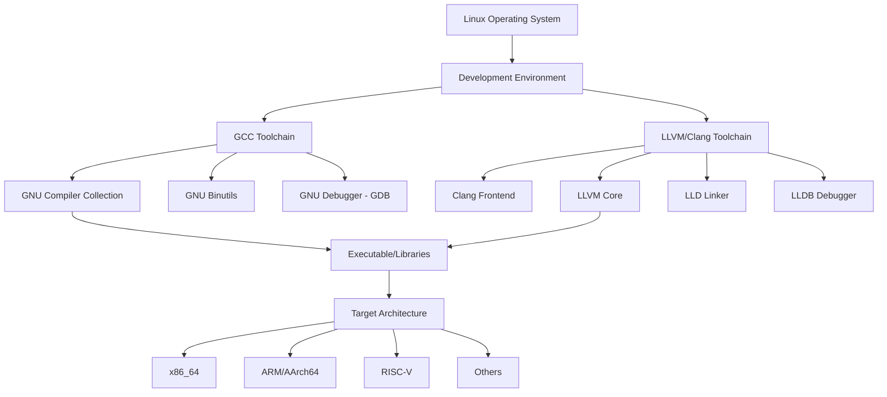
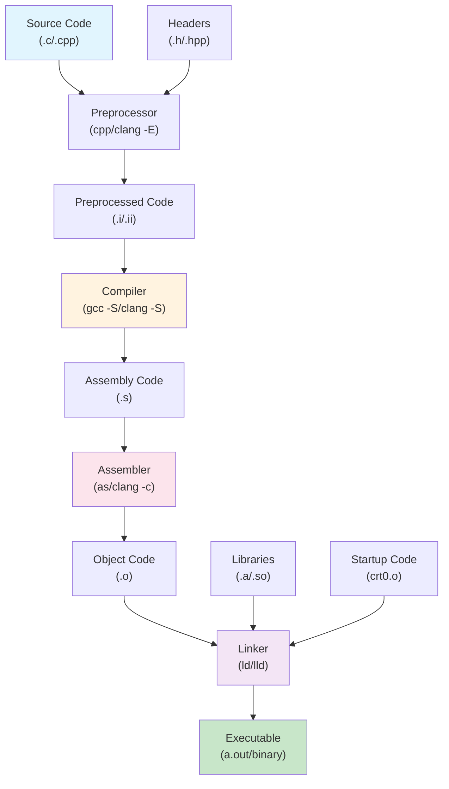
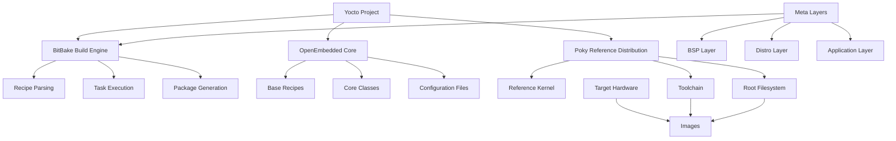
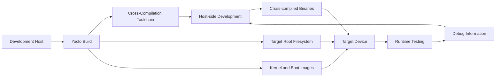

# Embedded Systems Development - Compilers

This repository contains information about C/C++ compilation, standards, embedded Linux development concepts, and practical compilation examples using toolchains. The interconnected ecosystem of Linux, GCC, Clang, and LLVM provides tools for creating portable, and reliable embedded software.

## Table of Contents
1. [Project Structure](#project-structure)
2. [Language Standards](#language-standards)
3. [Linux, GCC, Clang & LLVM](#linux-gcc-clang--llvm)
4. [Compilation Process Flow](#compilation-process-flow)
5. [Setting up LLVM/Clang Environment](#setting-up-llvmclang-environment)
6. [Compiling Examples](#compiling-examples)
7. [Cross-Compilation](#cross-compilation)
8. [Yocto Linux Integration](#yocto-linux-integration)
9. [Extended Build Systems](#extended-build-systems)

## Project Structure

```
EmbeddedSystemsDevelopment/Compilers/
├── README.md                    # This comprehensive guide
├── src/
│   ├── C/
│   │   └── t.c                 # Sample C program with vector operations
│   └── C++/
│       ├── t.cpp               # Sample C++ program
│       └── t.c++               # Sample C++ program with .c++ extension
├── build/                       # Build output directory (created during compilation)
│   ├── debug/                  # Debug builds
│   ├── release/                # Release builds
│   └── cross/                  # Cross-compilation outputs
├── scripts/                     # Build and utility scripts (to be created)
├── .vscode/                     # VS Code configuration
│   ├── tasks.json              # Build tasks
│   ├── launch.json             # Debug configuration
│   └── c_cpp_properties.json   # IntelliSense configuration
└── yocto/                       # Yocto integration files (optional)
    ├── recipes/
    └── meta-layer/
```

## Language Standards

### C99 (ISO/IEC 9899:1999)
C99 revolutionized C programming with significant enhancements:

#### Features: C99
- **Variable declarations anywhere in a block** (not just at the beginning)
- **Inline functions** using the `inline` keyword
- **Single-line comments** using `//` syntax
- **Variable-length arrays (VLAs)** - arrays whose size is determined at runtime
- **Compound literals** - anonymous objects with automatic storage
- **Designated initializers** for arrays and structures
- **New data types**: `long long int`, `_Bool`, `_Complex`, `_Imaginary`
- **New library features**: `<stdint.h>`, `<inttypes.h>`, `<stdbool.h>`
- **Flexible array members** in structures

#### Example: C99
```c
#include <stdio.h>
#include <stdbool.h>
#include <stdint.h>

int main() {
    // Variable declaration anywhere in block
    printf("C99 features demo\n");
    
    bool flag = true;  // _Bool type from stdbool.h
    
    // Variable-length array
    int n = 5;
    int arr[n];
    
    // Designated initializers
    int numbers[10] = {[0] = 1, [9] = 10};
    
    // Compound literals
    int *ptr = (int[]){1, 2, 3, 4, 5};
    
    // Inline function usage
    inline int square(int x) { return x * x; }
    
    return 0;
}
```

### C++17 (ISO/IEC 14882:2017)
C++17 introduced numerous modern features improving expressiveness and performance:

#### Features: C++17
- **Structured bindings** - decompose objects into individual variables
- **if constexpr** - conditional compilation within templates
- **Fold expressions** - variadic template simplification
- **Class template argument deduction (CTAD)**
- **std::optional** - optional values that may or may not contain a value
- **std::variant** - type-safe union
- **std::string_view** - non-owning string references
- **Parallel algorithms** - STL algorithms with execution policies
- **Filesystem library** - standardized filesystem operations
- **Inline variables** - variables can be declared inline

#### Example: C++17
```cpp
#include <iostream>
#include <optional>
#include <string_view>
#include <tuple>
#include <filesystem>
#include <variant>

int main() {
    // Structured bindings
    auto [x, y, z] = std::make_tuple(1, 2.5, "hello");
    
    // std::optional
    std::optional<int> opt_value = 42;
    if (opt_value.has_value()) {
        std::cout << "Value: " << opt_value.value() << std::endl;
    }
    
    // std::string_view (non-owning string reference)
    std::string_view sv = "Hello, C++17!";
    std::cout << sv << std::endl;
    
    // std::variant (type-safe union)
    std::variant<int, float, std::string> data;
    data = 3.14f;
    
    // if constexpr (compile-time conditional)
    if constexpr (sizeof(int) == 4) {
        std::cout << "32-bit integers" << std::endl;
    }
    
    return 0;
}
```

## 🛠️ Compiler Setup for Linux

This section provides detailed instructions for setting up GCC, Clang/LLVM, and related build tools for C99 and C++17 development on Linux systems. This guide is specifically designed to help DevOps teams establish robust embedded systems development environments.

### Prerequisites and System Requirements

#### Supported Linux Distributions
- **Ubuntu**: 18.04 LTS, 20.04 LTS, 22.04 LTS, 24.04 LTS (Recommended)
- **Debian**: 10 (Buster), 11 (Bullseye), 12 (Bookworm)
- **CentOS/RHEL**: 7, 8, 9
- **Fedora**: 35, 36, 37, 38, 39
- **openSUSE**: Leap 15.3+, Tumbleweed
- **Arch Linux**: Rolling release

#### Minimum System Requirements
- **Disk Space**: 50GB free space (recommended 100GB+ for full Yocto builds)
- **RAM**: 8GB minimum (16GB+ recommended for parallel builds)
- **CPU**: Multi-core processor (4+ cores recommended)
- **Internet Connection**: Required for package downloads and updates

### � Compiler Validation and Detection

Before installing or configuring compilers, it's essential to validate what's already available on your system. Here are comprehensive commands to detect and validate C, C++, and Clang compilers on Linux.

#### Essential Compiler Detection Commands

```bash
# Check if GCC is installed and get version
gcc --version 2>/dev/null && echo "  GCC is available" || echo "❌ GCC not found"
g++ --version 2>/dev/null && echo "  G++ is available" || echo "❌ G++ not found"

# Check if Clang is installed and get version
clang --version 2>/dev/null && echo "  Clang is available" || echo "❌ Clang not found"
clang++ --version 2>/dev/null && echo "  Clang++ is available" || echo "❌ Clang++ not found"

# Check for additional LLVM tools
llvm-config --version 2>/dev/null && echo "  LLVM is available" || echo "❌ LLVM not found"
lldb --version 2>/dev/null && echo "  LLDB debugger is available" || echo "❌ LLDB not found"

# Cross-compilation toolchains
aarch64-linux-gnu-gcc --version 2>/dev/null && echo "  ARM64 GCC cross-compiler available" || echo "❌ ARM64 GCC not found"
arm-linux-gnueabihf-gcc --version 2>/dev/null && echo "  ARM GCC cross-compiler available" || echo "❌ ARM GCC not found"
```

#### System Analysis Script

```bash
#!/bin/bash
# compiler_check.sh - Comprehensive compiler detection and validation

echo " Compiler Detection and Validation Report"
echo "==========================================="

# Function to check command availability
check_command() {
    local cmd="$1"
    local name="$2"
    if command -v "$cmd" >/dev/null 2>&1; then
        local version=$($cmd --version 2>/dev/null | head -n1)
        echo "  $name: $version"
        return 0
    else
        echo "❌ $name: Not found"
        return 1
    fi
}

# Function to check compiler standards support
check_standards() {
    local compiler="$1"
    local lang="$2"
    local std="$3"
    local test_file="/tmp/test_${lang}_${std}.${lang}"
    
    if [ "$lang" = "c" ]; then
        echo 'int main(){return 0;}' > "$test_file"
        if $compiler -std=$std -c "$test_file" -o "/tmp/test_${std}.o" 2>/dev/null; then
            echo "    $std support: Available"
            rm -f "/tmp/test_${std}.o"
        else
            echo "  ❌ $std support: Not available"
        fi
    elif [ "$lang" = "cpp" ]; then
        echo 'int main(){return 0;}' > "$test_file"
        if $compiler -std=$std -c "$test_file" -o "/tmp/test_${std}.o" 2>/dev/null; then
            echo "    $std support: Available"
            rm -f "/tmp/test_${std}.o"
        else
            echo "  ❌ $std support: Not available"
        fi
    fi
    rm -f "$test_file"
}

echo ""
echo " Native Compilers:"
echo "-------------------"

# GCC Detection
if check_command "gcc" "GCC C Compiler"; then
    check_standards "gcc" "c" "c99"
    check_standards "gcc" "c" "c11"
    check_standards "gcc" "c" "c17"
fi

if check_command "g++" "GCC C++ Compiler"; then
    check_standards "g++" "cpp" "c++11"
    check_standards "g++" "cpp" "c++14"
    check_standards "g++" "cpp" "c++17"
    check_standards "g++" "cpp" "c++20"
fi

echo ""
echo "⚡ Clang/LLVM Toolchain:"
echo "----------------------"

# Clang Detection
if check_command "clang" "Clang C Compiler"; then
    check_standards "clang" "c" "c99"
    check_standards "clang" "c" "c11"
    check_standards "clang" "c" "c17"
fi

if check_command "clang++" "Clang C++ Compiler"; then
    check_standards "clang++" "cpp" "c++11"
    check_standards "clang++" "cpp" "c++14"
    check_standards "clang++" "cpp" "c++17"
    check_standards "clang++" "cpp" "c++20"
    
    # Check for libc++ support
    echo 'int main(){return 0;}' > /tmp/test_libcxx.cpp
    if clang++ -stdlib=libc++ -c /tmp/test_libcxx.cpp -o /tmp/test_libcxx.o 2>/dev/null; then
        echo "    libc++ support: Available"
        rm -f /tmp/test_libcxx.o
    else
        echo "  ❌ libc++ support: Not available"
    fi
    rm -f /tmp/test_libcxx.cpp
fi

echo ""
echo "🛠️ LLVM Development Tools:"
echo "-------------------------"
check_command "llvm-config" "LLVM Config"
check_command "lldb" "LLVM Debugger"
check_command "lld" "LLVM Linker"
check_command "llvm-ar" "LLVM Archiver"
check_command "llvm-objdump" "LLVM Object Dump"
check_command "llvm-strip" "LLVM Strip"

echo ""
echo " Cross-Compilation Toolchains:"
echo "-------------------------------"
check_command "aarch64-linux-gnu-gcc" "ARM64 GCC"
check_command "aarch64-linux-gnu-g++" "ARM64 G++"
check_command "arm-linux-gnueabihf-gcc" "ARM Hard Float GCC"
check_command "arm-linux-gnueabihf-g++" "ARM Hard Float G++"

echo ""
echo "🔧 Build Tools:"
echo "-------------"
check_command "make" "GNU Make"
check_command "cmake" "CMake"
check_command "ninja" "Ninja Build"
check_command "autotools" "Autotools"
check_command "pkg-config" "pkg-config"

echo ""
echo "System Information:"
echo "--------------------"
echo "OS: $(uname -s)"
echo "Kernel: $(uname -r)"
echo "Architecture: $(uname -m)"
echo "CPU Cores: $(nproc)"
echo "Memory: $(free -h | awk '/^Mem:/ {print $2}')"
echo "Disk Space (current dir): $(df -h . | awk 'NR==2 {print $4 " available"}')"

echo "===================="
```

#### Validation Commands

```bash
# Quick check for essential compilers
echo "GCC: $(gcc --version 2>/dev/null | head -1 || echo 'Not found')"
echo "G++: $(g++ --version 2>/dev/null | head -1 || echo 'Not found')"
echo "Clang: $(clang --version 2>/dev/null | head -1 || echo 'Not found')"
echo "Clang++: $(clang++ --version 2>/dev/null | head -1 || echo 'Not found')"

# Check compiler paths
echo "GCC path: $(which gcc 2>/dev/null || echo 'Not found')"
echo "G++ path: $(which g++ 2>/dev/null || echo 'Not found')"
echo "Clang path: $(which clang 2>/dev/null || echo 'Not found')"
echo "Clang++ path: $(which clang++ 2>/dev/null || echo 'Not found')"

# Check for standard library headers
echo "C standard library: $(find /usr/include -name 'stdio.h' 2>/dev/null | head -1 || echo 'Not found')"
echo "C++ standard library: $(find /usr/include -name 'iostream' 2>/dev/null | head -1 || echo 'Not found')"

# Test basic compilation
echo 'int main(){return 0;}' | gcc -x c - -o /tmp/gcc_test 2>/dev/null && echo "GCC compilation:   Working" || echo "GCC compilation: ❌ Failed"
echo 'int main(){return 0;}' | g++ -x c++ - -o /tmp/gpp_test 2>/dev/null && echo "G++ compilation:   Working" || echo "G++ compilation: ❌ Failed"
echo 'int main(){return 0;}' | clang -x c - -o /tmp/clang_test 2>/dev/null && echo "Clang compilation:   Working" || echo "Clang compilation: ❌ Failed"
echo 'int main(){return 0;}' | clang++ -x c++ - -o /tmp/clangpp_test 2>/dev/null && echo "Clang++ compilation:   Working" || echo "Clang++ compilation: ❌ Failed"

# Cleanup test files
rm -f /tmp/{gcc,gpp,clang,clangpp}_test

# Check for package managers and installation options
echo "Package manager options:"
command -v apt >/dev/null 2>&1 && echo "    APT (Ubuntu/Debian): sudo apt install gcc g++ clang"
command -v dnf >/dev/null 2>&1 && echo "    DNF (Fedora): sudo dnf install gcc gcc-c++ clang"
command -v yum >/dev/null 2>&1 && echo "    YUM (RHEL/CentOS): sudo yum install gcc gcc-c++ clang"
command -v zypper >/dev/null 2>&1 && echo "    Zypper (openSUSE): sudo zypper install gcc gcc-c++ clang"
command -v pacman >/dev/null 2>&1 && echo "    Pacman (Arch): sudo pacman -S gcc clang"
```

#### Installation Verification

```bash
# After installing compilers, run this verification
echo " Post-Installation Verification"
echo "================================"

# Create test files
cat > /tmp/test_c99.c << 'EOF'
#include <stdio.h>
#include <complex.h>
int main() {
    double complex z = 1.0 + 2.0*I;
    printf("C99 complex number: %.1f + %.1fi\n", creal(z), cimag(z));
    return 0;
}
EOF

cat > /tmp/test_cpp17.cpp << 'EOF'
#include <iostream>
#include <optional>
#include <string_view>
int main() {
    std::optional<std::string_view> msg = "C++17 features working";
    if (msg) {
        std::cout << *msg << std::endl;
    }
    return 0;
}
EOF

# Test C99 compilation and execution
echo "Testing C99 with GCC:"
gcc -std=c99 /tmp/test_c99.c -o /tmp/test_c99 -lm && /tmp/test_c99 && echo "  GCC C99 working"

echo "Testing C99 with Clang:"
clang -std=c99 /tmp/test_c99.c -o /tmp/test_c99_clang -lm && /tmp/test_c99_clang && echo "  Clang C99 working"

# Test C++17 compilation and execution
echo "Testing C++17 with G++:"
g++ -std=c++17 /tmp/test_cpp17.cpp -o /tmp/test_cpp17 && /tmp/test_cpp17 && echo "  G++ C++17 working"

echo "Testing C++17 with Clang++:"
clang++ -std=c++17 /tmp/test_cpp17.cpp -o /tmp/test_cpp17_clang && /tmp/test_cpp17_clang && echo "  Clang++ C++17 working"

# Test C++17 with libc++ (if available)
echo "Testing C++17 with Clang++ and libc++:"
clang++ -std=c++17 -stdlib=libc++ /tmp/test_cpp17.cpp -o /tmp/test_cpp17_libcxx 2>/dev/null && /tmp/test_cpp17_libcxx && echo "  Clang++ with libc++ working"

# Cleanup
rm -f /tmp/test_c99* /tmp/test_cpp17*

echo " Verification complete!"
```

### 🔧GCC (GNU Compiler Collection) Setup

GCC is the traditional and most widely used compiler for embedded systems development.

#### Installing GCC on Ubuntu/Debian

```bash
# Update package list
sudo apt update

# Install GCC for C/C++ development
sudo apt install -y \
    gcc \
    g++ \
    gcc-multilib \
    g++-multilib \
    libc6-dev \
    linux-libc-dev

# Install specific GCC versions if needed
sudo apt install -y \
    gcc-9 g++-9 \
    gcc-10 g++-10 \
    gcc-11 g++-11 \
    gcc-12 g++-12 \
    gcc-13 g++-13

# Install cross-compilation toolchains
sudo apt install -y \
    gcc-arm-linux-gnueabihf \
    g++-arm-linux-gnueabihf \
    gcc-aarch64-linux-gnu \
    g++-aarch64-linux-gnu

# Install development tools
sudo apt install -y \
    build-essential \
    cmake \
    make \
    autotools-dev \
    automake \
    libtool \
    pkg-config \
    gdb \
    valgrind
```

#### Installing GCC on CentOS/RHEL/Fedora

```bash
# For CentOS/RHEL 8+
sudo dnf groupinstall "Development Tools"
sudo dnf install -y \
    gcc \
    gcc-c++ \
    glibc-devel \
    kernel-headers \
    cmake \
    make \
    autotools \
    gdb \
    valgrind

# For older CentOS/RHEL 7
sudo yum groupinstall "Development Tools"
sudo yum install -y \
    gcc \
    gcc-c++ \
    glibc-devel \
    kernel-headers \
    cmake3 \
    gdb \
    valgrind

# Install GCC cross-compilation toolchains
sudo dnf install -y \
    gcc-arm-linux-gnu \
    gcc-c++-arm-linux-gnu \
    gcc-aarch64-linux-gnu \
    gcc-c++-aarch64-linux-gnu
```

#### Verifying GCC Installation

```bash
# Check GCC version
gcc --version
g++ --version

# Test C99 compilation
echo '#include <stdio.h>
int main() {
    printf("GCC C99 test successful\\n");
    return 0;
}' > test_c99.c

gcc -std=c99 -Wall -Wextra -o test_c99 test_c99.c
./test_c99

# Test C++17 compilation
echo '#include <iostream>
int main() {
    std::cout << "GCC C++17 test successful\\n";
    return 0;
}' > test_cpp17.cpp

g++ -std=c++17 -Wall -Wextra -o test_cpp17 test_cpp17.cpp
./test_cpp17

# Clean up test files
rm -f test_c99.c test_c99 test_cpp17.cpp test_cpp17
```

### ⚡ Clang/LLVM Setup and Integration

Clang is a C and C++ frontend for LLVM. As part of the LLVM project, Clang can integrate with various components traditionally associated with the GNU toolchain, such as GNU linkers (e.g., ld, gold) and standard libraries (e.g., libstdc++ from GCC, or libc++ from LLVM).

#### Clang and LLVM

```
┌─────────────────────────────────────────────────────────────────┐
│                     LLVM Toolchain                              │
├─────────────────────────────────────────────────────────────────┤
│  Frontend (Clang)   │  Middle-end (LLVM)  │  Backend (LLVM)     │
│  ┌──────────────┐   │  ┌───────────────┐  │  ┌───────────────┐  │
│  │ C/C++ Source │   │  │ LLVM IR       │  │  │ Machine Code  │  │
│  │ Code         │───┼─▶│ Optimization  │──┼─▶│ Generation    │  │
│  │ (*.c, *.cpp) │   │  │ Passes        │  │  │ (Assembly)    │  │
│  └──────────────┘   │  └───────────────┘  │  └───────────────┘  │
│                     │                     │                     │
│  Parsing            │  IR Transformations │  Code Generation    │
│  Type Checking      │  Dead Code Elim.    │  Register Alloc.    │
│  Error Reporting    │  Loop Optimization  │  Instruction Sel.   │
└─────────────────────────────────────────────────────────────────┘
```

Clang takes source code in these languages and translates it into LLVM's intermediate representation.

#### Installing Clang/LLVM on Ubuntu/Debian

```bash
# Install Clang and LLVM tools
sudo apt update
sudo apt install -y \
    clang \
    clang++ \
    llvm \
    llvm-dev \
    lldb \
    lld \
    clang-format \
    clang-tidy \
    clang-tools

# Install specific Clang versions
sudo apt install -y \
    clang-12 \
    clang-13 \
    clang-14 \
    clang-15 \
    clang-16

# Install LLVM development libraries
sudo apt install -y \
    libllvm-15-dev \
    llvm-15-dev \
    llvm-15-tools \
    libc++-dev \
    libc++abi-dev
```

#### Building and Running Clang

Examples of using Clang:

```bash
# Example with vector operations (from our t.c file)
$ cat ~/t.c
typedef float V __attribute__((vector_size(16)));
V foo(V a, V b) { return a+b*a; }

# Preprocessing:
$ clang ~/t.c -E

# Type checking:
$ clang -fsyntax-only ~/t.c

# Compilation to object file:
$ clang -c ~/t.c -o t.o

# Full compilation:
$ clang ~/t.c -o t
```

#### Advanced Clang Features

```bash
# Generate LLVM IR from C code
clang -S -emit-llvm src/C/t.c -o t.ll

# Generate LLVM bitcode
clang -c -emit-llvm src/C/t.c -o t.bc

# Static Analysis with Clang
clang --analyze src/C/t.c

# Clang-Tidy for linting and fixes
clang-tidy src/C/t.c -- -std=c99
clang-tidy src/C++/t.cpp -- -std=c++17

# Code Formatting with Clang-Format
clang-format -style=llvm -i src/C/t.c
clang-format -style=llvm -i src/C++/t.cpp
```

### Practical Compilation

```bash
# C99 compilation with extensive warnings
gcc -std=c99 -Wall -Wextra -Wpedantic -Wformat=2 -Wcast-align \
    -Wcast-qual -Wfloat-equal -Wmissing-declarations -Wshadow \
    -Wstrict-overflow=5 -Wundef -g3 -O2 \
    src/C/t.c -o build/t_c99 -lm

# C++17 compilation with modern warnings
g++ -std=c++17 -Wall -Wextra -Wpedantic -Weffc++ -Wold-style-cast \
    -Woverloaded-virtual -Wformat=2 -Wshadow -Wstrict-overflow=5 \
    -g3 -O2 src/C++/t.cpp -o build/t_cpp17 -pthread

# Cross-compilation for ARM64
aarch64-linux-gnu-gcc -std=c99 -Wall -Wextra -O2 -static \
    src/C/t.c -o build/cross/t_c99_arm64 -lm

# Clang with sanitizers
clang -std=c99 -fsanitize=address -fno-omit-frame-pointer -g \
    src/C/t.c -o build/debug/t_c99_asan -lm

clang++ -std=c++17 -fsanitize=thread -fno-omit-frame-pointer -g \
    src/C++/t.cpp -o build/debug/t_cpp17_tsan -pthread
```

### Yocto Project Integration for Embedded Linux Development

The Yocto Project is an open source collaboration project focused on embedded Linux developers. It provides tools and resources to create custom embedded Linux distributions.

#### Installing Yocto Project Dependencies

```bash
# Ubuntu/Debian prerequisites
sudo apt update
sudo apt install -y \
    gawk wget git diffstat unzip texinfo gcc build-essential \
    chrpath socat cpio python3 python3-pip python3-pexpect \
    xz-utils debianutils iputils-ping python3-git python3-jinja2 \
    libegl1-mesa libsdl1.2-dev python3-subunit mesa-common-dev \
    zstd liblz4-tool file locales

# Set UTF-8 locale
sudo locale-gen en_US.UTF-8

# CentOS/RHEL/Fedora prerequisites
sudo dnf install -y \
    gawk make wget tar bzip2 gzip python3 unzip perl patch \
    diffutils diffstat git cpp gcc gcc-c++ glibc-devel texinfo \
    chrpath ccache perl-Data-Dumper perl-Text-ParseWords \
    perl-Thread-Queue perl-bignum xz which SDL-devel xterm \
    mesa-libGL-devel perl-FindBin file cpio python3-GitPython \
    python3-jinja2 python3-subunit zstd lz4 rpmdevtools
```

#### Setting Up Yocto Build Environment

```bash
# Create workspace directory
mkdir -p ~/yocto_workspace
cd ~/yocto_workspace

# Download Poky (Yocto's reference distribution)
git clone -b kirkstone https://git.yoctoproject.org/poky.git
cd poky

# Initialize build environment
source oe-init-build-env

# This creates a build directory and sets up environment variables
# You are now in build/
pwd  # Should show something like: ~/yocto_workspace/poky/build
```

### Integration and Continuous Integration (DevOps)

#### Docker-based Development Environment

```dockerfile
# Dockerfile.yocto-dev
FROM ubuntu:22.04

# Install Yocto dependencies
RUN apt-get update && apt-get install -y \
    gawk wget git diffstat unzip texinfo gcc build-essential \
    chrpath socat cpio python3 python3-pip python3-pexpect \
    xz-utils debianutils iputils-ping python3-git python3-jinja2 \
    libegl1-mesa libsdl1.2-dev python3-subunit mesa-common-dev \
    zstd liblz4-tool file locales sudo vim \
    && locale-gen en_US.UTF-8 \
    && apt-get clean \
    && rm -rf /var/lib/apt/lists/*

# Create yocto user
RUN useradd -m -s /bin/bash yocto && \
    echo 'yocto ALL=(ALL) NOPASSWD:ALL' >> /etc/sudoers

USER yocto
WORKDIR /home/yocto

# Setup Yocto workspace
RUN git clone -b kirkstone https://git.yoctoproject.org/poky.git

# Set environment
ENV LANG=en_US.UTF-8
ENV LC_ALL=en_US.UTF-8

CMD ["/bin/bash"]
```

#### Setup Script

```bash
#!/bin/bash
# setup_compilers.sh - Quick setup script for embedded development

set -e

echo "Setting up Embedded Systems Development Environment"

# Detect distribution
if [ -f /etc/os-release ]; then
    . /etc/os-release
    DISTRO=$ID
    VERSION=$VERSION_ID
else
    echo "Cannot detect Linux distribution"
    exit 1
fi

echo "Detected: $PRETTY_NAME"

# Update package manager
case $DISTRO in
    ubuntu|debian)
        sudo apt update
        INSTALL_CMD="sudo apt install -y"
        ;;
    centos|rhel|fedora)
        if command -v dnf &> /dev/null; then
            sudo dnf update
            INSTALL_CMD="sudo dnf install -y"
        else
            sudo yum update
            INSTALL_CMD="sudo yum install -y"
        fi
        ;;
    *)
        echo "Unsupported distribution: $DISTRO"
        exit 1
        ;;
esac

# Install GCC and essential tools
echo "Installing GCC and build tools..."
case $DISTRO in
    ubuntu|debian)
        $INSTALL_CMD gcc g++ gcc-multilib g++-multilib build-essential \
                     cmake make autotools-dev automake libtool pkg-config \
                     gdb valgrind git
        ;;
    centos|rhel|fedora)
        $INSTALL_CMD gcc gcc-c++ glibc-devel cmake make autotools \
                     gdb valgrind git
        ;;
esac

# Install Clang/LLVM
echo "⚡ Installing Clang/LLVM..."
case $DISTRO in
    ubuntu|debian)
        $INSTALL_CMD clang clang++ llvm llvm-dev lldb lld \
                     clang-format clang-tidy libc++-dev libc++abi-dev
        ;;
    centos|rhel|fedora)
        $INSTALL_CMD clang clang++ llvm llvm-devel lldb lld \
                     clang-tools-extra libc++ libc++abi
        ;;
esac

# Install cross-compilation toolchains
echo "Installing cross-compilation toolchains..."
case $DISTRO in
    ubuntu|debian)
        $INSTALL_CMD gcc-arm-linux-gnueabihf g++-arm-linux-gnueabihf \
                     gcc-aarch64-linux-gnu g++-aarch64-linux-gnu
        ;;
    centos|rhel|fedora)
        $INSTALL_CMD gcc-arm-linux-gnu gcc-c++-arm-linux-gnu \
                     gcc-aarch64-linux-gnu gcc-c++-aarch64-linux-gnu
        ;;
esac

# Verify installations
echo "  Verifying installations..."
gcc --version | head -1
g++ --version | head -1
clang --version | head -1
clang++ --version | head -1

echo "Setup complete!"
```

## Yocto Project Integration with Clang/LLVM

The Yocto Project is a build system for creating custom embedded Linux distributions. This section provides comprehensive integration with both GCC and Clang/LLVM toolchains.

### Overview of Yocto Components

The Yocto Project consists of:
- **Poky**: Reference build system and distribution
- **OpenEmbedded-Core**: Core metadata and build framework
- **BitBake**: Build tool that parses recipes and executes build tasks
- **meta-clang**: Layer providing Clang/LLVM support as alternative to GCC

### Yocto Project

```
┌─────────────────────────────────────────────────────────────────┐
│                     Yocto Project                               │
├─────────────────────────────────────────────────────────────────┤
│  BitBake Build Engine                                           │
│  ┌────────────┐  ┌─────────────┐  ┌────────────┐                │
│  │ Recipe     │  │ Metadata    │  │ Layer      │                │
│  │ (.bb)      │──┤ Parsing     │──┤ Management │                │
│  │ Files      │  │ Engine      │  │ System     │                │
│  └────────────┘  └─────────────┘  └────────────┘                │
│                          │                                      │
│  ┌─────────────────────────────────────────────────────────────┐│
│  │ Toolchain Selection (TOOLCHAIN variable)                    ││
│  │  ┌─────────────────┐       ┌─────────────────┐              ││
│  │  │ GCC Toolchain   │       │ Clang Toolchain │              ││
│  │  │ • gcc/g++       │  OR   │ • clang/clang++ │              ││
│  │  │ • libgcc        │       │ • compiler-rt   │              ││
│  │  │ • libstdc++     │       │ • libc++        │              ││
│  │  └─────────────────┘       └─────────────────┘              ││
│  └─────────────────────────────────────────────────────────────┘│
│                          │                                      │
│  ┌─────────────────────────────────────────────────────────────┐│
│  │ Build Output                                                ││
│  │ • Cross-compiled binaries  • Root filesystem                ││
│  │ • Kernel images           • SDK for development             ││
│  └─────────────────────────────────────────────────────────────┘│
└─────────────────────────────────────────────────────────────────┘
```

### Automated Setup

We've created a comprehensive setup script that handles the entire Yocto + Clang integration:

```bash
# Run the automated setup
./setup-yocto-clang.sh

# Initialize build environment
cd yocto-workspace/poky
source oe-init-build-env ../build-demo

# Build demo applications
bitbake c99-demo cpp17-demo              # GCC builds
bitbake c99-demo-clang cpp17-demo-clang  # Clang builds
```

### Manual Yocto Setup (Step-by-Step)

#### 1. Install Yocto Dependencies

```bash
# Ubuntu/Debian
sudo apt install -y \\
    gawk wget git diffstat unzip texinfo gcc build-essential \\
    chrpath socat cpio python3 python3-pip python3-pexpect \\
    xz-utils debianutils iputils-ping python3-git python3-jinja2 \\
    libegl1-mesa libsdl1.2-dev python3-subunit mesa-common-dev \\
    zstd liblz4-tool file locales

# CentOS/RHEL/Fedora
sudo dnf install -y \\
    gawk make wget tar bzip2 gzip python3 unzip perl patch \\
    diffutils diffstat git cpp gcc gcc-c++ glibc-devel texinfo \\
    chrpath ccache perl-Data-Dumper perl-Text-ParseWords \\
    perl-Thread-Queue perl-bignum xz which SDL-devel xterm \\
    mesa-libGL-devel perl-FindBin file cpio python3-GitPython \\
    python3-jinja2 python3-subunit zstd lz4
```

#### 2. Create Yocto Workspace

```bash
mkdir -p ~/yocto-workspace
cd ~/yocto-workspace

# Clone Poky (reference distribution)
git clone -b kirkstone https://git.yoctoproject.org/git/poky.git

# Clone additional layers
git clone -b kirkstone https://git.openembedded.org/meta-openembedded
git clone -b kirkstone https://github.com/kraj/meta-clang.git
```

#### 3. Create Custom Layer for Compiler Demos

```bash
# Create layer structure
mkdir -p meta-compilers-demo/{conf,recipes-examples}

# Layer configuration
cat > meta-compilers-demo/conf/layer.conf << 'EOF'
BBPATH .= ":${LAYERDIR}"
BBFILES += "${LAYERDIR}/recipes-*/*/*.bb \\
           ${LAYERDIR}/recipes-*/*/*.bbappend"
BBFILE_COLLECTIONS += "meta-compilers-demo"
BBFILE_PATTERN_meta-compilers-demo = "^${LAYERDIR}/"
BBFILE_PRIORITY_meta-compilers-demo = "6"
LAYERVERSION_meta-compilers-demo = "1"
LAYERSERIES_COMPAT_meta-compilers-demo = "kirkstone langdale mickledore nanbield scarthgap styhead"
LAYERDEPENDS_meta-compilers-demo = "core"
EOF
```

### Recipe Development

#### C99 Recipe with Clang Support

```bash
# Create recipe directory
mkdir -p meta-compilers-demo/recipes-examples/c99-demo/files

# Copy source file
cp ../src/C/t.c meta-compilers-demo/recipes-examples/c99-demo/files/

# Create BitBake recipe
cat > meta-compilers-demo/recipes-examples/c99-demo/c99-demo_1.0.bb << 'EOF'
SUMMARY = "C99 Compiler Features Demonstration"
DESCRIPTION = "Comprehensive C99 features demo for embedded systems with support for GCC and Clang"
LICENSE = "MIT"
LIC_FILES_CHKSUM = "file://${COMMON_LICENSE_DIR}/MIT;md5=0835ade698e0bcf8506ecda2f7b4f302"

SRC_URI = "file://t.c"
S = "${WORKDIR}"

# Toolchain selection
TOOLCHAIN ??= "gcc"

# Compiler flags
TARGET_CFLAGS += "-std=c99 -Wall -Wextra -O2"
LDFLAGS += "-lm"

# Configure for Clang if selected
python __anonymous() {
    toolchain = d.getVar('TOOLCHAIN')
    if toolchain == 'clang':
        d.setVar('CC', 'clang')
        d.appendVar('TARGET_CFLAGS', ' -Weverything -Wno-padded')
}

do_compile() {
    if [ "${TOOLCHAIN}" = "clang" ]; then
        bbnote "Compiling with Clang"
        clang ${TARGET_CFLAGS} ${CFLAGS} -o c99-demo t.c ${LDFLAGS}
    else
        bbnote "Compiling with GCC (default)"
        ${CC} ${TARGET_CFLAGS} ${CFLAGS} -o c99-demo t.c ${LDFLAGS}
    fi
}

do_install() {
    install -d ${D}${bindir}
    install -m 0755 c99-demo ${D}${bindir}/
}

FILES:${PN} = "${bindir}/c99-demo"
RDEPENDS:${PN} += "glibc"
EOF
```

#### C++17 Recipe with Clang and libc++ Support

```bash
# Create recipe directory
mkdir -p meta-compilers-demo/recipes-examples/cpp17-demo/files

# Copy source file
cp ../src/C++/t.cpp meta-compilers-demo/recipes-examples/cpp17-demo/files/

# Create BitBake recipe
cat > meta-compilers-demo/recipes-examples/cpp17-demo/cpp17-demo_1.0.bb << 'EOF'
SUMMARY = "C++17 Compiler Features Demonstration"
DESCRIPTION = "Comprehensive C++17 features demo with support for GCC, Clang, and different C++ runtime libraries"
LICENSE = "MIT"
LIC_FILES_CHKSUM = "file://${COMMON_LICENSE_DIR}/MIT;md5=0835ade698e0bcf8506ecda2f7b4f302"

SRC_URI = "file://t.cpp"
S = "${WORKDIR}"

# Toolchain and runtime selection
TOOLCHAIN ??= "gcc"
RUNTIME ??= "gnu"

# Compiler flags
TARGET_CXXFLAGS += "-std=c++17 -Wall -Wextra -O2"
LDFLAGS += "-lpthread"

# Configure for different toolchains and runtimes
python __anonymous() {
    toolchain = d.getVar('TOOLCHAIN')
    runtime = d.getVar('RUNTIME')
    
    if toolchain == 'clang':
        d.setVar('CXX', 'clang++')
        d.appendVar('TARGET_CXXFLAGS', ' -Wno-padded')
        
        if runtime == 'llvm':
            d.appendVar('TARGET_CXXFLAGS', ' -stdlib=libc++')
            d.appendVar('LDFLAGS', ' -stdlib=libc++ -lc++abi')
            d.appendVar('RDEPENDS_${PN}', ' libc++')
        else:
            d.appendVar('RDEPENDS_${PN}', ' libstdc++')
    else:
        d.appendVar('RDEPENDS_${PN}', ' libstdc++')
}

do_compile() {
    if [ "${TOOLCHAIN}" = "clang" ]; then
        if [ "${RUNTIME}" = "llvm" ]; then
            bbnote "Compiling with Clang and LLVM libc++"
            clang++ ${TARGET_CXXFLAGS} ${CXXFLAGS} -stdlib=libc++ -o cpp17-demo t.cpp ${LDFLAGS}
        else
            bbnote "Compiling with Clang and GNU libstdc++"
            clang++ ${TARGET_CXXFLAGS} ${CXXFLAGS} -o cpp17-demo t.cpp ${LDFLAGS}
        fi
    else
        bbnote "Compiling with GCC and GNU libstdc++ (default)"
        ${CXX} ${TARGET_CXXFLAGS} ${CXXFLAGS} -o cpp17-demo t.cpp ${LDFLAGS}
    fi
}

do_install() {
    install -d ${D}${bindir}
    install -m 0755 cpp17-demo ${D}${bindir}/
}

FILES:${PN} = "${bindir}/cpp17-demo"
RDEPENDS:${PN} += "glibc"
EOF
```

### Build Configuration

#### bblayers.conf

```bash
# Create build directory and configuration
mkdir -p build-demo/conf

cat > build-demo/conf/bblayers.conf << 'EOF'
POKY_BBLAYERS_CONF_VERSION = "2"

BBPATH = "${TOPDIR}"
BBFILES ?= ""

BBLAYERS ?= " \\
  ${TOPDIR}/../poky/meta \\
  ${TOPDIR}/../poky/meta-poky \\
  ${TOPDIR}/../poky/meta-yocto-bsp \\
  ${TOPDIR}/../meta-openembedded/meta-oe \\
  ${TOPDIR}/../meta-openembedded/meta-python \\
  ${TOPDIR}/../meta-clang \\
  ${TOPDIR}/../meta-compilers-demo \\
  "
EOF
```

#### local.conf with Clang Configuration

```bash
cat > build-demo/conf/local.conf << 'EOF'
# Machine and Distribution
MACHINE ??= "qemux86-64"
DISTRO ?= "poky"

# Build configuration
TMPDIR = "${TOPDIR}/tmp"
DL_DIR ?= "${TOPDIR}/downloads"
SSTATE_DIR ?= "${TOPDIR}/sstate-cache"

# Parallel builds
PARALLEL_MAKE = "-j ${@oe.utils.cpu_count()}"
BB_NUMBER_THREADS = "${@oe.utils.cpu_count()}"

# Package management
PACKAGE_CLASSES ?= "package_rpm"

#
# Toolchain Configuration Options
#

# Option 1: Use GCC (default)
TOOLCHAIN ??= "gcc"
RUNTIME ??= "gnu"

# Option 2: Use Clang system-wide (uncomment to enable)
# TOOLCHAIN = "clang"
# RUNTIME = "llvm"  # Use LLVM libc++ instead of GNU libstdc++

# Option 3: Mixed toolchain - use Clang for specific recipes
# (Set TOOLCHAIN in individual .bb files or .bbappend files)

# Add demo packages to image
IMAGE_INSTALL:append = " c99-demo cpp17-demo"

# Development tools
IMAGE_INSTALL:append = " gcc g++ make cmake gdb strace"

# Enable development features
EXTRA_IMAGE_FEATURES += "debug-tweaks dev-pkgs tools-debug"
EXTRA_IMAGE_FEATURES += "empty-root-password package-management"

# Security and optimization flags
SECURITY_CFLAGS = "-fstack-protector-strong -pie -fpie -D_FORTIFY_SOURCE=2"
TARGET_CFLAGS:append = " -O2 -g"
TARGET_CXXFLAGS:append = " -O2 -g"
EOF
```

### Building and Testing

#### Build Commands

```bash
# Initialize build environment
cd yocto-workspace/poky
source oe-init-build-env ../build-demo

# Build individual recipes
bitbake c99-demo                # C99 with GCC
bitbake cpp17-demo              # C++17 with GCC

# Build with Clang (if configured in recipe)
bitbake -c clean c99-demo && TOOLCHAIN="clang" bitbake c99-demo

# Build complete minimal image
bitbake core-image-minimal

# Generate SDK for cross-compilation
bitbake core-image-minimal -c populate_sdk
```

#### Clang Builds

```bash
# Force Clang toolchain for specific builds
echo 'TOOLCHAIN = "clang"' >> conf/local.conf
echo 'RUNTIME = "llvm"' >> conf/local.conf

# Rebuild with Clang
bitbake -c cleanall c99-demo cpp17-demo
bitbake c99-demo cpp17-demo

# Build image with Clang-compiled applications
bitbake core-image-minimal
```

#### Testing with QEMU

```bash
# Run QEMU with built image
runqemu qemux86-64 core-image-minimal

# Inside QEMU, test the applications
root@qemux86-64:~# c99-demo
root@qemux86-64:~# cpp17-demo

# Check which compiler was used
root@qemux86-64:~# readelf -p .comment /usr/bin/c99-demo
root@qemux86-64:~# readelf -p .comment /usr/bin/cpp17-demo
```

### Recipe Examples for Different Configurations

#### Recipe Variants

```bash
# GCC-only variant (recipe.bb)
TOOLCHAIN = "gcc"
SUMMARY = "C++17 Demo compiled with GCC"

# Clang + GNU libstdc++ variant
TOOLCHAIN = "clang"
RUNTIME = "gnu"
SUMMARY = "C++17 Demo compiled with Clang + libstdc++"

# Clang + LLVM libc++ variant
TOOLCHAIN = "clang"
RUNTIME = "llvm"
SUMMARY = "C++17 Demo compiled with Clang + libc++"
```

### Integration with VS Code

VS Code provides support for Yocto development with the right extensions and configuration.

#### Extensions

```json
{
    "recommendations": [
        "ms-vscode.cpptools",
        "ms-vscode.cmake-tools",
        "ms-vscode.cpptools-extension-pack",
        "llvm-vs-code-extensions.vscode-clangd",
        "yoctoproject.yocto-bitbake"
    ]
}
```

#### VS Code Settings for Cross-Compilation

```json
{
    "C_Cpp.default.compilerPath": "/path/to/yocto/sysroots/x86_64-pokysdk-linux/usr/bin/x86_64-poky-linux/x86_64-poky-linux-gcc",
    "C_Cpp.default.intelliSenseMode": "linux-gcc-x64",
    "C_Cpp.default.includePath": [
        "/path/to/yocto/sysroots/core2-64-poky-linux/usr/include/**"
    ],
    "C_Cpp.default.cStandard": "c99",
    "C_Cpp.default.cppStandard": "c++17"
}
```

### Debugging and Troubleshooting

#### Issues and Solutions

```bash
# Issue: Clang not found during build
# Solution: Verify meta-clang layer is added to bblayers.conf

# Issue: libc++ not found
# Solution: Ensure RUNTIME = "llvm" and meta-clang layer includes libc++

# Issue: Recipe fails with Clang
# Solution: Check for GCC-specific flags in CFLAGS/CXXFLAGS

# Debug build process
bitbake -DD c99-demo  # Extra debug output

# Clean and rebuild
bitbake -c cleanall c99-demo
bitbake c99-demo

# Check build dependencies
bitbake-diffsigs tmp/stamps/**/c99-demo*/do_compile.*
```

#### Performance Comparison

```bash
# Build timing comparison
time bitbake c99-demo              # GCC build
time TOOLCHAIN="clang" bitbake c99-demo  # Clang build

# Binary size comparison
ls -la tmp/work/**/c99-demo/*/c99-demo

# Runtime performance testing (in QEMU)
time /usr/bin/c99-demo    # GCC version
time /usr/bin/c99-demo-clang  # Clang version
```

1. **Toolchain Selection**: Choose between GCC and Clang per recipe or system-wide
2. **Runtime Library Options**: GNU (libgcc/libstdc++) or LLVM (compiler-rt/libc++)
3. **Workflow**: Complete embedded Linux distribution building
4. **Development Tools**: SDK generation for cross-compilation
5. **Quality Assurance**: QEMU testing and debugging support
6. **IDE Integration**: VS Code configuration for seamless development

The setup supports embedded development practices while maintaining compatibility with existing GCC-based workflows.


## Linux, GCC, Clang & LLVM

### The Inter-connected eco-system



### Linux Operating System
**Linux** provides the foundational environment where compilers operate and executables run. Key characteristics:
- **Open-source kernel** with extensive hardware support
- **POSIX-compliant** system interface
- **Multi-architecture support** (x86, ARM, RISC-V, etc.)
- **Package management** for easy compiler installation
- **Development tools integration** (make, cmake, ninja, etc.)

### GCC (GNU Compiler Collection)
**GCC** is the traditional and most widespread compiler suite:

#### Features:
- **Multi-language support**: C, C++, Fortran, Ada, Go, Rust (via GCC-RS)
- **Mature optimization**: Decades of optimization development
- **Wide platform support**: Virtually every Linux architecture
- **Standards compliance**: Full support for C89/99/11/17/23, C++98/03/11/14/17/20/23
- **Cross-compilation**: Extensive target support
- **Plugin architecture**: Extensible with custom optimizations

#### GCC Architecture:
```
Source Code → GCC Frontend → GIMPLE IR → RTL → Assembly → Object Code
     ↓              ↓            ↓        ↓        ↓
   Parsing    Language    Optimization  Target   Machine
             Specific      Passes      Specific   Code
```

### LLVM (Low Level Virtual Machine)
**LLVM** represents a modern, modular compiler infrastructure:

#### Core Components:
- **LLVM Core**: Intermediate representation (IR) and optimization framework
- **Clang**: C/C++/Objective-C frontend
- **LLD**: High-performance linker
- **LLDB**: Advanced debugger
- **libc++**: Modern C++ standard library
- **compiler-rt**: Runtime libraries

#### LLVM Architecture:
```
Source Code → Frontend → LLVM IR → Optimizer → Backend → Machine Code
     ↓           ↓         ↓          ↓         ↓         ↓
  Language   Language   Platform   Multiple   Target    Executable
   Agnostic  Specific   Independent  Passes   Specific   Binary
```

### Clang Compiler
**Clang** is LLVM's C/C++ frontend with distinctive advantages:

#### Advantages:
- **Superior diagnostics**: Clear, helpful error messages with suggestions
- **Faster compilation**: Often compiles faster than GCC
- **Memory efficiency**: Lower memory usage during compilation
- **Modern standards**: Early adoption of new C/C++ features
- **Static analysis**: Built-in code analysis capabilities
- **Modular design**: Can be used as a library
- **Cross-platform**: Excellent Windows, macOS, and Linux support

#### Clang vs GCC Comparison:
| Feature | Clang | GCC |
|---------|-------|-----|
| Error Messages | Excellent, colorized | Good, traditional |
| Compilation Speed | Generally faster | Varies by code |
| Memory Usage | Lower | Higher |
| Optimization | Excellent | Excellent, more mature |
| Standards Support | Early adopter | Comprehensive |
| Platform Support | Excellent | Broader embedded support |
| Static Analysis | Built-in | External tools |
| License | Apache/LLVM | GPL |

## Compilation Process Flow

### Compilation Pipeline



### Detailed Compilation Stages

#### 1. Preprocessing Stage
**Purpose**: Handle preprocessor directives and macro expansion

**Operations**:
- Include header files (`#include`)
- Macro expansion (`#define`, `#undef`)
- Conditional compilation (`#ifdef`, `#ifndef`, `#if`)
- Remove comments and whitespace normalization
- Line numbering and file tracking

**Commands**:
```bash
# GCC preprocessing
gcc -E -std=c99 src/C/t.c -o build/t.i
g++ -E -std=c++17 src/C++/t.cpp -o build/t.ii

# Clang preprocessing
clang -E -std=c99 src/C/t.c -o build/t.i
clang++ -E -std=c++17 src/C++/t.cpp -o build/t.ii
```

#### 2. Compilation Stage
**Purpose**: Transform preprocessed code to assembly language

**Operations**:
- **Lexical Analysis**: Tokenization of source code
- **Syntax Analysis**: Parse tokens into Abstract Syntax Tree (AST)
- **Semantic Analysis**: Type checking, scope resolution
- **Intermediate Code Generation**: Convert AST to intermediate representation
- **Optimization**: Apply various optimization passes
- **Code Generation**: Produce target assembly code

**Commands**:
```bash
# Generate assembly from source
gcc -S -std=c99 -O2 src/C/t.c -o build/t.s
clang -S -std=c99 -O2 src/C/t.c -o build/t.s

# Generate LLVM IR (Clang only)
clang -S -emit-llvm -O2 src/C/t.c -o build/t.ll
```

#### 3. Assembly Stage
**Purpose**: Convert assembly language to machine code

**Operations**:
- Parse assembly mnemonics
- Resolve symbols and labels
- Generate machine code instructions
- Create relocation information
- Produce object file format (ELF, COFF, Mach-O)

**Commands**:
```bash
# Assemble to object file
gcc -c src/C/t.c -o build/t.o
clang -c src/C/t.c -o build/t.o

# Or from assembly
as build/t.s -o build/t.o
```

#### 4. Linking Stage
**Purpose**: Combine object files and libraries into executable

**Operations**:
- **Symbol Resolution**: Link function calls to definitions
- **Address Assignment**: Assign final memory addresses
- **Library Linking**: Include static/dynamic libraries
- **Relocation**: Adjust code for final addresses
- **Executable Format**: Create final executable file

**Types of Linking**:
- **Static Linking**: Libraries embedded in executable
- **Dynamic Linking**: Libraries loaded at runtime
- **Position Independent**: Code can run at any address

**Commands**:
```bash
# Complete compilation and linking
gcc -std=c99 -O2 -Wall src/C/t.c -o build/hello_c
clang -std=c99 -O2 -Wall src/C/t.c -o build/hello_c

# Separate linking step
gcc build/t.o -o build/hello_c

# Link with libraries
gcc build/t.o -lmath -lpthread -o build/hello_c
```

## Setting up LLVM/Clang Environment

### Installation Methods

#### Method 1: Package Manager Installation (Recommended for most users)

**Ubuntu/Debian**:
```bash
# Install Clang/LLVM
sudo apt update
sudo apt install clang llvm lld lldb

# Install specific version
sudo apt install clang-15 llvm-15 lld-15 lldb-15

# Install development tools
sudo apt install build-essential cmake ninja-build git
```

**Fedora/CentOS/RHEL**:
```bash
# Fedora
sudo dnf install clang llvm lld lldb cmake ninja-build

# CentOS/RHEL (EPEL required)
sudo yum install clang llvm lld lldb cmake ninja-build
```

#### Method 2: Building from Source (Advanced users)

Based on LLVM documentation, here's the complete build process:

```bash
# 1. Clone LLVM project
git clone --depth=1 https://github.com/llvm/llvm-project.git
cd llvm-project

# 2. Create build directory
mkdir build
cd build

# 3. Configure with CMake
cmake -G Ninja \
    -DLLVM_ENABLE_PROJECTS="clang;lld;lldb" \
    -DCMAKE_BUILD_TYPE=Release \
    -DCMAKE_INSTALL_PREFIX=$HOME/llvm-install \
    -DLLVM_USE_LINKER=lld \
    -DLLVM_PARALLEL_LINK_JOBS=2 \
    ../llvm

# 4. Build (this takes significant time and resources)
ninja

# 5. Install
ninja install

# 6. Add to PATH
export PATH=$HOME/llvm-install/bin:$PATH
```

### Environment Configuration

#### Shell Configuration
Add to `~/.bashrc` or `~/.zshrc`:
```bash
# LLVM/Clang environment
export LLVM_HOME=$HOME/llvm-install
export PATH=$LLVM_HOME/bin:$PATH
export LD_LIBRARY_PATH=$LLVM_HOME/lib:$LD_LIBRARY_PATH
export CC=clang
export CXX=clang++
```

#### VS Code Configuration

Create `.vscode/c_cpp_properties.json`:
```json
{
    "configurations": [
        {
            "name": "Linux-Clang",
            "includePath": [
                "${workspaceFolder}/**",
                "/usr/include",
                "/usr/local/include"
            ],
            "defines": [],
            "compilerPath": "/usr/bin/clang",
            "cStandard": "c99",
            "cppStandard": "c++17",
            "intelliSenseMode": "linux-clang-x64",
            "compileCommands": "${workspaceFolder}/build/compile_commands.json"
        },
        {
            "name": "Linux-GCC",
            "includePath": ["${workspaceFolder}/**"],
            "defines": [],
            "compilerPath": "/usr/bin/gcc",
            "cStandard": "c99",
            "cppStandard": "c++17",
            "intelliSenseMode": "linux-gcc-x64"
        }
    ],
    "version": 4
}
```

Create `.vscode/tasks.json`:
```json
{
    "version": "2.0.0",
    "tasks": [
        {
            "label": "Build C with Clang",
            "type": "shell",
            "command": "clang",
            "args": [
                "-std=c99",
                "-Wall",
                "-Wextra",
                "-g",
                "-O2",
                "${file}",
                "-o",
                "${fileDirname}/build/${fileBasenameNoExtension}"
            ],
            "group": {
                "kind": "build",
                "isDefault": true
            },
            "presentation": {
                "echo": true,
                "reveal": "always",
                "focus": false,
                "panel": "shared",
                "showReuseMessage": true
            },
            "problemMatcher": ["$gcc"]
        },
        {
            "label": "Build C++ with Clang",
            "type": "shell",
            "command": "clang++",
            "args": [
                "-std=c++17",
                "-Wall",
                "-Wextra",
                "-g",
                "-O2",
                "${file}",
                "-o",
                "${fileDirname}/build/${fileBasenameNoExtension}"
            ],
            "group": "build",
            "problemMatcher": ["$gcc"]
        },
        {
            "label": "Generate LLVM IR",
            "type": "shell",
            "command": "clang",
            "args": [
                "-S",
                "-emit-llvm",
                "-O2",
                "${file}",
                "-o",
                "${fileDirname}/build/${fileBasenameNoExtension}.ll"
            ],
            "group": "build"
        },
        {
            "label": "Static Analysis",
            "type": "shell",
            "command": "clang",
            "args": [
                "--analyze",
                "-Xanalyzer",
                "-analyzer-output=text",
                "${file}"
            ],
            "group": "test"
        }
    ]
}
```

## Compiling Examples

Let's create comprehensive compilation examples for the source files in this repository.

### Compiling the C Program (src/C/t.c)

The C program demonstrates vector operations using GCC/Clang vector extensions:

```c
#include <stdio.h>

typedef float V __attribute__((vector_size(16)));
V foo(V a, V b) { return a+b*a; }

int main(int argc, char **argv) {
    printf("Hello World\n");
    return 0;
}
```

#### Basic Compilation:
```bash
# Create build directory
mkdir -p build

# Clang compilation
clang -std=c99 -Wall -O2 src/C/t.c -o build/hello_c_clang

# GCC compilation
gcc -std=c99 -Wall -O2 src/C/t.c -o build/hello_c_gcc

# Run the programs
./build/hello_c_clang
./build/hello_c_gcc
```

#### Advanced Compilation with Analysis:
```bash
# Compile with all warnings and debugging info
clang -std=c99 -Wall -Wextra -Wpedantic -g -O0 src/C/t.c -o build/hello_c_debug

# Generate LLVM IR to see intermediate representation
clang -S -emit-llvm -O2 src/C/t.c -o build/t.ll

# Generate assembly output
clang -S -O2 src/C/t.c -o build/t.s

# Perform static analysis
clang --analyze -Xanalyzer -analyzer-output=text src/C/t.c

# Generate compilation database for IDEs
clang -MJ build/t.c.json -c src/C/t.c -o build/t.o
```

#### Step-by-step Compilation:
```bash
# 1. Preprocessing
clang -E -std=c99 src/C/t.c -o build/t.i

# 2. Compilation to assembly
clang -S -std=c99 build/t.i -o build/t.s

# 3. Assembly to object
clang -c build/t.s -o build/t.o

# 4. Linking
clang build/t.o -o build/hello_c_manual

# Verify the binary
file build/hello_c_manual
```

### Compiling the C++ Program (src/C++/t.cpp)

```cpp
#include <iostream>

int main() {
    std::cout << "Hello, World!" << std::endl;
    return 0;
}
```

### C++ File Extensions

C++ source files can use several different extensions, each with specific conventions:

#### Common C++ Extensions:
- **`.cpp`** - Most widely used, standard in modern development
- **`.cc`** - Google's preferred extension, used in Chromium, Android
- **`.cxx`** - Microsoft Visual C++ convention
- **`.c++`** - Explicit C++ indicator, less common but valid
- **`.C`** - Capital C, traditional Unix convention (case-sensitive systems)

#### Extension Comparison:
| Extension | Usage | Compiler Recognition | Notes |
|-----------|-------|---------------------|-------|
| `.cpp` | **Most common** |   All compilers | Industry standard |
| `.cc` | **Google/Linux** |   All compilers | Preferred by Google |
| `.cxx` | **Microsoft** |   All compilers | Visual Studio default |
| `.c++` | **Explicit** |   All compilers | Clear C++ indication |
| `.C` | **Unix legacy** |   Unix/Linux only | Case-sensitive required |

#### Header Extensions:
- **`.hpp`** - C++ headers (most common)
- **`.hxx`** - Microsoft C++ headers
- **`.h++`** - Alternative C++ headers
- **`.h`** - C-style headers (also used for C++)

All major compilers (GCC, Clang, MSVC) automatically recognize these extensions and treat them as C++ source files.

#### Modern C++ Compilation:
```bash
# C++17 with Clang
clang++ -std=c++17 -Wall -Wextra -O2 src/C++/t.cpp -o build/hello_cpp_clang

# C++17 with GCC
g++ -std=c++17 -Wall -Wextra -O2 src/C++/t.cpp -o build/hello_cpp_gcc

# C++20 features (if supported)
clang++ -std=c++20 -Wall -Wextra -O2 src/C++/t.cpp -o build/hello_cpp20

# With libc++ (LLVM's C++ standard library)
clang++ -std=c++17 -stdlib=libc++ -Wall -O2 src/C++/t.cpp -o build/hello_cpp_libcxx

# Compiling .c++ extension files
g++ -std=c++17 -Wall -Wextra -O2 src/C++/t.c++ -o build/hello_cpp_plus
clang++ -std=c++17 -Wall -Wextra -O2 src/C++/t.c++ -o build/hello_cpp_plus_clang
```

#### C++ Extension Compilation Examples:
```bash
# All these commands work identically - compilers recognize the extensions
g++ -std=c++17 -Wall -O2 program.cpp -o program_cpp
g++ -std=c++17 -Wall -O2 program.cc -o program_cc
g++ -std=c++17 -Wall -O2 program.cxx -o program_cxx
g++ -std=c++17 -Wall -O2 program.c++ -o program_plus

# Test our .c++ file
g++ -std=c++17 -Wall -Wextra -O2 src/C++/t.c++ -o build/demo_cpp_extension
./build/demo_cpp_extension
```

#### Performance and Debug Builds:
```bash
# Debug build with sanitizers
clang++ -std=c++17 -g -O0 -fsanitize=address,undefined \
    src/C++/t.cpp -o build/hello_cpp_debug

# Profile-guided optimization (PGO) - requires multiple steps
clang++ -std=c++17 -fprofile-generate src/C++/t.cpp -o build/hello_cpp_pgo
./build/hello_cpp_pgo  # Generate profile data
clang++ -std=c++17 -fprofile-use src/C++/t.cpp -o build/hello_cpp_optimized

# Link-time optimization (LTO)
clang++ -std=c++17 -flto -O3 src/C++/t.cpp -o build/hello_cpp_lto
```

### Comparative Analysis Script

Create `scripts/compare_compilers.sh`:
```bash
#!/bin/bash

set -e

# Create necessary directories
mkdir -p build/{gcc,clang,analysis}

echo "=== Compiler Comparison for Embedded Development ==="

# Compile with different compilers and settings
echo "1. Compiling C program with different compilers..."

gcc -std=c99 -Wall -O2 -s src/C/t.c -o build/gcc/hello_c_gcc
clang -std=c99 -Wall -O2 -s src/C/t.c -o build/clang/hello_c_clang

echo "2. Compiling C++ program..."
g++ -std=c++17 -Wall -O2 -s src/C++/t.cpp -o build/gcc/hello_cpp_gcc
clang++ -std=c++17 -Wall -O2 -s src/C++/t.cpp -o build/clang/hello_cpp_clang

echo "3. Size comparison:"
echo "GCC C binary size:   $(stat -c%s build/gcc/hello_c_gcc) bytes"
echo "Clang C binary size: $(stat -c%s build/clang/hello_c_clang) bytes"
echo "GCC C++ binary size:   $(stat -c%s build/gcc/hello_cpp_gcc) bytes" 
echo "Clang C++ binary size: $(stat -c%s build/clang/hello_cpp_clang) bytes"

echo "4. Performance test (simple execution time):"
echo -n "GCC C program: "
time ./build/gcc/hello_c_gcc >/dev/null

echo -n "Clang C program: "
time ./build/clang/hello_c_clang >/dev/null

echo "5. Generate analysis files:"
# Generate LLVM IR
clang -S -emit-llvm -O2 src/C/t.c -o build/analysis/t.ll

# Generate assembly for comparison
gcc -S -O2 src/C/t.c -o build/analysis/t_gcc.s
clang -S -O2 src/C/t.c -o build/analysis/t_clang.s

echo "Analysis files generated in build/analysis/"
echo "=== Comparison Complete ==="
```

Make it executable:
```bash
chmod +x scripts/compare_compilers.sh
./scripts/compare_compilers.sh
```

## Cross-Compilation

Cross-compilation is crucial for embedded development, allowing you to build binaries on a powerful development machine for resource-constrained target devices.

### Setting up Cross-Compilation Environment

#### For ARM64 (AArch64) Targets:
```bash
# Install cross-compilation toolchain
sudo apt install gcc-aarch64-linux-gnu g++-aarch64-linux-gnu

# For Clang cross-compilation, you need target libraries
sudo apt install libc6-dev-arm64-cross
```

#### Cross-compilation with GCC:
```bash
# Set environment variables
export TARGET=aarch64-linux-gnu
export CC=${TARGET}-gcc
export CXX=${TARGET}-g++

# Compile C program for ARM64
${CC} -std=c99 -Wall -O2 src/C/t.c -o build/cross/hello_c_arm64

# Compile C++ program for ARM64
${CXX} -std=c++17 -Wall -O2 src/C++/t.cpp -o build/cross/hello_cpp_arm64

# Verify the architecture
file build/cross/hello_c_arm64
```

#### Cross-compilation with Clang:
Based on LLVM's cross-compilation documentation:

```bash
# Set up sysroot and target
export TARGET=aarch64-linux-gnu
export SYSROOT=/usr/aarch64-linux-gnu

# Compile with Clang for ARM64
clang --target=${TARGET} --sysroot=${SYSROOT} \
    -std=c99 -Wall -O2 src/C/t.c -o build/cross/hello_c_clang_arm64

clang++ --target=${TARGET} --sysroot=${SYSROOT} \
    -std=c++17 -Wall -O2 src/C++/t.cpp -o build/cross/hello_cpp_clang_arm64
```

#### Advanced Cross-Compilation with CMake:

Create `cmake/aarch64-linux-gnu.cmake`:
```cmake
# Cross-compilation toolchain file for AArch64
set(CMAKE_SYSTEM_NAME Linux)
set(CMAKE_SYSTEM_PROCESSOR aarch64)

set(CMAKE_SYSROOT /usr/aarch64-linux-gnu)

set(CMAKE_C_COMPILER clang)
set(CMAKE_CXX_COMPILER clang++)
set(CMAKE_C_COMPILER_TARGET aarch64-linux-gnu)
set(CMAKE_CXX_COMPILER_TARGET aarch64-linux-gnu)

set(CMAKE_FIND_ROOT_PATH_MODE_PROGRAM NEVER)
set(CMAKE_FIND_ROOT_PATH_MODE_LIBRARY ONLY)
set(CMAKE_FIND_ROOT_PATH_MODE_INCLUDE ONLY)
set(CMAKE_FIND_ROOT_PATH_MODE_PACKAGE ONLY)
```

Use the toolchain:
```bash
# Configure for cross-compilation
cmake -G Ninja \
    -DCMAKE_BUILD_TYPE=Release \
    -DCMAKE_TOOLCHAIN_FILE=cmake/aarch64-linux-gnu.cmake \
    -S . -B build/cross/cmake

# Build
ninja -C build/cross/cmake
```

## Yocto Linux Integration

### What is Yocto?
**Yocto Project** is an open-source collaboration project providing tools and methods to create custom Linux distributions for embedded systems, regardless of hardware architecture.

### Yocto Overview



### Yocto Components

#### 1. BitBake
- **Task executor and scheduler**
- **Recipe parsing engine**
- **Dependency resolution**
- **Parallel build coordination**

#### 2. OpenEmbedded-Core (OE-Core)
- **Shared metadata collection**
- **Core recipes for basic system**
- **Build system classes**
- **Common configuration templates**

#### 3. Poky
- **Reference distribution**
- **Complete build system**
- **Includes kernel, toolchain, and userspace**
- **Testing and integration platform**

#### 4. Meta Layers
- **Modular recipe collections**
- **Hardware-specific adaptations (BSP)**
- **Software collections**
- **Custom application integration**

### Why Use Yocto for Embedded Development?

#### Advantages:
- **Minimal footprint**: Build only what's needed
- **Reproducible builds**: Consistent output across environments
- **Cross-compilation**: Native support for multiple architectures
- **Long-term support**: Stable releases with extended maintenance
- **License management**: Automatic compliance tracking
- **Security features**: Secure boot, signing, hardening
- **Industry adoption**: Used in automotive, IoT, industrial systems

#### Use Cases:
- **IoT gateways and devices**
- **Automotive infotainment systems**
- **Industrial controllers and HMIs**
- **Network appliances and routers**
- **Set-top boxes and media players**
- **Medical devices**
- **Drone and robotics platforms**

### Integrating Compilers with Yocto

#### Setting up Yocto Build Environment:
```bash
# 1. Install host dependencies
sudo apt install gawk wget git diffstat unzip texinfo gcc build-essential \
    chrpath socat cpio python3 python3-pip python3-pexpect xz-utils \
    debianutils iputils-ping python3-git python3-jinja2 libegl1-mesa \
    libsdl1.2-dev pylint3 xterm python3-subunit mesa-common-dev zstd liblz4-tool

# 2. Clone Poky
git clone -b kirkstone https://git.yoctoproject.org/git/poky
cd poky

# 3. Initialize build environment
source oe-init-build-env build-embedded

# 4. Configure for your target (example: Raspberry Pi 4)
echo 'MACHINE = "raspberrypi4-64"' >> conf/local.conf
echo 'ENABLE_UART = "1"' >> conf/local.conf
```

#### Using Custom Compilers in Yocto:

Create `meta-custom/recipes-devtools/clang/clang_%.bbappend`:
```bitbake
# Use specific LLVM/Clang version
PREFERRED_VERSION_llvm = "15.0.7"
PREFERRED_VERSION_clang = "15.0.7"

# Enable additional LLVM tools
PACKAGECONFIG_append = " lldb lld"

# Custom compilation flags for embedded targets
TARGET_CC_ARCH_append = " -mcpu=cortex-a72"
TARGET_CXX_ARCH_append = " -mcpu=cortex-a72"
```

#### Creating Custom Recipe for Our Programs:

Create `meta-custom/recipes-examples/embedded-compilers/embedded-compilers.bb`:
```bitbake
SUMMARY = "Embedded Systems Compilation Examples"
DESCRIPTION = "Sample C and C++ programs demonstrating compilation techniques"
LICENSE = "MIT"
LIC_FILES_CHKSUM = "file://${COMMON_LICENSE_DIR}/MIT;md5=0835ade698e0bcf8506ecda2f7b4f302"

SRC_URI = "file://t.c \
           file://t.cpp \
          "

S = "${WORKDIR}"

do_compile() {
    # Compile C program with C99 standard
    ${CC} ${CFLAGS} -std=c99 -Wall -O2 t.c -o hello_c ${LDFLAGS}
    
    # Compile C++ program with C++17 standard
    ${CXX} ${CXXFLAGS} -std=c++17 -Wall -O2 t.cpp -o hello_cpp ${LDFLAGS}
}

do_install() {
    install -d ${D}${bindir}
    install -m 0755 hello_c ${D}${bindir}
    install -m 0755 hello_cpp ${D}${bindir}
}

FILES_${PN} = "${bindir}/hello_c ${bindir}/hello_cpp"
```

#### Building Custom Image:
```bash
# Add our layer
bitbake-layers add-layer ../meta-custom

# Add our package to image
echo 'IMAGE_INSTALL_append = " embedded-compilers"' >> conf/local.conf

# Build minimal image with our programs
bitbake core-image-minimal

# Build SDK for cross-compilation
bitbake core-image-minimal -c populate_sdk
```

### Yocto Cross-Development Workflow:



## Extended Build Systems

### CMake Integration

Create `CMakeLists.txt`:
```cmake
cmake_minimum_required(VERSION 3.20)
project(EmbeddedCompilers LANGUAGES C CXX)

# Set standards
set(CMAKE_C_STANDARD 99)
set(CMAKE_CXX_STANDARD 17)
set(CMAKE_C_STANDARD_REQUIRED ON)
set(CMAKE_CXX_STANDARD_REQUIRED ON)

# Compiler options
if(CMAKE_C_COMPILER_ID MATCHES "Clang")
    message(STATUS "Using Clang compiler")
    add_compile_options(-Wall -Wextra -Wpedantic)
elseif(CMAKE_C_COMPILER_ID MATCHES "GNU")
    message(STATUS "Using GCC compiler")
    add_compile_options(-Wall -Wextra -Wpedantic)
endif()

# Build configuration
if(NOT CMAKE_BUILD_TYPE)
    set(CMAKE_BUILD_TYPE Release)
endif()

message(STATUS "Build type: ${CMAKE_BUILD_TYPE}")

# Options for different features
option(ENABLE_STATIC_ANALYSIS "Enable static analysis" OFF)
option(ENABLE_SANITIZERS "Enable runtime sanitizers" OFF)
option(GENERATE_LLVM_IR "Generate LLVM IR files" OFF)

# Targets
add_executable(hello_c src/C/t.c)
add_executable(hello_cpp src/C++/t.cpp)

# Compiler-specific optimizations
if(CMAKE_BUILD_TYPE STREQUAL "Release")
    target_compile_options(hello_c PRIVATE -O3 -DNDEBUG)
    target_compile_options(hello_cpp PRIVATE -O3 -DNDEBUG)
elseif(CMAKE_BUILD_TYPE STREQUAL "Debug")
    target_compile_options(hello_c PRIVATE -O0 -g)
    target_compile_options(hello_cpp PRIVATE -O0 -g)
endif()

# Enable sanitizers for debug builds
if(ENABLE_SANITIZERS AND CMAKE_BUILD_TYPE STREQUAL "Debug")
    target_compile_options(hello_c PRIVATE -fsanitize=address,undefined)
    target_link_options(hello_c PRIVATE -fsanitize=address,undefined)
    target_compile_options(hello_cpp PRIVATE -fsanitize=address,undefined)  
    target_link_options(hello_cpp PRIVATE -fsanitize=address,undefined)
endif()

# Generate LLVM IR (Clang only)
if(GENERATE_LLVM_IR AND CMAKE_C_COMPILER_ID MATCHES "Clang")
    add_custom_target(llvm_ir
        COMMAND ${CMAKE_C_COMPILER} -S -emit-llvm -O2 ${CMAKE_SOURCE_DIR}/src/C/t.c -o hello_c.ll
        COMMAND ${CMAKE_CXX_COMPILER} -S -emit-llvm -O2 ${CMAKE_SOURCE_DIR}/src/C++/t.cpp -o hello_cpp.ll
        WORKING_DIRECTORY ${CMAKE_BINARY_DIR}
        COMMENT "Generating LLVM IR files"
    )
endif()

# Installation
install(TARGETS hello_c hello_cpp
    RUNTIME DESTINATION bin
)

# Generate compile_commands.json for IDE support
set(CMAKE_EXPORT_COMPILE_COMMANDS ON)
```

### Usage Examples:
```bash
# Standard build
cmake -B build -DCMAKE_BUILD_TYPE=Release
cmake --build build

# Debug build with sanitizers
cmake -B build-debug -DCMAKE_BUILD_TYPE=Debug -DENABLE_SANITIZERS=ON
cmake --build build-debug

# Cross-compilation build
cmake -B build-cross -DCMAKE_TOOLCHAIN_FILE=cmake/aarch64-linux-gnu.cmake
cmake --build build-cross

# Generate LLVM IR
cmake -B build-ir -DGENERATE_LLVM_IR=ON
cmake --build build-ir --target llvm_ir
```

### Makefile for Development

Create `Makefile`:
```makefile
# Makefile for Embedded Compilers Project

# Compiler configuration
CC = clang
CXX = clang++
LD = lld

# Standards and flags
CFLAGS = -std=c99 -Wall -Wextra -Wpedantic
CXXFLAGS = -std=c++17 -Wall -Wextra -Wpedantic
LDFLAGS =

# Build configurations
DEBUG_FLAGS = -g -O0 -DDEBUG
RELEASE_FLAGS = -O3 -DNDEBUG -s
SANITIZER_FLAGS = -fsanitize=address,undefined

# Directories
SRC_DIR = src
BUILD_DIR = build
CROSS_DIR = $(BUILD_DIR)/cross

# Source files
C_SRC = $(SRC_DIR)/C/t.c
CPP_SRC = $(SRC_DIR)/C++/t.cpp

# Targets
C_TARGET = $(BUILD_DIR)/hello_c
CPP_TARGET = $(BUILD_DIR)/hello_cpp

# Cross-compilation settings
CROSS_TARGET = aarch64-linux-gnu
CROSS_CC = clang --target=$(CROSS_TARGET) --sysroot=/usr/$(CROSS_TARGET)
CROSS_CXX = clang++ --target=$(CROSS_TARGET) --sysroot=/usr/$(CROSS_TARGET)

.PHONY: all clean debug release cross analyze help

# Default target
all: release

# Create directories
$(BUILD_DIR):
	@mkdir -p $(BUILD_DIR)

$(CROSS_DIR):
	@mkdir -p $(CROSS_DIR)

# Release builds
release: $(BUILD_DIR)
	$(CC) $(CFLAGS) $(RELEASE_FLAGS) $(C_SRC) -o $(C_TARGET)
	$(CXX) $(CXXFLAGS) $(RELEASE_FLAGS) $(CPP_SRC) -o $(CPP_TARGET)
	@echo "Release builds complete"

# Debug builds
debug: $(BUILD_DIR)
	$(CC) $(CFLAGS) $(DEBUG_FLAGS) $(C_SRC) -o $(C_TARGET)_debug
	$(CXX) $(CXXFLAGS) $(DEBUG_FLAGS) $(CPP_SRC) -o $(CPP_TARGET)_debug
	@echo "Debug builds complete"

# Debug builds with sanitizers
sanitize: $(BUILD_DIR)
	$(CC) $(CFLAGS) $(DEBUG_FLAGS) $(SANITIZER_FLAGS) $(C_SRC) -o $(C_TARGET)_sanitize
	$(CXX) $(CXXFLAGS) $(DEBUG_FLAGS) $(SANITIZER_FLAGS) $(CPP_SRC) -o $(CPP_TARGET)_sanitize
	@echo "Sanitizer builds complete"

# Cross-compilation
cross: $(CROSS_DIR)
	$(CROSS_CC) $(CFLAGS) $(RELEASE_FLAGS) $(C_SRC) -o $(CROSS_DIR)/hello_c_$(CROSS_TARGET)
	$(CROSS_CXX) $(CXXFLAGS) $(RELEASE_FLAGS) $(CPP_SRC) -o $(CROSS_DIR)/hello_cpp_$(CROSS_TARGET)
	@echo "Cross-compilation complete for $(CROSS_TARGET)"

# Generate LLVM IR
llvm-ir: $(BUILD_DIR)
	$(CC) -S -emit-llvm -O2 $(C_SRC) -o $(BUILD_DIR)/t.ll
	$(CXX) -S -emit-llvm -O2 $(CPP_SRC) -o $(BUILD_DIR)/t_cpp.ll
	@echo "LLVM IR files generated"

# Generate assembly
asm: $(BUILD_DIR)
	$(CC) -S -O2 $(C_SRC) -o $(BUILD_DIR)/t_clang.s
	gcc -S -O2 $(C_SRC) -o $(BUILD_DIR)/t_gcc.s
	@echo "Assembly files generated"

# Static analysis
analyze:
	$(CC) --analyze -Xanalyzer -analyzer-output=text $(C_SRC)
	$(CXX) --analyze -Xanalyzer -analyzer-output=text $(CPP_SRC)
	@echo "Static analysis complete"

# Run tests
test: release
	@echo "Running C program:"
	./$(C_TARGET)
	@echo "Running C++ program:"
	./$(CPP_TARGET)

# Clean build artifacts
clean:
	rm -rf $(BUILD_DIR)
	@echo "Clean complete"

# Help target
help:
	@echo "Available targets:"
	@echo "  all      - Build release version (default)"
	@echo "  release  - Build optimized release version"
	@echo "  debug    - Build debug version with symbols"
	@echo "  sanitize - Build debug version with sanitizers"
	@echo "  cross    - Cross-compile for $(CROSS_TARGET)"
	@echo "  llvm-ir  - Generate LLVM intermediate representation"
	@echo "  asm      - Generate assembly files"
	@echo "  analyze  - Run static analysis"
	@echo "  test     - Build and run programs"
	@echo "  clean    - Remove build artifacts"
	@echo "  help     - Show this help message"
```

### Usage:
```bash
# Build everything
make

# Debug build with sanitizers
make sanitize

# Cross-compile for ARM
make cross

# Generate LLVM IR and assembly
make llvm-ir asm

# Run static analysis
make analyze

# Test the programs
make test

# Clean up
make clean
```

1. **Modern Standards**: C99 and C++17 provide robust features for embedded development
2. **Toolchain Choice**: Both GCC and Clang/LLVM offer excellent embedded support with different strengths
3. **Build Systems**: CMake and Make provide flexible build automation
4. **Cross-Compilation**: Essential for embedded development, well-supported by both toolchains
5. **Yocto Integration**: Provides complete embedded Linux distribution building capabilities
6. **Development Workflow**: Structured approach from source to deployed embedded system

### Next Steps:
- **Validate your setup**: Run `./scripts/compiler_check.sh` to verify all compilers
- Experiment with the provided examples and build scripts
- Set up cross-compilation for your target hardware
- Integrate with Yocto for complete system builds
- Explore advanced optimization techniques
- Implement continuous integration for embedded projects

### Compiler Validation Commands

Before starting development, validate your compiler setup with these essential commands:

```bash
# Quick validation of available compilers
gcc --version && echo "  GCC available" || echo "❌ GCC not found"
g++ --version && echo "  G++ available" || echo "❌ G++ not found" 
clang --version && echo "  Clang available" || echo "❌ Clang not found"
clang++ --version && echo "  Clang++ available" || echo "❌ Clang++ not found"

# Test basic compilation capabilities
echo 'int main(){return 0;}' | gcc -x c - -o /tmp/gcc_test && echo "  GCC works" || echo "❌ GCC failed"
echo 'int main(){return 0;}' | g++ -x c++ - -o /tmp/gpp_test && echo "  G++ works" || echo "❌ G++ failed"

# Run our comprehensive validation script
./scripts/compiler_check.sh
```

**Use the validation script for:**
-   Complete system analysis and compiler detection
-   Standards compliance testing (C99, C11, C17, C++11-20)
-   Cross-compilation toolchain verification
-   LLVM/Clang ecosystem validation
-   Installation recommendations based on detected gaps
