# Arcee Agent

Arcee Agent is a 7B parameter language model designed for function calling and tool use. 

This project demonstrates how to use the Arcee Agent model to process datasets containing queries, tools, and expected answers for function calling tasks.

## Links

- **Introducing Arcee Agent**: https://www.arcee.ai/blog/introducing-arcee-agent-a-specialized-7b-language-model-for-function-calling-and-tool-use-2
- **Arcee Agent model (HuggingFace)**: https://huggingface.co/arcee-ai/Arcee-Agent
- **Quantized models (GGUF)**: https://huggingface.co/crusoeai/Arcee-Agent-GGUF
- **Ollama model**: https://ollama.com/arcee-ai/arcee-agent
- **AWS SageMaker example**: https://github.com/arcee-ai/aws-samples/blob/main/model_notebooks/sample-notebook-arcee-agent-on-sagemaker.ipynb

## Features

- 🤖 **Function calls**: Implements function calling with the Arcee Agent model
- 🛠️ **Tool processing**: Parses and processes tool definitions from datasets
- 📊 **Dataset handling**: Loads and processes function calling datasets
- 🔍 **Evaluation**: Evaluates model predictions against ground truth
- 📁 **Local & API support**: Works with both local quantized models and API endpoints
- ⚡ **VLLM integration**: Compatible with VLLM OpenAI-compatible servers

## Project

```

ARCEE_AGENT/
├── main.py                    # Main function calling implementation
├── test_arcee_agent.py       # Test suite
├── dataset_example.ipynb     # Jupyter notebook example
├── setup.sh                  # Environment setup script
├── requirements.txt          # Python dependencies
├── .gitignore               # Git ignore file
├── dataset/                 # Dataset directory
│   ├── data-00000-of-00001.arrow
│   ├── dataset_dict.json
│   ├── dataset_info.json
│   └── ...
└── models/                  # Local models directory (created by setup)

```

## Steps

### 1. Environment

```bash
# Make setup script executable and run it
chmod +x setup.sh
./setup.sh
```

The setup script will:
- Install required dependencies using Poetry
- Create necessary directories
- Optionally download the quantized Arcee Agent model (~4.3GB)

### 2. Using Ollama (Option)

```bash
# Install and run with Ollama
ollama run arcee-ai/arcee-agent

# Use with our script (in another terminal)
poetry run python main.py \
    --model arcee-agent \
    --base_url http://127.0.0.1:11434/v1 \
    --max_samples 5
```

### 3. Using VLLM server (Recommended for production)

Start a VLLM server with the Arcee Agent model.

```bash
# Install VLLM (if not already installed)
poetry add vllm

# Start VLLM server
poetry run vllm serve arcee-ai/Arcee-Agent --port 8000
```

In another terminal, run the function calling script.

```bash
# Process a few samples for testing
poetry run python main.py \
    --model arcee-ai/Arcee-Agent \
    --base_url http://127.0.0.1:8000/v1 \
    --max_samples 5 \
    --evaluate

# Process full dataset
poetry run python main.py \
    --model arcee-ai/Arcee-Agent \
    --base_url http://127.0.0.1:8000/v1 \
    --evaluate
```

### 4. Using local Quantized models

If you downloaded the quantized model during setup.

```bash
poetry run python main.py \
    --model arcee-agent-local \
    --use_local_model \
    --max_samples 5
```

### 5. Run tests

```bash
poetry run python test_arcee_agent.py
```

## Dataset format

The dataset should contain the following columns:

- **query**: User query/question (string)
- **tools**: Available tools in JSON format (string)
- **answers**: Expected tool calls in JSON format (string, optional for evaluation)

Example:
```json
{
  "query": "Where can I find live giveaways for beta access and games?",
  "tools": "[{\"name\": \"live_giveaways_by_type\", \"description\": \"Retrieve live giveaways from the GamerPower API based on the specified type.\", \"parameters\": {\"type\": {\"description\": \"The type of giveaways to retrieve (e.g., game, loot, beta).\", \"type\": \"str\", \"default\": \"game\"}}}]",
  "answers": "[{\"name\": \"live_giveaways_by_type\", \"arguments\": {\"type\": \"beta\"}}, {\"name\": \"live_giveaways_by_type\", \"arguments\": {\"type\": \"game\"}}]"
}
```

## Command line

```bash
python main.py [OPTIONS]

Options:
  --model TEXT              Name of the model to use [required]
  --base_url TEXT          Base URL of the inference server [default: http://127.0.0.1:8000/v1]
  --api_key TEXT           API key for the inference server [default: dummy]
  --use_local_model        Use local quantized model instead of API
  --model_path TEXT        Path to local model file [default: ./models/arcee-agent-q4_k_m.gguf]
  --max_samples INTEGER    Maximum number of samples to process (for testing)
  --download_model         Download the quantized model before processing
  --dataset_path TEXT      Path to the dataset directory [default: ./dataset/]
  --output_path TEXT       Path to save the processed dataset [default: ./my_dataset]
  --evaluate              Evaluate predictions against ground truth
  --help                  Show this message and exit
```

## Usage

### Run the Arcee Agent model with Ollama (Local)

```bash
# Start Ollama (in one terminal)
ollama serve

# In another terminal
ollama run arcee-ai/arcee-agent

# Process 5 samples with evaluation (in third terminal)
poetry run python main.py \
    --model arcee-agent \
    --base_url http://127.0.0.1:11434/v1 \
    --max_samples 5 \
    --evaluate
```

### VLLM server (Production)

```bash
# Process 5 samples with evaluation
poetry run python main.py \
    --model arcee-ai/Arcee-Agent \
    --base_url http://127.0.0.1:8000/v1 \
    --max_samples 5 \
    --evaluate
```

### Download and use local model

```bash
# Download quantized model
poetry run python main.py \
    --download_model \
    --model arcee-agent-local

# Use local model
poetry run python main.py \
    --model arcee-agent-local \
    --use_local_model \
    --max_samples 5
```

## Function calling process

1. **Load dataset**: Load the function calling dataset from disk
2. **Validate rows**: Check each row has required fields (query, tools)
3. **Create prompts**: Generate function calling prompts with query and tool definitions
4. **Model inference**: Call Arcee Agent model to generate tool calls
5. **Parse responses**: Extract tool calls from model responses
6. **Evaluation**: Compare predictions with ground truth (if available)
7. **Save results**: Save processed dataset with generated tool calls

## Model output format

The model generates tool calls in JSON format:

```json
[
  {
    "name": "tool_name",
    "arguments": {
      "param1": "value1",
      "param2": "value2"
    }
  }
]
```
## Evaluation

### Metrics

- **Tool accuracy**: Percentage of correct tool names
- **Exact match**: Percentage of exact matches (tool names + arguments)
- **Total samples**: Number of evaluated samples

## Troubleshooting

### Issues

1. **Model not found**: Ensure VLLM server/Ollama is running or local model is downloaded
2. **Memory issues**: Use `--max_samples` to limit processing for testing
3. **Import errors**: Run the setup script to install dependencies

### Performance

- Use Ollama for simple local inference
- Use quantized models for faster inference and lower memory usage
- Limit samples with `--max_samples` for testing
- Use VLLM server for better performance with multiple requests

## Fine-tuning Arcee Agent model

### Prerequisites for fine-tuning

- **GPU requirements**: NVIDIA GPU with at least 16GB VRAM
- **System memory**: 32GB+ RAM recommended
- **Storage**: 50GB+ free space for model weights and training data

### Installing fine-tuning dependencies

```bash
# Install additional packages for fine-tuning
poetry add torch torchvision torchaudio --index-url https://download.pytorch.org/whl/cu118
poetry add transformers accelerate peft bitsandbytes
poetry add wandb tensorboard  # For experiment tracking
```

### Fine-tuning script

Create a fine-tuning script `fine_tune_arcee.py`:

```python
#!/usr/bin/env python3
"""
Fine-tune Arcee Agent model on function calling dataset
"""

import torch
from transformers import (
    AutoTokenizer, AutoModelForCausalLM, 
    TrainingArguments, Trainer, DataCollatorForLanguageModeling
)
from datasets import load_from_disk
import json
from peft import LoraConfig, get_peft_model, TaskType

def prepare_training_data(dataset, tokenizer, max_length=2048):
    """Prepare dataset for fine-tuning."""
    
    def format_training_example(example):
        """Format each example for training."""
        query = example['query']
        tools = json.loads(example['tools'])
        answers = json.loads(example['answers'])
        
        # Create the training prompt
        tools_str = json.dumps(tools, indent=2)
        prompt = f"""You are an AI assistant with access to the following tools:

{tools_str}

Based on the user's query, determine which tool(s) to call and with what arguments.
Your response should be a JSON array of tool calls in the format:
[{{"name": "tool_name", "arguments": {{"param": "value"}}}}]

User Query: {query}

Tool Calls: {json.dumps(answers)}"""
        
        return {"text": prompt}
    
    # Format the dataset
    formatted_dataset = dataset.map(format_training_example)
    
    # Tokenize
    def tokenize_function(examples):
        return tokenizer(
            examples["text"],
            truncation=True,
            padding=True,
            max_length=max_length,
            return_tensors="pt"
        )
    
    tokenized_dataset = formatted_dataset.map(
        tokenize_function, 
        batched=True, 
        remove_columns=formatted_dataset.column_names
    )
    
    return tokenized_dataset

def main():
    # Load model and tokenizer
    model_name = "arcee-ai/Arcee-Agent"
    tokenizer = AutoTokenizer.from_pretrained(model_name)
    tokenizer.pad_token = tokenizer.eos_token
    
    model = AutoModelForCausalLM.from_pretrained(
        model_name,
        torch_dtype=torch.float16,
        device_map="auto",
        trust_remote_code=True
    )
    
    # Configure LoRA for efficient fine-tuning
    lora_config = LoraConfig(
        task_type=TaskType.CAUSAL_LM,
        inference_mode=False,
        r=16,
        lora_alpha=32,
        lora_dropout=0.1,
        target_modules=["q_proj", "v_proj", "k_proj", "o_proj"]
    )
    
    model = get_peft_model(model, lora_config)
    
    # Load and prepare dataset
    dataset = load_from_disk("./dataset")
    train_dataset = prepare_training_data(dataset, tokenizer)
    
    # Split dataset (80% train, 20% validation)
    train_size = int(0.8 * len(train_dataset))
    train_ds = train_dataset.select(range(train_size))
    eval_ds = train_dataset.select(range(train_size, len(train_dataset)))
    
    # Training arguments
    training_args = TrainingArguments(
        output_dir="./fine_tuned_arcee_agent",
        num_train_epochs=3,
        per_device_train_batch_size=1,
        per_device_eval_batch_size=1,
        gradient_accumulation_steps=8,
        warmup_steps=100,
        learning_rate=5e-5,
        fp16=True,
        logging_steps=10,
        evaluation_strategy="steps",
        eval_steps=50,
        save_steps=100,
        save_total_limit=3,
        remove_unused_columns=False,
        dataloader_pin_memory=False,
    )
    
    # Data collator
    data_collator = DataCollatorForLanguageModeling(
        tokenizer=tokenizer,
        mlm=False,
    )
    
    # Create trainer
    trainer = Trainer(
        model=model,
        args=training_args,
        train_dataset=train_ds,
        eval_dataset=eval_ds,
        data_collator=data_collator,
    )
    
    # Start training
    print("Starting fine-tuning...")
    trainer.train()
    
    # Save the fine-tuned model
    trainer.save_model("./fine_tuned_arcee_agent")
    tokenizer.save_pretrained("./fine_tuned_arcee_agent")
    
    print("Fine-tuning completed!")

if __name__ == "__main__":
    main()
```

### Running fine-tuning

```bash
# Install dependencies
pip install torch transformers accelerate peft bitsandbytes

# Run fine-tuning (requires GPU)
python fine_tune_arcee.py

# Monitor training with tensorboard
tensorboard --logdir ./fine_tuned_arcee_agent/logs
```

## Downloading Quantized Arcee Agent model

### Automatic download with the script

```bash
# Download the quantized model automatically
python main.py --download_model

# Check downloaded model
ls -la ./models/
# Should show: arcee-agent-q4_k_m.gguf (~4.3GB)
```

### Manual download from Hugging Face

```bash
# Using huggingface_hub
pip install huggingface_hub

python -c "
from huggingface_hub import hf_hub_download
import os

os.makedirs('./models', exist_ok=True)
hf_hub_download(
    repo_id='crusoeai/Arcee-Agent-GGUF',
    filename='arcee-agent-q4_k_m.gguf',
    local_dir='./models',
    local_dir_use_symlinks=False
)
print('Model downloaded successfully!')
"
```

### Using Git LFS

```bash
# Clone the quantized model repository
git lfs install
git clone https://huggingface.co/crusoeai/Arcee-Agent-GGUF ./models/arcee-agent-gguf

# Copy the model file
cp ./models/arcee-agent-gguf/arcee-agent-q4_k_m.gguf ./models/
```

## Data flow

```mermaid
graph TD
    A[Dataset] --> B[🔍 Data Validation]
    B --> C[✅ Valid Rows]
    B --> D[❌ Invalid Rows - Skipped]
    
    C --> E[Prompt Creation]
    E --> F[Function Calling Prompt]
    
    F --> G{Arcee Agent Model}
    
    G --> H[Ollama Server]
    G --> I[⚡ VLLM Server]
    G --> J[Local GGUF Model]
    
    H --> K[Model Response]
    I --> K
    J --> K
    
    K --> L[Response Parsing]
    L --> M[Tool Calls Extracted]
    L --> N[Parse Errors]
    
    M --> O[Evaluation]
    O --> P[Tool Accuracy]
    O --> Q[Exact Match Score]
    
    M --> R[Save Results]
    R --> S[Output Dataset]
    
    style A fill:#e1f5fe
    style G fill:#f3e5f5
    style K fill:#e8f5e8
    style S fill:#fff3e0
```



### Data processing flow

1. **Data loading** (`load_from_disk`)
   - Loads dataset with queries, tools, answers
   - Validates JSON format for tools and answers

2. **Row validation** (`validate_dataset_row`)
   - Checks required fields: query, tools
   - Validates JSON format in tools field
   - Skips invalid rows for training

3. **Prompt engineering** (`create_function_calling_prompt`)
   - Formats tools as JSON specification
   - Creates structured prompt for function calling
   - Includes examples and format instructions

4. **Model inference** (Multiple options)
   - **Ollama**: Local server with simple setup
   - **VLLM**: High-performance OpenAI-compatible API
   - **Local GGUF**: Direct quantized model inference

5. **Response processing** (`parse_tool_calls`)
   - Extracts JSON from model response
   - Validates tool call format
   - Handles various response formats

6. **Evaluation** (`evaluate_predictions`)
   - Compares with ground truth answers
   - Calculates tool name accuracy
   - Measures exact match scores

## Running Ollama server for Arcee Agent

### Installing Ollama

```bash
# Linux/macOS
curl -fsSL https://ollama.ai/install.sh | sh

# Or download from https://ollama.ai/
```

### Setting up Arcee Agent with Ollama

```bash
# Pull the Arcee Agent model
ollama pull arcee-ai/arcee-agent

# Start Ollama server (runs on port 11434 by default)
ollama serve

# Test the model directly
ollama run arcee-ai/arcee-agent
```

### Using Ollama with the script

```bash
# Option 1: Use our demo script
python demo_ollama.py

# Option 2: Use main script with Ollama
python main.py \
    --model arcee-ai/arcee-agent \
    --base_url http://127.0.0.1:11434/v1 \
    --max_samples 5 \
    --evaluate
```

### Ollama configuration

Create `~/.ollama/config.json` for custom settings:

```json
{
  "origins": ["*"],
  "host": "0.0.0.0:11434",
  "keep_alive": "5m",
  "max_loaded_models": 1
}
```

## OpenAI API Integration & CURL testing

### API Endpoints available

When running with Ollama or VLLM, you get OpenAI-compatible endpoints:

- **Chat Completions**: `POST /v1/chat/completions`
- **Models**: `GET /v1/models`
- **Health**: `GET /health`

### CURL tests

#### Test model availability

```bash
# Check available models
curl -X GET "http://127.0.0.1:11434/v1/models" \
  -H "Content-Type: application/json"
```

#### Test function calling

```bash
# Create a function calling request
curl -X POST "http://127.0.0.1:11434/v1/chat/completions" \
  -H "Content-Type: application/json" \
  -d '{
    "model": "arcee-ai/arcee-agent",
    "messages": [
      {
        "role": "system",
        "content": "You are a helpful AI assistant that excels at function calling. Always respond with valid JSON."
      },
      {
        "role": "user",
        "content": "You have access to this tool: [{\"name\": \"get_weather\", \"description\": \"Get weather for a location\", \"parameters\": {\"location\": {\"type\": \"string\", \"description\": \"City name\"}}}]. For the query \"What is the weather in New York?\", what tool should I call?"
      }
    ],
    "temperature": 0.1,
    "max_tokens": 512
  }'
```

#### Test with the dataset format

```bash
# Test with actual dataset format
curl -X POST "http://127.0.0.1:11434/v1/chat/completions" \
  -H "Content-Type: application/json" \
  -d '{
    "model": "arcee-ai/arcee-agent",
    "messages": [
      {
        "role": "user",
        "content": "You are an AI assistant with access to the following tools:\n\n[{\"name\": \"live_giveaways_by_type\", \"description\": \"Retrieve live giveaways from the GamerPower API based on the specified type.\", \"parameters\": {\"type\": {\"description\": \"The type of giveaways to retrieve (e.g., game, loot, beta).\", \"type\": \"str\", \"default\": \"game\"}}}]\n\nBased on the user query, determine which tool(s) to call and with what arguments.\nYour response should be a JSON array of tool calls in the format:\n[{\"name\": \"tool_name\", \"arguments\": {\"param\": \"value\"}}]\n\nUser Query: Where can I find live giveaways for beta access and games?\n\nTool Calls:"
      }
    ],
    "temperature": 0.1,
    "max_tokens": 512
  }'
```

### Python Script API integration

Our main script integrates with these APIs using the OpenAI client:

```python
from openai import OpenAI

# For Ollama
client = OpenAI(
    base_url="http://127.0.0.1:11434/v1", 
    api_key="dummy"  # Ollama doesn't require real API key
)

# For VLLM
client = OpenAI(
    base_url="http://127.0.0.1:8000/v1",
    api_key="dummy"  # VLLM also accepts dummy key
)

# Make request
response = client.chat.completions.create(
    model="arcee-ai/arcee-agent",
    messages=[{"role": "user", "content": "Your prompt here"}],
    temperature=0.1,
    max_tokens=512
)
```

### Testing script integration

Create a simple test script `test_api.py`:

```python
#!/usr/bin/env python3
import requests
import json

def test_ollama_api():
    """Test Ollama API directly"""
    url = "http://127.0.0.1:11434/v1/chat/completions"
    
    payload = {
        "model": "arcee-ai/arcee-agent",
        "messages": [
            {
                "role": "user",
                "content": "What tools would you call for: 'Get weather in Paris'?"
            }
        ],
        "temperature": 0.1,
        "max_tokens": 256
    }
    
    try:
        response = requests.post(url, json=payload, timeout=30)
        response.raise_for_status()
        result = response.json()
        print("✅ API Response:")
        print(json.dumps(result, indent=2))
        return True
    except Exception as e:
        print(f"❌ API Error: {e}")
        return False

if __name__ == "__main__":
    test_ollama_api()
```

Run the test:

```bash
python test_api.py
```
