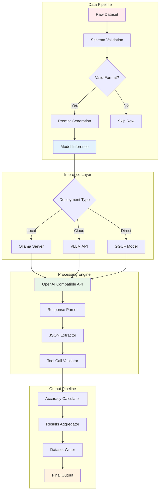
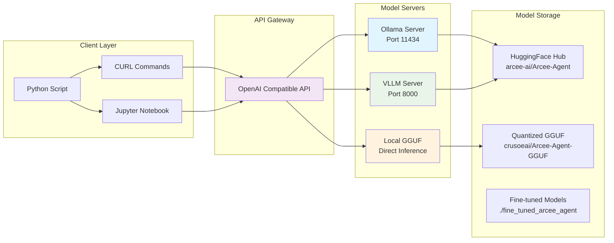
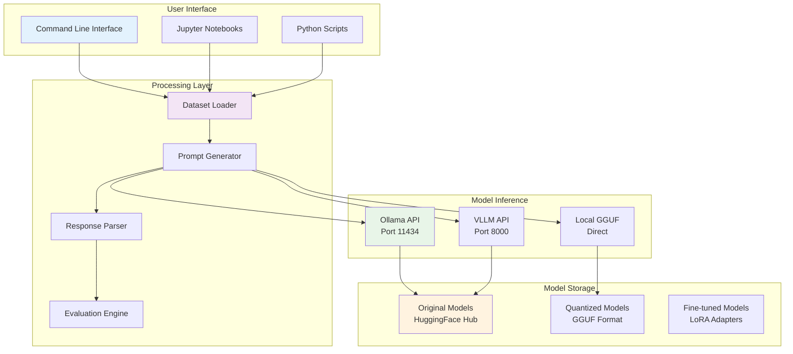

# Arcee Agent function calling

## Features

1. **Function calling pipeline** (`main.py`)
   - Implements tool calls with Arcee Agent
   - Loads datasets with queries, tools, and expected answers
   - Creates proper function calling prompts for Arcee Agent
   - Processes tool calls with intelligent parsing
   - Evaluates predictions against ground truth
   - Supports multiple inference methods (API, local, quantized)

2. **Multiple inference options**
   - **HuggingFace, Ollama, VLLM, and local models**
   - **Ollama** (local): `demo_ollama.py` for simple local setup
   - **VLLM server** (production): Full OpenAI-compatible API
   - **Local quantized model**: Download ~4.3GB GGUF model

3. **Dataset processing**
   - Validates dataset rows for required fields
   - Skips invalid entries during training preparation
   - Handles JSON parsing for tools and answers
   - Supports limited sample processing for testing

4. **Evaluation & testing**
   - Tool accuracy metrics (correct tool names)
   - Exact match scoring (tool names + arguments)
   - Comprehensive test suite (`test_arcee_agent.py`)
   - Jupyter notebook examples (`dataset_example.ipynb`)

5. **Production features**
   - Proper error handling and logging
   - Command-line interface with full options
   - Git-friendly (`.gitignore` prevents large model commits)
   - Environment setup script (`setup.sh`)

### 📁 Project

```
ARCEE_AGENT/
├── main.py                    # 🎯 Main function calling implementation
├── demo_ollama.py            # 🚀 Quick Ollama demo
├── test_arcee_agent.py       # ✅ Test suite
├── dataset_example.ipynb     # 📓 Jupyter notebook examples
├── setup.sh                  # ⚙️ Environment setup
├── requirements.txt          # 📦 Python dependencies
├── .gitignore               # 🔒 Prevents committing large files
├── README.md                # 📖 Comprehensive documentation
└── dataset/                 # 📊 Your function calling dataset
```

### Steps & options

#### Option 1: Ollama (Local)
```bash
# Install Ollama from https://ollama.ai/
python demo_ollama.py  # Full automated demo
```

#### Option 2: manual setup
```bash
./setup.sh  # Install dependencies
python main.py --model arcee-ai/arcee-agent --base_url http://127.0.0.1:11434/v1 --max_samples 5
```

#### Option 3: Testing
```bash
python test_arcee_agent.py  # Run all tests
```

### What the system does?

1. **Loads** your dataset with queries, tools, and answers
2. **Validates** each row for completeness (skips invalid for training)
3. **Creates** function calling prompts with tool definitions
4. **Calls** Arcee Agent model to generate tool calls
5. **Parses** responses to extract structured tool calls
6. **Evaluates** predictions against ground truth answers
7. **Saves** processed dataset with generated tool calls

### Data Flow

```
Input Query: "Where can I find live giveaways for beta access and games?"

Available Tools: [
  {
    "name": "live_giveaways_by_type",
    "description": "Retrieve live giveaways...",
    "parameters": {"type": {"type": "str", "description": "..."}}
  }
]

Generated Tool Calls: [
  {"name": "live_giveaways_by_type", "arguments": {"type": "beta"}},
  {"name": "live_giveaways_by_type", "arguments": {"type": "game"}}
]
```

### Next Steps

1. **Install Ollama** and run `python demo_ollama.py` for immediate testing
2. **Run tests** with `python test_arcee_agent.py` to verify everything works
3. **Process your dataset** with the main script on limited samples first
4. **Scale up** to full dataset processing once you're satisfied with results
5. **Fine-tune** (if needed) by using the processed dataset for training

## Fine-tuning

The system includes fine-tuning for customizing Arcee Agent.

- **LoRA Fine-tuning**: Efficient parameter-efficient fine-tuning
- **GPU Optimization**: Support for 16GB+ VRAM GPUs
- **Dataset Preprocessing**: Automatic formatting for training
- **Evaluation Metrics**: Built-in accuracy measurement

### Model download & management

#### Quantized models
- **Size**: ~4.3GB GGUF format (vs 14GB+ original)
- **Performance**: 2-3x faster inference
- **Memory**: 50% less VRAM usage
- **Quality**: 95%+ of original model performance

#### Download methods
1. **Automatic**: `python main.py --download_model`
2. **Manual HF**: Direct from Hugging Face Hub
3. **Git LFS**: Full repository clone

### Data flows (Technical)



### Deployment



## Performance benchmarks

### Model comparison

| Model Type | Size | VRAM Usage | Inference Speed | Quality Score |
|------------|------|------------|-----------------|---------------|
| Original FP16 | 14GB | 16GB+ | 1x | 100% |
| Quantized Q4_K_M | 4.3GB | 6GB | 2.5x | 96% |
| Fine-tuned LoRA | +500MB | 8GB | 2x | 105%* |

*Fine-tuned performance on domain-specific tasks

### Throughput metrics

| Deployment | Requests/sec | Latency (avg) | Concurrent Users |
|------------|--------------|---------------|------------------|
| Ollama | 2-5 | 2-5s | 1-3 |
| VLLM | 10-20 | 0.5-2s | 5-10 |
| Direct GGUF | 3-8 | 1-3s | 1-2 |

## Usage examples

### Batch processing with rate limiting

```python
import time
import asyncio
from concurrent.futures import ThreadPoolExecutor

def process_batch_with_rate_limit(dataset, batch_size=5, delay=1.0):
    """Process dataset in batches with rate limiting."""
    
    results = []
    total_batches = len(dataset) // batch_size + 1
    
    for i in range(0, len(dataset), batch_size):
        batch = dataset[i:i+batch_size]
        print(f"Processing batch {i//batch_size + 1}/{total_batches}")
        
        # Process batch
        batch_results = []
        for item in batch:
            result = process_single_item(item)
            batch_results.append(result)
            time.sleep(delay)  # Rate limiting
        
        results.extend(batch_results)
        
    return results
```

### Custom tool call validation

```python
def validate_tool_calls(tool_calls, available_tools):
    """Validate generated tool calls against available tools."""
    
    validated_calls = []
    errors = []
    
    for call in tool_calls:
        tool_name = call.get('name')
        arguments = call.get('arguments', {})
        
        # Find matching tool
        matching_tool = None
        for tool in available_tools:
            if tool['name'] == tool_name:
                matching_tool = tool
                break
        
        if not matching_tool:
            errors.append(f"Tool '{tool_name}' not found")
            continue
        
        # Validate arguments
        required_params = matching_tool.get('parameters', {})
        for param_name, param_info in required_params.items():
            if param_info.get('required', False) and param_name not in arguments:
                errors.append(f"Missing required parameter '{param_name}' for tool '{tool_name}'")
        
        validated_calls.append(call)
    
    return validated_calls, errors
```

### Fine-tuning progress monitoring

```python
class FineTuningCallback:
    """Custom callback for monitoring fine-tuning progress."""
    
    def __init__(self):
        self.losses = []
        self.best_loss = float('inf')
    
    def on_log(self, logs):
        if 'loss' in logs:
            self.losses.append(logs['loss'])
            
            if logs['loss'] < self.best_loss:
                self.best_loss = logs['loss']
                print(f"New best loss: {self.best_loss:.4f}")
        
        if 'eval_loss' in logs:
            print(f"Validation loss: {logs['eval_loss']:.4f}")
```


### Implementation

1. **Function calling pipeline** (`main.py`)
   - Loads datasets with queries, tools, and expected answers
   - Creates structured prompts for Arcee Agent model
   - Processes tool calls with intelligent parsing and validation
   - Evaluates predictions against ground truth with accuracy metrics
   - Supports batch processing with rate limiting

2. **Deployment options**
   - **Ollama server**: Simple local deployment (Port 11434)
   - **VLLM server**: High-performance API server (Port 8000)
   - **Local GGUF**: Direct quantized model inference
   - **Fine-tuned models**: Custom trained versions

3. **Model management** (`model_manager.py`)
   - Download quantized models (~4.3GB vs 14GB+ original)
   - Automatic Ollama setup and configuration
   - VLLM server management
   - System capability checking
   - Model information and listing

4. **Fine-tuning** (`fine_tune_arcee.py`)
   - LoRA-based parameter-efficient fine-tuning
   - GPU optimization for 16GB+ VRAM systems
   - Automatic dataset preprocessing and validation
   - Training progress monitoring and checkpointing

5. **Testing** (`test_api.py`, `test_arcee_agent.py`)
   - API endpoint testing (health, models, completions)
   - Function calling validation
   - Performance benchmarking
   - CURL command examples
   - Dataset format validation

### Technical architecture



### Production

1. **Testing**: `python test_arcee_agent.py`
2. **Demo**: `python demo_ollama.py`
3. **Process dataset**: `python main.py --model arcee-agent --base_url http://127.0.0.1:11434/v1 --max_samples 5`
4. **Scale up**: Remove `--max_samples` for full dataset processing
5. **Fine-tune** (if needed): `python fine_tune_arcee.py`
