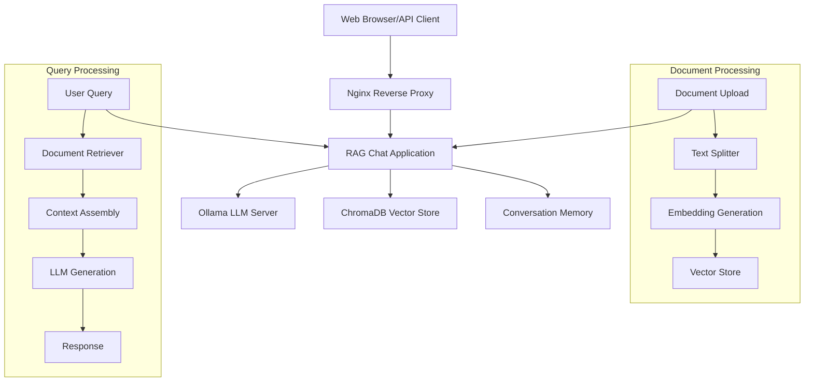

# Retrieval Augmented Generation (RAG) chat with LangChain.js

Questions and answers (QA) chat providing **Retrieval-Augmented Generation (RAG)** built with **LangChain.js**, **Ollama**, and **ChromaDB**. This application enables domain-specific question-answering by combining the power of large language models with your custom knowledge base.

## Features

- **RAG**: Combines retrieval from vector databases with generation from LLMs
- **Conversational memory**: Multi-turn conversations with session management
- **Document upload**: Support for various document formats (PDF, TXT, MD, DOC, DOCX)
- **Vector search**: ChromaDB integration for efficient similarity search
- **RESTful API**: Complete API for chat and document management
- **Web UI**: Web-based chat interface
- **Meta Llama 4 Scout**: Compatible with the latest quantized models
- **Docker deployment**: Complete containerized setup
- **Nginx reverse proxy**: Production-ready with HTTPS support
- **Error handling**: Comprehensive error handling and logging
- **Rate limiting**: Built-in API rate limiting and security

## Architecture



## Steps

### Automatic installation

1. **Clone the repository:**
   ```bash
   git clone <repository-url>
   cd RAG
   ```

2. **Run the installation script:**
   ```bash
   chmod +x scripts/install.sh
   ./scripts/install.sh
   ```

3. **Start the services:**
   ```bash
   docker-compose up -d
   ```

4. **Download AI models:**
   ```bash
   chmod +x scripts/setup-models.sh
   ./scripts/setup-models.sh
   ```

5. **Access the application:**
   - Web Interface: http://localhost:3000
   - Open WebUI: http://localhost:3001
   - API Documentation: http://localhost:3000/api/health

### Manual installation

#### Prerequisites

- **Node.js** 18+ and npm
- **Docker** and **Docker Compose**
- **Git**

#### Step 1: Install dependencies

```bash
# Install Node.js dependencies
npm install

# Copy environment configuration
cp .env.example .env
```

#### Step 2: Configure environment

Edit the `.env` file to match your setup:

```env
# Server Configuration
PORT=3000
NODE_ENV=development

# Ollama Configuration
OLLAMA_BASE_URL=http://localhost:11434
OLLAMA_MODEL=llama3.1:8b

# ChromaDB Configuration
CHROMA_URL=http://localhost:8000
CHROMA_COLLECTION=rag_documents

# RAG Configuration
RETRIEVAL_K=4
CHUNK_SIZE=1000
CHUNK_OVERLAP=200
```

#### Step 3: Start services

```bash
# Start all services
docker-compose up -d

# Check service status
docker-compose ps
```

#### Step 4: Download models

```bash
# Download Llama 3.1 8B model
docker-compose exec ollama ollama pull llama3.1:8b

# Download embedding model
docker-compose exec ollama ollama pull nomic-embed-text

# For Meta Llama 4 Scout (when available):
docker-compose exec ollama ollama pull llama4-scout:8b
```

## Meta Llama 4 Scout

### Model configuration

Update your `.env` file to use Meta Llama 4 Scout models:

```env
# Meta Llama 4 Scout 8B (Quantized)
OLLAMA_MODEL=llama4-scout:8b

# Or Meta Llama 4 Scout 4B (Faster)
OLLAMA_MODEL=llama4-scout:4b
```

### Prompt Template for Meta Llama 4 Scout

The application automatically uses the appropriate prompt format. For custom implementations, follow the [Meta Llama 4 documentation](https://www.llama.com/docs/model-cards-and-prompt-formats/llama4/):

```javascript
const prompt = `<|begin_of_text|><|start_header_id|>system<|end_header_id|>

You are a helpful AI assistant with access to a knowledge base.

Context from knowledge base:
${context}

<|eot_id|><|start_header_id|>user<|end_header_id|>

${question}<|eot_id|><|start_header_id|>assistant<|end_header_id|>`;
```

## API Documentation

### Chat Endpoint

**POST** `/api/chat`

Send a message to the RAG chat system.

```bash
curl -X POST http://localhost:3000/api/chat \
  -H "Content-Type: application/json" \
  -d '{
    "message": "What is machine learning?",
    "sessionId": "optional-session-id"
  }'
```

**Response:**
```json
{
  "success": true,
  "data": {
    "answer": "Machine learning is...",
    "sources": [
      {
        "content": "Relevant document excerpt...",
        "metadata": {...}
      }
    ],
    "sessionId": "session_1234567890",
    "timestamp": "2024-01-15T10:30:00.000Z",
    "processingStrategy": "RAG",
    "classification": {
      "useRAG": true,
      "reasoning": "High similarity score: 0.82",
      "confidence": 0.82
    }
  }
}
```

### Document upload

**POST** `/api/documents/upload`

Upload a document to the knowledge base.

```bash
curl -X POST http://localhost:3000/api/documents/upload \
  -F "document=@/path/to/your/document.pdf"
```

**Response:**
```json
{
  "success": true,
  "data": {
    "documentId": "uuid-here",
    "originalName": "document.pdf",
    "chunksCreated": 15,
    "totalSize": 1024576,
    "uploadDate": "2024-01-15T10:30:00.000Z"
  }
}
```

### Vectorization APIs

#### Query
**POST** `/api/vectorization/analyze-query`

Analyze how a query would be processed (RAG vs Pure LLM).

```bash
curl -X POST http://localhost:3000/api/vectorization/analyze-query \
  -H "Content-Type: application/json" \
  -d '{"query": "What is deep learning?"}'
```

#### Vector search
**POST** `/api/vectorization/search`

Search the vector database directly.

```bash
curl -X POST http://localhost:3000/api/vectorization/search \
  -H "Content-Type: application/json" \
  -d '{
    "query": "machine learning algorithms",
    "k": 5,
    "includeScores": true
  }'
```

#### System statistics
**GET** `/api/vectorization/stats`

Get detailed system and vectorization statistics.

```bash
curl http://localhost:3000/api/vectorization/stats
```

#### Embeddings
**GET** `/api/vectorization/embeddings-info`

Get information about the embedding model and process.

```bash
curl http://localhost:3000/api/vectorization/embeddings-info
```

#### Text processing
**POST** `/api/vectorization/process-text`

Process raw text and show chunking/vectorization steps.

```bash
curl -X POST http://localhost:3000/api/vectorization/process-text \
  -H "Content-Type: application/json" \
  -d '{
    "text": "Your text content here...",
    "preview": false
  }'
```

### Health Check

**GET** `/api/health`

Check system health and service status.

```bash
curl http://localhost:3000/api/health
```

## Testing

### Automated tests

Run the comprehensive test suite:

```bash
chmod +x scripts/test.sh
./scripts/test.sh
```

Test vectorization and document processing:

```bash
chmod +x scripts/test-vectorization.sh
./scripts/test-vectorization.sh
```

### Manual testing with cURL

1. **Health Check**
   ```bash
   curl http://localhost:3000/api/health
   ```

2. **Chat**
   ```bash
   curl -X POST http://localhost:3000/api/chat \
     -H "Content-Type: application/json" \
     -d '{"message": "Hello, what can you help me with?"}'
   ```

3. **Document upload**
   ```bash
   echo "Test document content" > test.txt
   curl -X POST http://localhost:3000/api/documents/upload \
     -F "document=@test.txt"
   rm test.txt
   ```

4. **RAG query**
   ```bash
   curl -X POST http://localhost:3000/api/chat \
     -H "Content-Type: application/json" \
     -d '{"message": "What information do you have from the uploaded documents?"}'
   ```

### Test with Open WebUI

1. Access Open WebUI at http://localhost:3001
2. Configure Ollama connection: http://ollama:11434
3. Select your model (e.g., llama3.1:8b or llama4-scout:8b)
4. Start chatting!

## Docker configuration

### Services

- **rag-app**: Main application (Port: 3000)
- **ollama**: LLM server (Port: 11434)
- **chromadb**: Vector database (Port: 8000)
- **nginx**: Reverse proxy (Ports: 80, 443)
- **open-webui**: Web interface for Ollama (Port: 3001)

### Docker Containers

Node.js RAG Application (rag-app)
Image: Custom Node.js 18 Alpine
Port: 3000
Built from Dockerfile

Nginx Reverse Proxy (nginx):
Image: nginx:alpine
Ports: 80 (HTTP) and 443 (HTTPS)
Configuration: nginx.conf

Ollama LLM Server (ollama)
Image: ollama/ollama:latest
Port: 11434
GPU support enabled

ChromaDB Vector Database (chromadb)
Image: chromadb/chroma:latest
Port: 8000

Open WebUI (open-webui)
Image: ghcr.io/open-webui/open-webui:main
Port: 3001


### Docker Compose

**Start all Docker services**: start.sh
**Stop all Docker services**: stop.sh
**Check service status**: status.sh

### Docker commands

```bash
# Start all services
docker-compose up -d

# View logs
docker-compose logs -f rag-app

# Stop services
docker-compose down

# Rebuild and restart
docker-compose up --build -d

# Scale the application
docker-compose up --scale rag-app=3 -d
```

## Configuration

### Environment variables

| Variable | Default | Description |
|----------|---------|-------------|
| `PORT` | 3000 | Application port |
| `OLLAMA_BASE_URL` | http://localhost:11434 | Ollama server URL |
| `OLLAMA_MODEL` | llama3.1:8b | LLM model to use |
| `CHROMA_URL` | http://localhost:8000 | ChromaDB URL |
| `RETRIEVAL_K` | 4 | Number of documents to retrieve |
| `CHUNK_SIZE` | 1000 | Document chunk size |
| `CHUNK_OVERLAP` | 200 | Chunk overlap size |
| `MEMORY_TOKEN_LIMIT` | 2000 | Conversation memory limit |
| `SESSION_MAX_AGE_HOURS` | 24 | Session timeout |

### Nginx configuration

The Nginx configuration includes:
- Rate limiting
- Security headers
- SSL support (configure certificates in `nginx/ssl/`)
- Request routing and load balancing

To enable HTTPS:
1. Place SSL certificates in `nginx/ssl/`
2. Uncomment the HTTPS server block in `nginx/nginx.conf`
3. Restart nginx: `docker-compose restart nginx`

## Performance optimization

### Model selection

- **llama3.1:7b**: Faster responses, lower memory usage
- **llama3.1:8b**: Balanced performance and quality
- **llama4-scout:4b**: Latest model, 4-bit quantization
- **llama4-scout:8b**: Latest model, 8-bit quantization

### Memory management

- Adjust `MEMORY_TOKEN_LIMIT` based on available RAM
- Set `SESSION_MAX_AGE_HOURS` to clean up old conversations
- Monitor memory usage: `docker stats`

### Scaling

For production deployments:
1. Use multiple application instances
2. Implement load balancing
3. Use external vector database
4. Configure persistent storage

## Development

### Project

```
RAG/
├── src/
│   ├── server.js              # Main server
│   ├── rag.js                 # RAG implementation
│   ├── handlers/              # API handlers
│   ├── middleware/            # Express middleware
│   └── utils/                 # Utilities
├── public/                    # Web interface
├── scripts/                   # Installation scripts
├── nginx/                     # Nginx configuration
├── docker-compose.yml         # Docker services
├── Dockerfile                 # Application container
└── README.md                  # Documentation
```

### Adding new features

1. **New API Endpoints**: Add handlers in `src/handlers/`
2. **Middleware**: Add to `src/middleware/`
3. **Document Loaders**: Extend `src/handlers/documentHandler.js`
4. **Prompt Templates**: Modify `src/rag.js`

### Running in development

```bash
# Install dependencies
npm install

# Start services (except the app)
docker-compose up -d ollama chromadb

# Run in development mode
npm run dev
```

## Troubleshooting

### Issues

1. **Ollama not responding**: Check if Docker container is running
2. **ChromaDB connection failed**: Verify vector database is accessible
3. **Out of memory**: Reduce model size or increase Docker memory
4. **Upload fails**: Check file permissions and disk space

### Debug

```bash
# Check service status
docker-compose ps

# View application logs
docker-compose logs rag-app

# Check Ollama models
docker-compose exec ollama ollama list

# Test ChromaDB
curl http://localhost:8000/api/v1/heartbeat

# System health
curl http://localhost:3000/api/health
```

### Logs

- Application logs: `logs/combined.log`
- Error logs: `logs/error.log`
- Docker logs: `docker-compose logs`
- Check the health endpoint: `/api/health`

This project is licensed under the ISC License - see the LICENSE file for details.

## References

- [LangChain.js Documentation](https://js.langchain.com/docs/tutorials/chatbot/)
- [Build a Retrieval Augmented Generation (RAG) App](https://js.langchain.com/docs/tutorials/qa_chat_history/)
- [Meta Llama 4 Documentation](https://www.llama.com/docs/model-cards-and-prompt-formats/llama4/)
- [Ollama Documentation](https://ollama.ai/docs)
- [ChromaDB Documentation](https://docs.trychroma.com/)

---


