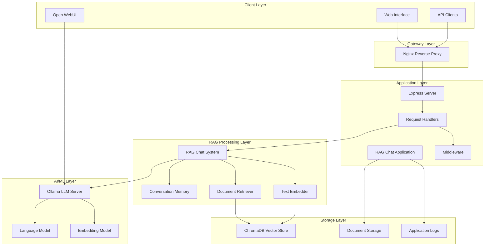
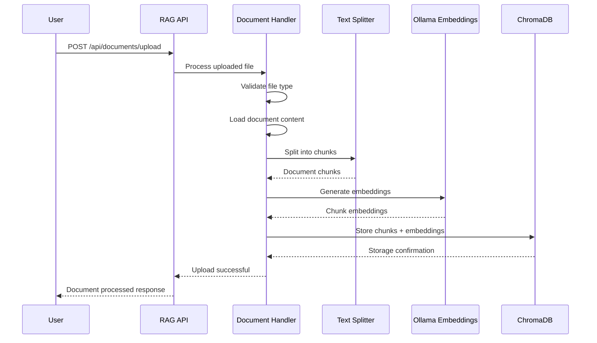
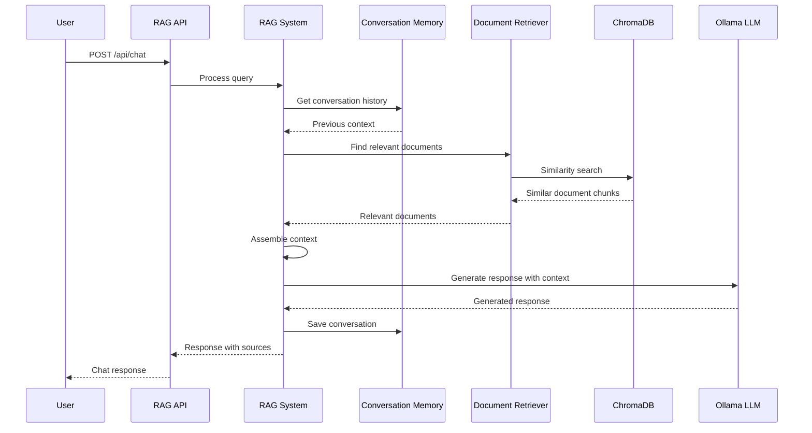
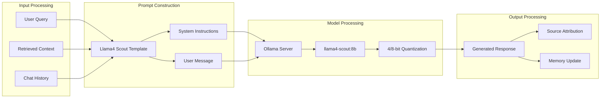
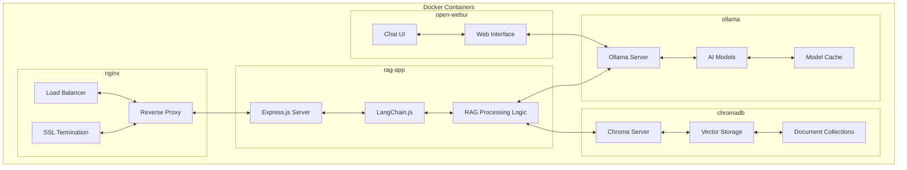
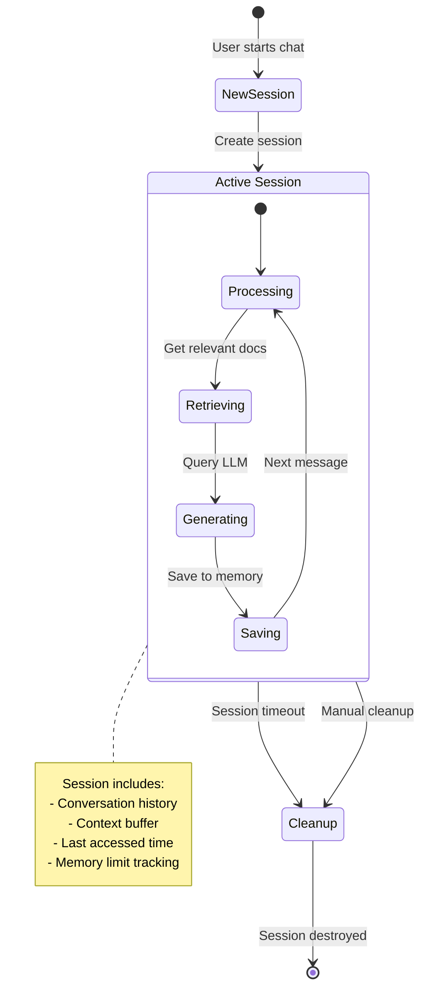
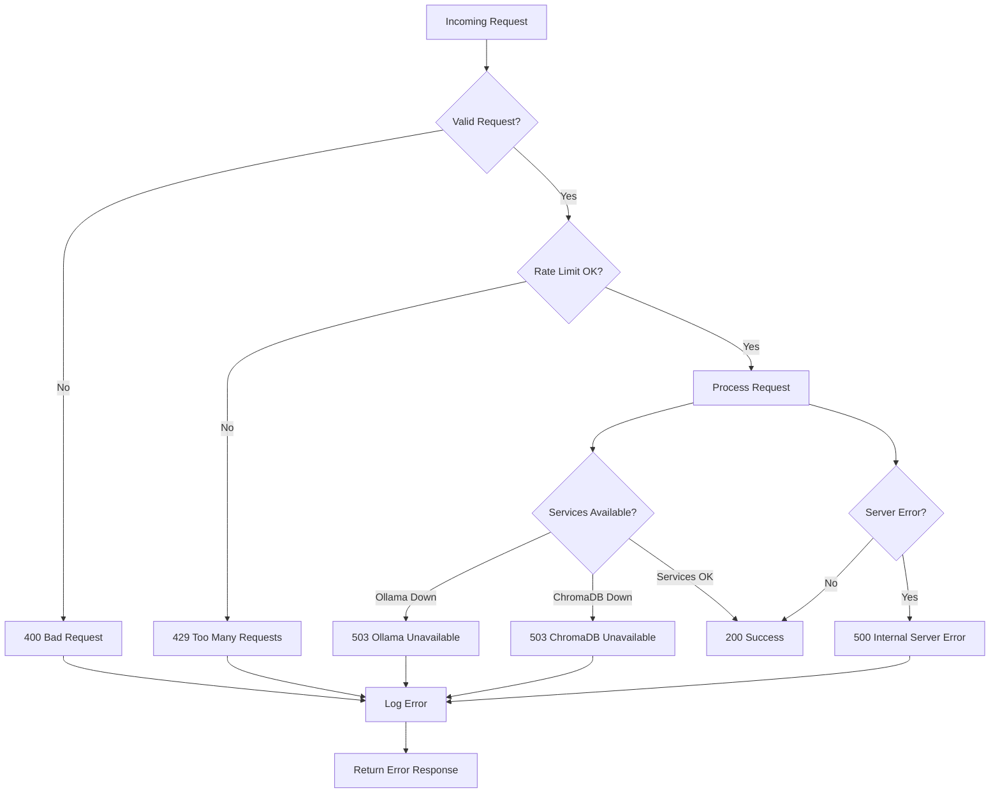

# Data flow

## System architecture

## Document processing flow

## Chat query processing flow

## Meta Llama 4 Scout

## System component interaction

## Memory and session management

## Error handling

