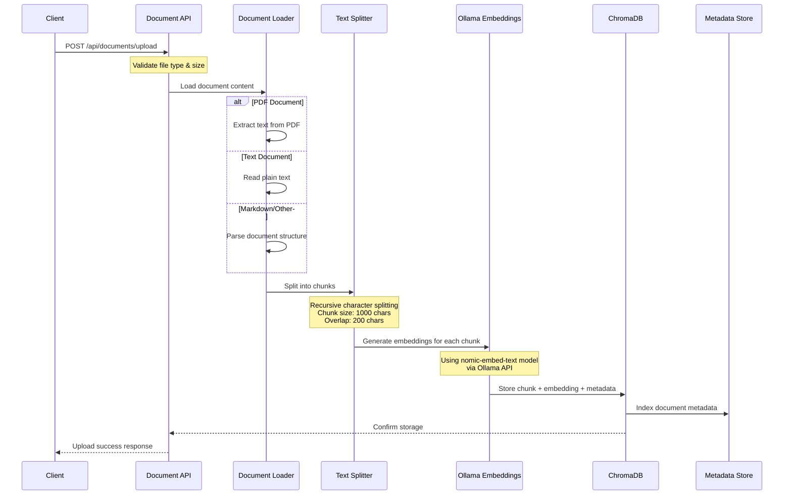
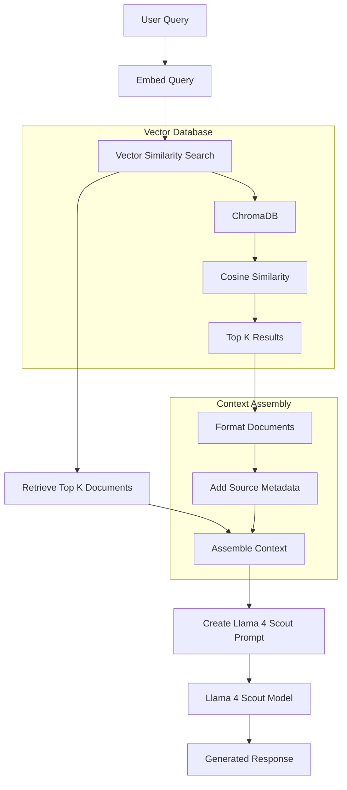

# RAG document processing and vector database

## 📄 Document processing pipeline

### 1. Document upload and processing



### 2. Vectorization and Tokenization process

The system uses a multi-step process for document vectorization:

#### **Text Splitting (Tokenization)**
```javascript
// Recursive Character Text Splitter
const textSplitter = new RecursiveCharacterTextSplitter({
  chunkSize: 1000,        // Maximum characters per chunk
  chunkOverlap: 200,      // Overlap between chunks
  separators: [           // Split hierarchy
    '\n\n',              // Paragraphs first
    '\n',                // Then lines
    ' ',                 // Then words
    ''                   // Finally characters
  ]
});
```

#### **Embedding Generation (Vectorization)**
```javascript
// Ollama Embeddings using nomic-embed-text
const embeddings = new OllamaEmbeddings({
  baseUrl: 'http://localhost:11434',
  model: 'nomic-embed-text',    // Specialized embedding model
  requestOptions: {
    temperature: 0,             // Deterministic embeddings
  }
});

// Each chunk becomes a vector of dimensions (typically 768 or 1536)
```

#### **Vector Storage**
```javascript
// ChromaDB Vector Store
const vectorStore = new ChromaVectorStore(embeddings, {
  collectionName: 'rag_documents',
  url: 'http://localhost:8000',
  metadata: {
    documentId: uuid,
    originalName: filename,
    chunkIndex: index,
    uploadDate: timestamp
  }
});
```

## 🔍 How Llama 4 Scout uses vector database

### 1. Query processing flow



### 2. Decision logic: When to use Vector Database vs LLM

The enhanced system uses **smart routing** to decide between RAG and pure LLM:

#### **Query Classification Process**

```javascript
async classifyQuery(query) {
  const patterns = {
    factual: /what is|who is|when did|where is|how does|define|explain/i,
    personal: /my name is|i am|i work|remember that/i,
    general: /hello|hi|goodbye|thank you|how are you/i,
    computational: /calculate|compute|solve|what's \d+/i,
    creative: /write a story|create a poem|imagine/i
  };

  // 1. Pattern-based classification
  if (patterns.general.test(query)) {
    return { useRAG: false, reasoning: 'General conversational query' };
  }

  // 2. Similarity-based classification
  const relevantDocs = await this.vectorStore.similaritySearchWithScore(query, 1);
  if (relevantDocs.length === 0 || relevantDocs[0][1] < threshold) {
    return { useRAG: false, reasoning: 'No relevant documents found' };
  }

  return { useRAG: true, reasoning: 'Relevant documents available' };
}
```

#### **Processing**

| Query Type | Strategy | Reasoning |
|------------|----------|-----------|
| **"Hello, how are you?"** | Pure LLM | General conversation, no knowledge lookup needed |
| **"Calculate 25 * 37"** | Pure LLM | Mathematical computation, no documents needed |
| **"What is machine learning?"** | RAG | Factual query that benefits from knowledge base |
| **"Explain the uploaded document"** | RAG | Specifically references uploaded content |
| **"My name is John"** | Pure LLM | Personal information, conversational context |

### 3. Meta Llama 4 Scout Prompt Engineering

The system uses specialized prompts for Llama 4 Scout models:

```javascript
// Llama 4 Scout RAG Prompt Template
const createLlama4ScoutPrompt = (context, question, chatHistory) => `
<|begin_of_text|><|start_header_id|>system<|end_header_id|>

You are a helpful AI assistant with access to a knowledge base.

Context from knowledge base:
${context}

Instructions:
- Answer based on the provided context when relevant
- If context doesn't contain relevant information, say so clearly
- Be concise but comprehensive
- Cite sources when possible
- Use a friendly, professional tone

<|eot_id|><|start_header_id|>user<|end_header_id|>

${question}<|eot_id|><|start_header_id|>assistant<|end_header_id|>

`;
```

## API Endpoints for Vectorization

### 1. Document upload and processing
```bash
POST /api/documents/upload
Content-Type: multipart/form-data

curl -X POST http://localhost:3000/api/documents/upload \
  -F "document=@your_document.pdf"
```

**Response:**
```json
{
  "success": true,
  "data": {
    "documentId": "uuid-here",
    "originalName": "document.pdf",
    "chunksCreated": 15,
    "totalSize": 1024576,
    "uploadDate": "2024-01-15T10:30:00.000Z"
  }
}
```

### 2. Vector search API
```bash
POST /api/vectorization/search
Content-Type: application/json

{
  "query": "machine learning algorithms",
  "k": 5,
  "includeScores": true
}
```

**Response:**
```json
{
  "success": true,
  "data": {
    "query": "machine learning algorithms",
    "results": [
      {
        "content": "Machine learning is a subset of artificial intelligence...",
        "score": 0.85,
        "relevance": "High",
        "metadata": {
          "documentId": "uuid",
          "originalName": "ml_guide.pdf",
          "chunkIndex": 3
        }
      }
    ],
    "totalResults": 5
  }
}
```

### 3. Query API
```bash
POST /api/vectorization/analyze-query
Content-Type: application/json

{
  "query": "What is deep learning?"
}
```

**Response:**
```json
{
  "success": true,
  "data": {
    "query": "What is deep learning?",
    "classification": {
      "strategy": "RAG (Retrieval-Augmented Generation)",
      "reasoning": "High similarity score: 0.82",
      "confidence": 0.82,
      "useRAG": true
    },
    "similarityAnalysis": {
      "topDocuments": [
        {
          "score": 0.82,
          "relevance": "High",
          "preview": "Deep learning is a subset of machine learning...",
          "source": "ai_handbook.pdf"
        }
      ],
      "threshold": 0.5,
      "wouldRetrieve": true
    },
    "recommendation": "Excellent match found in knowledge base. RAG will provide highly relevant context."
  }
}
```

### 4. Embeddings API
```bash
GET /api/vectorization/embeddings-info
```

**Response:**
```json
{
  "success": true,
  "data": {
    "embeddingModel": {
      "name": "nomic-embed-text",
      "provider": "Ollama",
      "baseUrl": "http://localhost:11434",
      "dimensions": 768,
      "testProcessingTime": "45ms"
    },
    "vectorizationProcess": {
      "steps": [
        "1. Document uploaded via API",
        "2. Text extracted and cleaned",
        "3. Split into chunks (1000 chars, 200 overlap)",
        "4. Each chunk sent to embedding model",
        "5. Vector embeddings generated",
        "6. Stored in ChromaDB with metadata",
        "7. Indexed for similarity search"
      ],
      "chunkSize": 1000,
      "chunkOverlap": 200,
      "batchSize": 10
    }
  }
}
```

### 5. Text processing API
```bash
POST /api/vectorization/process-text
Content-Type: application/json

{
  "text": "Your raw text content here...",
  "preview": false
}
```

## How LLM decides to use Vector Database?

The decision-making process involves multiple factors:

### 1. **Similarity threshold check**
```javascript
const SIMILARITY_THRESHOLD = 0.5; // Configurable

// If similarity score > threshold, use RAG
if (similarityScore > SIMILARITY_THRESHOLD) {
  strategy = 'RAG';
} else {
  strategy = 'Pure LLM';
}
```

### 2. **Query pattern analysis**
- **Factual questions**: "What is...", "How does...", "Define..." → RAG
- **Conversational**: "Hello", "Thank you" → Pure LLM  
- **Computational**: Math, calculations → Pure LLM
- **Creative**: Story writing, poems → Pure LLM

### 3. **Document Availability**
- **No documents uploaded**: Pure LLM only
- **Documents available but not relevant**: Pure LLM
- **Relevant documents found**: RAG with context

### 4. **Confidence scoring**
```javascript
const classification = {
  useRAG: true,
  reasoning: 'High similarity score: 0.82',
  confidence: 0.82,
  similarityScore: 0.82,
  documentsFound: 4
};
```

## Practices for Document Vectorization

### 1. **Optimal chunk sizes**
- **Small chunks (500-800 chars)**: Better precision, more chunks
- **Large chunks (1000-1500 chars)**: Better context, fewer chunks
- **Overlap**: 10-20% of chunk size for continuity

### 2. **Document preparation**
- Clean formatting and remove unnecessary characters
- Ensure consistent structure
- Include metadata for better retrieval

### 3. **Embedding model Sslection**
- **nomic-embed-text**: General purpose, good performance
- **all-MiniLM-L6-v2**: Lightweight, fast
- **sentence-transformers**: Domain-specific models available

### 4. **Query optimization**
- Use specific terms for better matches
- Include context in queries when possible
- Test different similarity thresholds

The RAG application enables Llama 4 Scout to make decision about when to use the vector database versus relying on its training knowledge, providing the most relevant and accurate responses possible.
