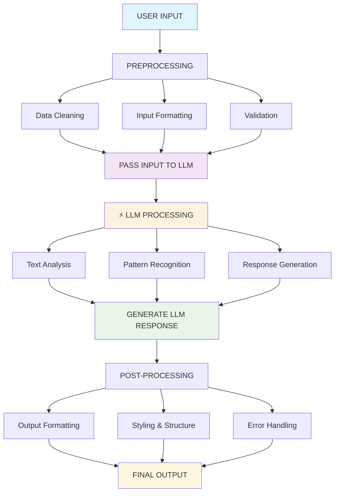

#  Large Language Models (LLM)

## LangChain.js application

This project demonstrates how to use LangChain.js library to create custom chains for text processing.

The application includes a custom chain that converts text lowercase in input to uppercase in output.

### Prerequisites

Before running this application, verify that you have the following tools installed.

1. **Node.js** (version 14 or higher)
   - Download from [nodejs.org](https://nodejs.org/)
   - Verify installation: `node --version`

2. **npm** (comes with Node.js)
   - Verify installation: `npm --version`

### Setup

1. **Clone the repository** (if applicable):
   ```bash
   git clone <repository-url>
   cd LangChain
   ```

2. **Install dependencies**:
   ```bash
   npm install
   ```

3. **Run the application**:
   ```bash
   npm start
   ```

4. **Run tests**:
   ```bash
   npm test
   ```

### Project

```
├── src/
│   └── index.js          # Main entry point with UppercaseChain implementation
├── tests/
│   └── index.test.js     # Test cases
├── package.json          # Project configuration and dependencies
├── README.md            # This file
└── .gitignore           # Git ignore rules
```

### What this application does?

- **Custom Chain Implementation**: Extends LangChain's `BaseChain` to create an `UppercaseChain`
- **Text Processing**: Converts input text to uppercase
- **Async Processing**: Uses asynchronous processing with proper error handling
- **Modular Design**: Exports the chain for use in other applications

### Usage

The main application runs automatically when you execute `npm start`.

You can also import and use the `UppercaseChain` in your own applications.

```javascript
const { UppercaseChain } = require('./src/index.js');

(async () => {
  const chain = new UppercaseChain();
  const result = await chain.call({ text: 'hello world' });
  console.log(result); // { uppercaseText: 'HELLO WORLD' }
})();
```

### LangChain.js

LangChain.js is a JavaScript library for building applications with large language models (LLMs).


- **Chains**: Sequence multiple operations together
- **Prompts**: Template and manage prompts for LLMs
- **Memory**: Add state to chains and agents
- **Agents**: Use LLMs to choose which actions to take
- **Data Sources**: Connect to various data sources

## LangChain processing workflow

The following flowchart illustrates how data flows through a LangChain application, demonstrating the chain of processing steps from user input to final output.



### Workflow

1. **USER INPUT**: Raw input from the user (text, queries, commands)
2. **PREPROCESSING**: 
   - Data cleaning (removing unwanted characters, normalization)
   - Input formatting (structuring data for LLM consumption)
   - Validation (ensuring input meets requirements)
3. **PASS INPUT TO LLM**: Formatted input is sent to the language model
4. **LLM PROCESSING**: The language model processes the input through:
   - Text analysis and understanding
   - Pattern recognition and context analysis
   - Response generation based on training and prompts
5. **GENERATE LLM RESPONSE**: Raw response from the language model
6. **POST-PROCESSING**:
   - Output formatting (structuring the response)
   - Styling and presentation (making output user-friendly)
   - Error handling (managing failures and edge cases)
7. **FINAL OUTPUT**: Processed, formatted response delivered to the user

## Asynchronous programming with LangChain.js

LangChain.js extensively uses asynchronous programming to handle I/O-bound operations efficiently.

- Make API calls to language models
- Access databases or external services
- Process multiple requests concurrently
- Maintain responsive user interfaces

### Key asynchronous concepts in LangChain.js

#### 1. Chain execution
Chains in LangChain.js are inherently asynchronous. Each step in the chain can be processed without blocking other operations:

```javascript
// Asynchronous chain execution
const chain = new UppercaseChain();
const result = await chain.call({ text: 'hello world' });
```

#### 2. Concurrent processing
Multiple chains can be executed in parallel for better performance:

```javascript
// Processing multiple inputs concurrently
const promises = inputs.map(input => chain.call(input));
const results = await Promise.all(promises);
```

#### 3. Runnable interface
LangChain components implement the Runnable interface, providing consistent async methods:

- `invoke()` / `ainvoke()` - Execute synchronously/asynchronously
- `stream()` / `astream()` - Stream results
- `batch()` / `abatch()` - Process multiple inputs

#### 4. Error handling in asynchronous chains
Proper error handling is essential in asynchronous chain processing:

```javascript
try {
  const result = await chain.call(input);
  // Process successful result
} catch (error) {
  // Handle chain execution errors
  console.error('Chain execution failed:', error.message);
}
```

### Asynchronous processing

1. **Non-blocking operations**: Other tasks can continue while waiting for I/O operations
2. **Resource utilization**: CPU can work on other tasks during network requests
3. **Scalability**: Applications can handle more concurrent users
4. **User experience**: UI remains responsive during processing

### Performance

- **Thread pool management**: Async operations use thread pools efficiently
- **Context switching**: Minimal overhead when switching between async tasks
- **Event loop**: JavaScript's event loop handles async operations naturally
- **Memory usage**: Async patterns help manage memory more efficiently

The combination of LangChain's chain architecture with JavaScript's native async capabilities creates powerful, responsive applications that can handle complex language model workflows efficiently.

## Chain examples

### Sequential chain processing

```javascript
// Example of sequential chain processing with async operations
class TextProcessingPipeline extends BaseChain {
  constructor() {
    super();
    this.cleaningChain = new TextCleaningChain();
    this.uppercaseChain = new UppercaseChain();
    this.validationChain = new ValidationChain();
  }

  async _call(inputs) {
    // Step 1: Clean the input
    const cleaned = await this.cleaningChain.call(inputs);
    
    // Step 2: Convert to uppercase
    const uppercased = await this.uppercaseChain.call(cleaned);
    
    // Step 3: Validate the output
    const validated = await this.validationChain.call(uppercased);
    
    return validated;
  }

  get inputKeys() { return ['text']; }
  get outputKeys() { return ['processedText']; }
  _chainType() { return 'text_processing_pipeline'; }
}
```

### Parallel chain processing

```javascript
// Example of parallel processing for better performance
async function processMultipleTexts(texts) {
  const chain = new UppercaseChain();
  
  // Process all texts concurrently
  const promises = texts.map(async (text) => {
    try {
      return await chain.call({ text });
    } catch (error) {
      return { error: error.message, originalText: text };
    }
  });
  
  const results = await Promise.all(promises);
  return results;
}
```

### Streaming chain results

```javascript
// Example of streaming results for real-time processing
class StreamingUppercaseChain extends BaseChain {
  async *_streamCall(inputs) {
    const text = inputs.text;
    let result = '';
    
    // Simulate streaming by processing character by character
    for (let i = 0; i < text.length; i++) {
      result += text[i].toUpperCase();
      yield { partialResult: result, progress: (i + 1) / text.length };
      
      // Small delay to simulate processing time
      await new Promise(resolve => setTimeout(resolve, 10));
    }
    
    return { uppercaseText: result };
  }
  
  // ... other methods
}
```

## Integration with JavaScript frameworks

### Express.js API

```javascript
const express = require('express');
const { UppercaseChain } = require('./src/index.js');

const app = express();
app.use(express.json());

const chain = new UppercaseChain();

app.post('/process', async (req, res) => {
  try {
    const { text } = req.body;
    const result = await chain.call({ text });
    res.json({ success: true, result });
  } catch (error) {
    res.status(400).json({ success: false, error: error.message });
  }
});

app.listen(3000, () => {
  console.log('LangChain API server running on port 3000');
});
```

### React.js frontend

```javascript
// React component using the LangChain API
function TextProcessor() {
  const [text, setText] = useState('');
  const [result, setResult] = useState('');
  const [loading, setLoading] = useState(false);

  const processText = async () => {
    setLoading(true);
    try {
      const response = await fetch('/api/process', {
        method: 'POST',
        headers: { 'Content-Type': 'application/json' },
        body: JSON.stringify({ text })
      });
      const data = await response.json();
      setResult(data.result.uppercaseText);
    } catch (error) {
      console.error('Processing failed:', error);
    } finally {
      setLoading(false);
    }
  };

  return (
    <div>
      <textarea 
        value={text} 
        onChange={(e) => setText(e.target.value)}
        placeholder="Enter text to process..."
      />
      <button onClick={processText} disabled={loading}>
        {loading ? 'Processing...' : 'Process Text'}
      </button>
      {result && <div>Result: {result}</div>}
    </div>
  );
}
```

## AWS serverless deployment

This application can be deployed to AWS Lambda with API Gateway for serverless execution. The deployment creates a scalable, pay-per-use RESTful API.

### Steps

```bash
# 1. Set up AWS environment
npm run setup:aws

# 2. Deploy to AWS (development)
npm run deploy

# 3. Test locally first
npm run test:local

# 4. Test deployed API
npm run test:api https://your-api-endpoint.amazonaws.com/dev
```

### Architecture

```
Internet → API Gateway → AWS Lambda → LangChain.js → Response
```

**Amazon AWS components:**
- **AWS Lambda**: Serverless Node.js runtime
- **API Gateway**: RESTful API endpoints
- **IAM Role**: Security permissions
- **CloudWatch**: Logging and monitoring

### Deployment configuration

The deployment includes:

1. **Lambda Functions**:
   - `transformText`: Main text processing function
   - `healthCheck`: Service health monitoring

2. **API Endpoints**:
   - `POST /transform`: Transform text to uppercase
   - `GET /health`: Health check endpoint

3. **Security Features**:
   - CORS enabled for web browser access
   - IAM roles with least-privilege permissions
   - Request validation and error handling

4. **Monitoring**:
   - CloudWatch logs for debugging
   - X-Ray tracing for performance analysis
   - Custom metrics for monitoring

### Local development

```bash
# Start local development server
npm run test:local

# Server runs at http://localhost:3000
# Test endpoints:
curl -X POST http://localhost:3000/transform \
  -H 'Content-Type: application/json' \
  -d '{"text": "hello world"}'

curl http://localhost:3000/health
```

### Production deployment

```bash
# Deploy to production stage
npm run deploy:prod

# Monitor logs
npm run logs

# Remove deployment
npm run remove
```

For detailed deployment instructions, see [AWS_DEPLOYMENT.md](./AWS_DEPLOYMENT.md).

### API responses

**Successful Response:**
```json
{
  "success": true,
  "data": {
    "originalText": "hello world",
    "transformedText": "HELLO WORLD",
    "processingTimeMs": 45,
    "timestamp": "2025-01-15T10:30:00.000Z"
  },
  "meta": {
    "requestId": "abc123-def456",
    "functionName": "langchain-text-transformer-dev-transformText"
  }
}
```

**Error response:**
```json
{
  "success": false,
  "error": "Invalid input type",
  "message": "Text must be a string",
  "meta": {
    "requestId": "abc123-def456",
    "functionName": "langchain-text-transformer-dev-transformText"
  }
}
```